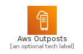
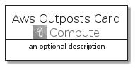

# AwsOutposts


```text
aws-q3-2021/Architecture/Compute/AwsOutposts
```

```text
include('aws-q3-2021/Architecture/Compute/AwsOutposts')
```


| Illustration | AwsOutposts | AwsOutpostsCard | AwsOutpostsGroup |
| :---: | :---: | :---: | :---: |
|  |  |  |  |


## AwsOutposts

### Load remotely
```plantuml
@startuml
' configures the library
!global $LIB_BASE_LOCATION="https://github.com/tmorin/plantuml-libs/distribution"

' loads the library's bootstrap
!include $LIB_BASE_LOCATION/bootstrap.puml

' loads the package bootstrap
include('aws-q3-2021/bootstrap')

' loads the Item which embeds the element AwsOutposts
include('aws-q3-2021/Architecture/Compute/AwsOutposts')

' renders the element
AwsOutposts('AwsOutposts', 'Aws Outposts', 'an optional tech label')
@enduml
```

### Load locally
```plantuml
@startuml
' configures the library
!global $INCLUSION_MODE="local"
!global $LIB_BASE_LOCATION="../../.."

' loads the library's bootstrap
!include $LIB_BASE_LOCATION/bootstrap.puml

' loads the package bootstrap
include('aws-q3-2021/bootstrap')

' loads the Item which embeds the element AwsOutposts
include('aws-q3-2021/Architecture/Compute/AwsOutposts')

' renders the element
AwsOutposts('AwsOutposts', 'Aws Outposts', 'an optional tech label')
@enduml
```

## AwsOutpostsCard

### Load remotely
```plantuml
@startuml
' configures the library
!global $LIB_BASE_LOCATION="https://github.com/tmorin/plantuml-libs/distribution"

' loads the library's bootstrap
!include $LIB_BASE_LOCATION/bootstrap.puml

' loads the package bootstrap
include('aws-q3-2021/bootstrap')

' loads the Item which embeds the element AwsOutpostsCard
include('aws-q3-2021/Architecture/Compute/AwsOutposts')

' renders the element
AwsOutpostsCard('AwsOutpostsCard', 'Aws Outposts Card', 'an optional description')
@enduml
```

### Load locally
```plantuml
@startuml
' configures the library
!global $INCLUSION_MODE="local"
!global $LIB_BASE_LOCATION="../../.."

' loads the library's bootstrap
!include $LIB_BASE_LOCATION/bootstrap.puml

' loads the package bootstrap
include('aws-q3-2021/bootstrap')

' loads the Item which embeds the element AwsOutpostsCard
include('aws-q3-2021/Architecture/Compute/AwsOutposts')

' renders the element
AwsOutpostsCard('AwsOutpostsCard', 'Aws Outposts Card', 'an optional description')
@enduml
```

## AwsOutpostsGroup

### Load remotely
```plantuml
@startuml
' configures the library
!global $LIB_BASE_LOCATION="https://github.com/tmorin/plantuml-libs/distribution"

' loads the library's bootstrap
!include $LIB_BASE_LOCATION/bootstrap.puml

' loads the package bootstrap
include('aws-q3-2021/bootstrap')

' loads the Item which embeds the element AwsOutpostsGroup
include('aws-q3-2021/Architecture/Compute/AwsOutposts')

' renders the element
AwsOutpostsGroup('AwsOutpostsGroup', 'Aws Outposts Group', 'an optional tech label') {
    note as note
        the content of the group
    end note
}
@enduml
```

### Load locally
```plantuml
@startuml
' configures the library
!global $INCLUSION_MODE="local"
!global $LIB_BASE_LOCATION="../../.."

' loads the library's bootstrap
!include $LIB_BASE_LOCATION/bootstrap.puml

' loads the package bootstrap
include('aws-q3-2021/bootstrap')

' loads the Item which embeds the element AwsOutpostsGroup
include('aws-q3-2021/Architecture/Compute/AwsOutposts')

' renders the element
AwsOutpostsGroup('AwsOutpostsGroup', 'Aws Outposts Group', 'an optional tech label') {
    note as note
        the content of the group
    end note
}
@enduml
```

