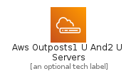
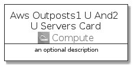

# AwsOutposts1UAnd2UServers


```text
aws-q3-2021/Architecture/Compute/AwsOutposts1UAnd2UServers
```

```text
include('aws-q3-2021/Architecture/Compute/AwsOutposts1UAnd2UServers')
```


| Illustration | AwsOutposts1UAnd2UServers | AwsOutposts1UAnd2UServersCard | AwsOutposts1UAnd2UServersGroup |
| :---: | :---: | :---: | :---: |
|  |  |  |  |


## AwsOutposts1UAnd2UServers

### Load remotely
```plantuml
@startuml
' configures the library
!global $LIB_BASE_LOCATION="https://raw.githubusercontent.com/tmorin/plantuml-libs/master/distribution"

' loads the library's bootstrap
!include $LIB_BASE_LOCATION/bootstrap.puml

' loads the package bootstrap
include('aws-q3-2021/bootstrap')

' loads the Item which embeds the element AwsOutposts1UAnd2UServers
include('aws-q3-2021/Architecture/Compute/AwsOutposts1UAnd2UServers')

' renders the element
AwsOutposts1UAnd2UServers('AwsOutposts1UAnd2UServers', 'Aws Outposts1 U And2 U Servers', 'an optional tech label')
@enduml
```

### Load locally
```plantuml
@startuml
' configures the library
!global $INCLUSION_MODE="local"
!global $LIB_BASE_LOCATION="../../.."

' loads the library's bootstrap
!include $LIB_BASE_LOCATION/bootstrap.puml

' loads the package bootstrap
include('aws-q3-2021/bootstrap')

' loads the Item which embeds the element AwsOutposts1UAnd2UServers
include('aws-q3-2021/Architecture/Compute/AwsOutposts1UAnd2UServers')

' renders the element
AwsOutposts1UAnd2UServers('AwsOutposts1UAnd2UServers', 'Aws Outposts1 U And2 U Servers', 'an optional tech label')
@enduml
```

## AwsOutposts1UAnd2UServersCard

### Load remotely
```plantuml
@startuml
' configures the library
!global $LIB_BASE_LOCATION="https://raw.githubusercontent.com/tmorin/plantuml-libs/master/distribution"

' loads the library's bootstrap
!include $LIB_BASE_LOCATION/bootstrap.puml

' loads the package bootstrap
include('aws-q3-2021/bootstrap')

' loads the Item which embeds the element AwsOutposts1UAnd2UServersCard
include('aws-q3-2021/Architecture/Compute/AwsOutposts1UAnd2UServers')

' renders the element
AwsOutposts1UAnd2UServersCard('AwsOutposts1UAnd2UServersCard', 'Aws Outposts1 U And2 U Servers Card', 'an optional description')
@enduml
```

### Load locally
```plantuml
@startuml
' configures the library
!global $INCLUSION_MODE="local"
!global $LIB_BASE_LOCATION="../../.."

' loads the library's bootstrap
!include $LIB_BASE_LOCATION/bootstrap.puml

' loads the package bootstrap
include('aws-q3-2021/bootstrap')

' loads the Item which embeds the element AwsOutposts1UAnd2UServersCard
include('aws-q3-2021/Architecture/Compute/AwsOutposts1UAnd2UServers')

' renders the element
AwsOutposts1UAnd2UServersCard('AwsOutposts1UAnd2UServersCard', 'Aws Outposts1 U And2 U Servers Card', 'an optional description')
@enduml
```

## AwsOutposts1UAnd2UServersGroup

### Load remotely
```plantuml
@startuml
' configures the library
!global $LIB_BASE_LOCATION="https://raw.githubusercontent.com/tmorin/plantuml-libs/master/distribution"

' loads the library's bootstrap
!include $LIB_BASE_LOCATION/bootstrap.puml

' loads the package bootstrap
include('aws-q3-2021/bootstrap')

' loads the Item which embeds the element AwsOutposts1UAnd2UServersGroup
include('aws-q3-2021/Architecture/Compute/AwsOutposts1UAnd2UServers')

' renders the element
AwsOutposts1UAnd2UServersGroup('AwsOutposts1UAnd2UServersGroup', 'Aws Outposts1 U And2 U Servers Group', 'an optional tech label') {
    note as note
        the content of the group
    end note
}
@enduml
```

### Load locally
```plantuml
@startuml
' configures the library
!global $INCLUSION_MODE="local"
!global $LIB_BASE_LOCATION="../../.."

' loads the library's bootstrap
!include $LIB_BASE_LOCATION/bootstrap.puml

' loads the package bootstrap
include('aws-q3-2021/bootstrap')

' loads the Item which embeds the element AwsOutposts1UAnd2UServersGroup
include('aws-q3-2021/Architecture/Compute/AwsOutposts1UAnd2UServers')

' renders the element
AwsOutposts1UAnd2UServersGroup('AwsOutposts1UAnd2UServersGroup', 'Aws Outposts1 U And2 U Servers Group', 'an optional tech label') {
    note as note
        the content of the group
    end note
}
@enduml
```

