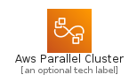
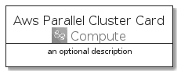
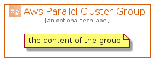

# AwsParallelCluster


```text
aws-q3-2021/Architecture/Compute/AwsParallelCluster
```

```text
include('aws-q3-2021/Architecture/Compute/AwsParallelCluster')
```


| Illustration | AwsParallelCluster | AwsParallelClusterCard | AwsParallelClusterGroup |
| :---: | :---: | :---: | :---: |
|  |  |  |  |


## AwsParallelCluster

### Load remotely
```plantuml
@startuml
' configures the library
!global $LIB_BASE_LOCATION="https://github.com/tmorin/plantuml-libs/distribution"

' loads the library's bootstrap
!include $LIB_BASE_LOCATION/bootstrap.puml

' loads the package bootstrap
include('aws-q3-2021/bootstrap')

' loads the Item which embeds the element AwsParallelCluster
include('aws-q3-2021/Architecture/Compute/AwsParallelCluster')

' renders the element
AwsParallelCluster('AwsParallelCluster', 'Aws Parallel Cluster', 'an optional tech label')
@enduml
```

### Load locally
```plantuml
@startuml
' configures the library
!global $INCLUSION_MODE="local"
!global $LIB_BASE_LOCATION="../../.."

' loads the library's bootstrap
!include $LIB_BASE_LOCATION/bootstrap.puml

' loads the package bootstrap
include('aws-q3-2021/bootstrap')

' loads the Item which embeds the element AwsParallelCluster
include('aws-q3-2021/Architecture/Compute/AwsParallelCluster')

' renders the element
AwsParallelCluster('AwsParallelCluster', 'Aws Parallel Cluster', 'an optional tech label')
@enduml
```

## AwsParallelClusterCard

### Load remotely
```plantuml
@startuml
' configures the library
!global $LIB_BASE_LOCATION="https://github.com/tmorin/plantuml-libs/distribution"

' loads the library's bootstrap
!include $LIB_BASE_LOCATION/bootstrap.puml

' loads the package bootstrap
include('aws-q3-2021/bootstrap')

' loads the Item which embeds the element AwsParallelClusterCard
include('aws-q3-2021/Architecture/Compute/AwsParallelCluster')

' renders the element
AwsParallelClusterCard('AwsParallelClusterCard', 'Aws Parallel Cluster Card', 'an optional description')
@enduml
```

### Load locally
```plantuml
@startuml
' configures the library
!global $INCLUSION_MODE="local"
!global $LIB_BASE_LOCATION="../../.."

' loads the library's bootstrap
!include $LIB_BASE_LOCATION/bootstrap.puml

' loads the package bootstrap
include('aws-q3-2021/bootstrap')

' loads the Item which embeds the element AwsParallelClusterCard
include('aws-q3-2021/Architecture/Compute/AwsParallelCluster')

' renders the element
AwsParallelClusterCard('AwsParallelClusterCard', 'Aws Parallel Cluster Card', 'an optional description')
@enduml
```

## AwsParallelClusterGroup

### Load remotely
```plantuml
@startuml
' configures the library
!global $LIB_BASE_LOCATION="https://github.com/tmorin/plantuml-libs/distribution"

' loads the library's bootstrap
!include $LIB_BASE_LOCATION/bootstrap.puml

' loads the package bootstrap
include('aws-q3-2021/bootstrap')

' loads the Item which embeds the element AwsParallelClusterGroup
include('aws-q3-2021/Architecture/Compute/AwsParallelCluster')

' renders the element
AwsParallelClusterGroup('AwsParallelClusterGroup', 'Aws Parallel Cluster Group', 'an optional tech label') {
    note as note
        the content of the group
    end note
}
@enduml
```

### Load locally
```plantuml
@startuml
' configures the library
!global $INCLUSION_MODE="local"
!global $LIB_BASE_LOCATION="../../.."

' loads the library's bootstrap
!include $LIB_BASE_LOCATION/bootstrap.puml

' loads the package bootstrap
include('aws-q3-2021/bootstrap')

' loads the Item which embeds the element AwsParallelClusterGroup
include('aws-q3-2021/Architecture/Compute/AwsParallelCluster')

' renders the element
AwsParallelClusterGroup('AwsParallelClusterGroup', 'Aws Parallel Cluster Group', 'an optional tech label') {
    note as note
        the content of the group
    end note
}
@enduml
```

