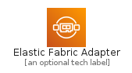
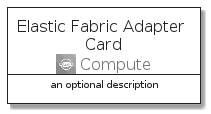
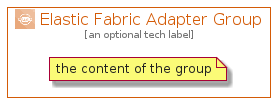

# ElasticFabricAdapter


```text
aws-q3-2021/Architecture/Compute/ElasticFabricAdapter
```

```text
include('aws-q3-2021/Architecture/Compute/ElasticFabricAdapter')
```


| Illustration | ElasticFabricAdapter | ElasticFabricAdapterCard | ElasticFabricAdapterGroup |
| :---: | :---: | :---: | :---: |
|  |  |  |  |


## ElasticFabricAdapter

### Load remotely
```plantuml
@startuml
' configures the library
!global $LIB_BASE_LOCATION="https://raw.githubusercontent.com/tmorin/plantuml-libs/master/distribution"

' loads the library's bootstrap
!include $LIB_BASE_LOCATION/bootstrap.puml

' loads the package bootstrap
include('aws-q3-2021/bootstrap')

' loads the Item which embeds the element ElasticFabricAdapter
include('aws-q3-2021/Architecture/Compute/ElasticFabricAdapter')

' renders the element
ElasticFabricAdapter('ElasticFabricAdapter', 'Elastic Fabric Adapter', 'an optional tech label')
@enduml
```

### Load locally
```plantuml
@startuml
' configures the library
!global $INCLUSION_MODE="local"
!global $LIB_BASE_LOCATION="../../.."

' loads the library's bootstrap
!include $LIB_BASE_LOCATION/bootstrap.puml

' loads the package bootstrap
include('aws-q3-2021/bootstrap')

' loads the Item which embeds the element ElasticFabricAdapter
include('aws-q3-2021/Architecture/Compute/ElasticFabricAdapter')

' renders the element
ElasticFabricAdapter('ElasticFabricAdapter', 'Elastic Fabric Adapter', 'an optional tech label')
@enduml
```

## ElasticFabricAdapterCard

### Load remotely
```plantuml
@startuml
' configures the library
!global $LIB_BASE_LOCATION="https://raw.githubusercontent.com/tmorin/plantuml-libs/master/distribution"

' loads the library's bootstrap
!include $LIB_BASE_LOCATION/bootstrap.puml

' loads the package bootstrap
include('aws-q3-2021/bootstrap')

' loads the Item which embeds the element ElasticFabricAdapterCard
include('aws-q3-2021/Architecture/Compute/ElasticFabricAdapter')

' renders the element
ElasticFabricAdapterCard('ElasticFabricAdapterCard', 'Elastic Fabric Adapter Card', 'an optional description')
@enduml
```

### Load locally
```plantuml
@startuml
' configures the library
!global $INCLUSION_MODE="local"
!global $LIB_BASE_LOCATION="../../.."

' loads the library's bootstrap
!include $LIB_BASE_LOCATION/bootstrap.puml

' loads the package bootstrap
include('aws-q3-2021/bootstrap')

' loads the Item which embeds the element ElasticFabricAdapterCard
include('aws-q3-2021/Architecture/Compute/ElasticFabricAdapter')

' renders the element
ElasticFabricAdapterCard('ElasticFabricAdapterCard', 'Elastic Fabric Adapter Card', 'an optional description')
@enduml
```

## ElasticFabricAdapterGroup

### Load remotely
```plantuml
@startuml
' configures the library
!global $LIB_BASE_LOCATION="https://raw.githubusercontent.com/tmorin/plantuml-libs/master/distribution"

' loads the library's bootstrap
!include $LIB_BASE_LOCATION/bootstrap.puml

' loads the package bootstrap
include('aws-q3-2021/bootstrap')

' loads the Item which embeds the element ElasticFabricAdapterGroup
include('aws-q3-2021/Architecture/Compute/ElasticFabricAdapter')

' renders the element
ElasticFabricAdapterGroup('ElasticFabricAdapterGroup', 'Elastic Fabric Adapter Group', 'an optional tech label') {
    note as note
        the content of the group
    end note
}
@enduml
```

### Load locally
```plantuml
@startuml
' configures the library
!global $INCLUSION_MODE="local"
!global $LIB_BASE_LOCATION="../../.."

' loads the library's bootstrap
!include $LIB_BASE_LOCATION/bootstrap.puml

' loads the package bootstrap
include('aws-q3-2021/bootstrap')

' loads the Item which embeds the element ElasticFabricAdapterGroup
include('aws-q3-2021/Architecture/Compute/ElasticFabricAdapter')

' renders the element
ElasticFabricAdapterGroup('ElasticFabricAdapterGroup', 'Elastic Fabric Adapter Group', 'an optional tech label') {
    note as note
        the content of the group
    end note
}
@enduml
```

