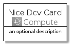
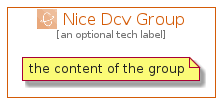

# NiceDcv


```text
aws-q3-2021/Architecture/Compute/NiceDcv
```

```text
include('aws-q3-2021/Architecture/Compute/NiceDcv')
```


| Illustration | NiceDcv | NiceDcvCard | NiceDcvGroup |
| :---: | :---: | :---: | :---: |
|  |  |  |  |


## NiceDcv

### Load remotely
```plantuml
@startuml
' configures the library
!global $LIB_BASE_LOCATION="https://raw.githubusercontent.com/tmorin/plantuml-libs/master/distribution"

' loads the library's bootstrap
!include $LIB_BASE_LOCATION/bootstrap.puml

' loads the package bootstrap
include('aws-q3-2021/bootstrap')

' loads the Item which embeds the element NiceDcv
include('aws-q3-2021/Architecture/Compute/NiceDcv')

' renders the element
NiceDcv('NiceDcv', 'Nice Dcv', 'an optional tech label')
@enduml
```

### Load locally
```plantuml
@startuml
' configures the library
!global $INCLUSION_MODE="local"
!global $LIB_BASE_LOCATION="../../.."

' loads the library's bootstrap
!include $LIB_BASE_LOCATION/bootstrap.puml

' loads the package bootstrap
include('aws-q3-2021/bootstrap')

' loads the Item which embeds the element NiceDcv
include('aws-q3-2021/Architecture/Compute/NiceDcv')

' renders the element
NiceDcv('NiceDcv', 'Nice Dcv', 'an optional tech label')
@enduml
```

## NiceDcvCard

### Load remotely
```plantuml
@startuml
' configures the library
!global $LIB_BASE_LOCATION="https://raw.githubusercontent.com/tmorin/plantuml-libs/master/distribution"

' loads the library's bootstrap
!include $LIB_BASE_LOCATION/bootstrap.puml

' loads the package bootstrap
include('aws-q3-2021/bootstrap')

' loads the Item which embeds the element NiceDcvCard
include('aws-q3-2021/Architecture/Compute/NiceDcv')

' renders the element
NiceDcvCard('NiceDcvCard', 'Nice Dcv Card', 'an optional description')
@enduml
```

### Load locally
```plantuml
@startuml
' configures the library
!global $INCLUSION_MODE="local"
!global $LIB_BASE_LOCATION="../../.."

' loads the library's bootstrap
!include $LIB_BASE_LOCATION/bootstrap.puml

' loads the package bootstrap
include('aws-q3-2021/bootstrap')

' loads the Item which embeds the element NiceDcvCard
include('aws-q3-2021/Architecture/Compute/NiceDcv')

' renders the element
NiceDcvCard('NiceDcvCard', 'Nice Dcv Card', 'an optional description')
@enduml
```

## NiceDcvGroup

### Load remotely
```plantuml
@startuml
' configures the library
!global $LIB_BASE_LOCATION="https://raw.githubusercontent.com/tmorin/plantuml-libs/master/distribution"

' loads the library's bootstrap
!include $LIB_BASE_LOCATION/bootstrap.puml

' loads the package bootstrap
include('aws-q3-2021/bootstrap')

' loads the Item which embeds the element NiceDcvGroup
include('aws-q3-2021/Architecture/Compute/NiceDcv')

' renders the element
NiceDcvGroup('NiceDcvGroup', 'Nice Dcv Group', 'an optional tech label') {
    note as note
        the content of the group
    end note
}
@enduml
```

### Load locally
```plantuml
@startuml
' configures the library
!global $INCLUSION_MODE="local"
!global $LIB_BASE_LOCATION="../../.."

' loads the library's bootstrap
!include $LIB_BASE_LOCATION/bootstrap.puml

' loads the package bootstrap
include('aws-q3-2021/bootstrap')

' loads the Item which embeds the element NiceDcvGroup
include('aws-q3-2021/Architecture/Compute/NiceDcv')

' renders the element
NiceDcvGroup('NiceDcvGroup', 'Nice Dcv Group', 'an optional tech label') {
    note as note
        the content of the group
    end note
}
@enduml
```

