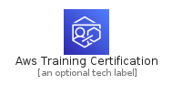
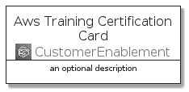
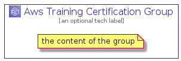

# AwsTrainingCertification


```text
aws-q3-2021/Architecture/CustomerEnablement/AwsTrainingCertification
```

```text
include('aws-q3-2021/Architecture/CustomerEnablement/AwsTrainingCertification')
```


| Illustration | AwsTrainingCertification | AwsTrainingCertificationCard | AwsTrainingCertificationGroup |
| :---: | :---: | :---: | :---: |
|  |  |  |  |


## AwsTrainingCertification

### Load remotely
```plantuml
@startuml
' configures the library
!global $LIB_BASE_LOCATION="https://github.com/tmorin/plantuml-libs/distribution"

' loads the library's bootstrap
!include $LIB_BASE_LOCATION/bootstrap.puml

' loads the package bootstrap
include('aws-q3-2021/bootstrap')

' loads the Item which embeds the element AwsTrainingCertification
include('aws-q3-2021/Architecture/CustomerEnablement/AwsTrainingCertification')

' renders the element
AwsTrainingCertification('AwsTrainingCertification', 'Aws Training Certification', 'an optional tech label')
@enduml
```

### Load locally
```plantuml
@startuml
' configures the library
!global $INCLUSION_MODE="local"
!global $LIB_BASE_LOCATION="../../.."

' loads the library's bootstrap
!include $LIB_BASE_LOCATION/bootstrap.puml

' loads the package bootstrap
include('aws-q3-2021/bootstrap')

' loads the Item which embeds the element AwsTrainingCertification
include('aws-q3-2021/Architecture/CustomerEnablement/AwsTrainingCertification')

' renders the element
AwsTrainingCertification('AwsTrainingCertification', 'Aws Training Certification', 'an optional tech label')
@enduml
```

## AwsTrainingCertificationCard

### Load remotely
```plantuml
@startuml
' configures the library
!global $LIB_BASE_LOCATION="https://github.com/tmorin/plantuml-libs/distribution"

' loads the library's bootstrap
!include $LIB_BASE_LOCATION/bootstrap.puml

' loads the package bootstrap
include('aws-q3-2021/bootstrap')

' loads the Item which embeds the element AwsTrainingCertificationCard
include('aws-q3-2021/Architecture/CustomerEnablement/AwsTrainingCertification')

' renders the element
AwsTrainingCertificationCard('AwsTrainingCertificationCard', 'Aws Training Certification Card', 'an optional description')
@enduml
```

### Load locally
```plantuml
@startuml
' configures the library
!global $INCLUSION_MODE="local"
!global $LIB_BASE_LOCATION="../../.."

' loads the library's bootstrap
!include $LIB_BASE_LOCATION/bootstrap.puml

' loads the package bootstrap
include('aws-q3-2021/bootstrap')

' loads the Item which embeds the element AwsTrainingCertificationCard
include('aws-q3-2021/Architecture/CustomerEnablement/AwsTrainingCertification')

' renders the element
AwsTrainingCertificationCard('AwsTrainingCertificationCard', 'Aws Training Certification Card', 'an optional description')
@enduml
```

## AwsTrainingCertificationGroup

### Load remotely
```plantuml
@startuml
' configures the library
!global $LIB_BASE_LOCATION="https://github.com/tmorin/plantuml-libs/distribution"

' loads the library's bootstrap
!include $LIB_BASE_LOCATION/bootstrap.puml

' loads the package bootstrap
include('aws-q3-2021/bootstrap')

' loads the Item which embeds the element AwsTrainingCertificationGroup
include('aws-q3-2021/Architecture/CustomerEnablement/AwsTrainingCertification')

' renders the element
AwsTrainingCertificationGroup('AwsTrainingCertificationGroup', 'Aws Training Certification Group', 'an optional tech label') {
    note as note
        the content of the group
    end note
}
@enduml
```

### Load locally
```plantuml
@startuml
' configures the library
!global $INCLUSION_MODE="local"
!global $LIB_BASE_LOCATION="../../.."

' loads the library's bootstrap
!include $LIB_BASE_LOCATION/bootstrap.puml

' loads the package bootstrap
include('aws-q3-2021/bootstrap')

' loads the Item which embeds the element AwsTrainingCertificationGroup
include('aws-q3-2021/Architecture/CustomerEnablement/AwsTrainingCertification')

' renders the element
AwsTrainingCertificationGroup('AwsTrainingCertificationGroup', 'Aws Training Certification Group', 'an optional tech label') {
    note as note
        the content of the group
    end note
}
@enduml
```

