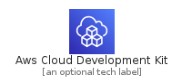
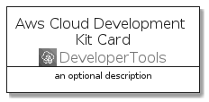
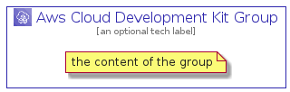

# AwsCloudDevelopmentKit


```text
aws-q3-2021/Architecture/DeveloperTools/AwsCloudDevelopmentKit
```

```text
include('aws-q3-2021/Architecture/DeveloperTools/AwsCloudDevelopmentKit')
```


| Illustration | AwsCloudDevelopmentKit | AwsCloudDevelopmentKitCard | AwsCloudDevelopmentKitGroup |
| :---: | :---: | :---: | :---: |
|  |  |  |  |


## AwsCloudDevelopmentKit

### Load remotely
```plantuml
@startuml
' configures the library
!global $LIB_BASE_LOCATION="https://raw.githubusercontent.com/tmorin/plantuml-libs/master/distribution"

' loads the library's bootstrap
!include $LIB_BASE_LOCATION/bootstrap.puml

' loads the package bootstrap
include('aws-q3-2021/bootstrap')

' loads the Item which embeds the element AwsCloudDevelopmentKit
include('aws-q3-2021/Architecture/DeveloperTools/AwsCloudDevelopmentKit')

' renders the element
AwsCloudDevelopmentKit('AwsCloudDevelopmentKit', 'Aws Cloud Development Kit', 'an optional tech label')
@enduml
```

### Load locally
```plantuml
@startuml
' configures the library
!global $INCLUSION_MODE="local"
!global $LIB_BASE_LOCATION="../../.."

' loads the library's bootstrap
!include $LIB_BASE_LOCATION/bootstrap.puml

' loads the package bootstrap
include('aws-q3-2021/bootstrap')

' loads the Item which embeds the element AwsCloudDevelopmentKit
include('aws-q3-2021/Architecture/DeveloperTools/AwsCloudDevelopmentKit')

' renders the element
AwsCloudDevelopmentKit('AwsCloudDevelopmentKit', 'Aws Cloud Development Kit', 'an optional tech label')
@enduml
```

## AwsCloudDevelopmentKitCard

### Load remotely
```plantuml
@startuml
' configures the library
!global $LIB_BASE_LOCATION="https://raw.githubusercontent.com/tmorin/plantuml-libs/master/distribution"

' loads the library's bootstrap
!include $LIB_BASE_LOCATION/bootstrap.puml

' loads the package bootstrap
include('aws-q3-2021/bootstrap')

' loads the Item which embeds the element AwsCloudDevelopmentKitCard
include('aws-q3-2021/Architecture/DeveloperTools/AwsCloudDevelopmentKit')

' renders the element
AwsCloudDevelopmentKitCard('AwsCloudDevelopmentKitCard', 'Aws Cloud Development Kit Card', 'an optional description')
@enduml
```

### Load locally
```plantuml
@startuml
' configures the library
!global $INCLUSION_MODE="local"
!global $LIB_BASE_LOCATION="../../.."

' loads the library's bootstrap
!include $LIB_BASE_LOCATION/bootstrap.puml

' loads the package bootstrap
include('aws-q3-2021/bootstrap')

' loads the Item which embeds the element AwsCloudDevelopmentKitCard
include('aws-q3-2021/Architecture/DeveloperTools/AwsCloudDevelopmentKit')

' renders the element
AwsCloudDevelopmentKitCard('AwsCloudDevelopmentKitCard', 'Aws Cloud Development Kit Card', 'an optional description')
@enduml
```

## AwsCloudDevelopmentKitGroup

### Load remotely
```plantuml
@startuml
' configures the library
!global $LIB_BASE_LOCATION="https://raw.githubusercontent.com/tmorin/plantuml-libs/master/distribution"

' loads the library's bootstrap
!include $LIB_BASE_LOCATION/bootstrap.puml

' loads the package bootstrap
include('aws-q3-2021/bootstrap')

' loads the Item which embeds the element AwsCloudDevelopmentKitGroup
include('aws-q3-2021/Architecture/DeveloperTools/AwsCloudDevelopmentKit')

' renders the element
AwsCloudDevelopmentKitGroup('AwsCloudDevelopmentKitGroup', 'Aws Cloud Development Kit Group', 'an optional tech label') {
    note as note
        the content of the group
    end note
}
@enduml
```

### Load locally
```plantuml
@startuml
' configures the library
!global $INCLUSION_MODE="local"
!global $LIB_BASE_LOCATION="../../.."

' loads the library's bootstrap
!include $LIB_BASE_LOCATION/bootstrap.puml

' loads the package bootstrap
include('aws-q3-2021/bootstrap')

' loads the Item which embeds the element AwsCloudDevelopmentKitGroup
include('aws-q3-2021/Architecture/DeveloperTools/AwsCloudDevelopmentKit')

' renders the element
AwsCloudDevelopmentKitGroup('AwsCloudDevelopmentKitGroup', 'Aws Cloud Development Kit Group', 'an optional tech label') {
    note as note
        the content of the group
    end note
}
@enduml
```

