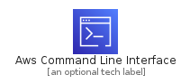
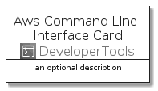
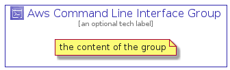

# AwsCommandLineInterface


```text
aws-q3-2021/Architecture/DeveloperTools/AwsCommandLineInterface
```

```text
include('aws-q3-2021/Architecture/DeveloperTools/AwsCommandLineInterface')
```


| Illustration | AwsCommandLineInterface | AwsCommandLineInterfaceCard | AwsCommandLineInterfaceGroup |
| :---: | :---: | :---: | :---: |
|  |  |  |  |


## AwsCommandLineInterface

### Load remotely
```plantuml
@startuml
' configures the library
!global $LIB_BASE_LOCATION="https://github.com/tmorin/plantuml-libs/distribution"

' loads the library's bootstrap
!include $LIB_BASE_LOCATION/bootstrap.puml

' loads the package bootstrap
include('aws-q3-2021/bootstrap')

' loads the Item which embeds the element AwsCommandLineInterface
include('aws-q3-2021/Architecture/DeveloperTools/AwsCommandLineInterface')

' renders the element
AwsCommandLineInterface('AwsCommandLineInterface', 'Aws Command Line Interface', 'an optional tech label')
@enduml
```

### Load locally
```plantuml
@startuml
' configures the library
!global $INCLUSION_MODE="local"
!global $LIB_BASE_LOCATION="../../.."

' loads the library's bootstrap
!include $LIB_BASE_LOCATION/bootstrap.puml

' loads the package bootstrap
include('aws-q3-2021/bootstrap')

' loads the Item which embeds the element AwsCommandLineInterface
include('aws-q3-2021/Architecture/DeveloperTools/AwsCommandLineInterface')

' renders the element
AwsCommandLineInterface('AwsCommandLineInterface', 'Aws Command Line Interface', 'an optional tech label')
@enduml
```

## AwsCommandLineInterfaceCard

### Load remotely
```plantuml
@startuml
' configures the library
!global $LIB_BASE_LOCATION="https://github.com/tmorin/plantuml-libs/distribution"

' loads the library's bootstrap
!include $LIB_BASE_LOCATION/bootstrap.puml

' loads the package bootstrap
include('aws-q3-2021/bootstrap')

' loads the Item which embeds the element AwsCommandLineInterfaceCard
include('aws-q3-2021/Architecture/DeveloperTools/AwsCommandLineInterface')

' renders the element
AwsCommandLineInterfaceCard('AwsCommandLineInterfaceCard', 'Aws Command Line Interface Card', 'an optional description')
@enduml
```

### Load locally
```plantuml
@startuml
' configures the library
!global $INCLUSION_MODE="local"
!global $LIB_BASE_LOCATION="../../.."

' loads the library's bootstrap
!include $LIB_BASE_LOCATION/bootstrap.puml

' loads the package bootstrap
include('aws-q3-2021/bootstrap')

' loads the Item which embeds the element AwsCommandLineInterfaceCard
include('aws-q3-2021/Architecture/DeveloperTools/AwsCommandLineInterface')

' renders the element
AwsCommandLineInterfaceCard('AwsCommandLineInterfaceCard', 'Aws Command Line Interface Card', 'an optional description')
@enduml
```

## AwsCommandLineInterfaceGroup

### Load remotely
```plantuml
@startuml
' configures the library
!global $LIB_BASE_LOCATION="https://github.com/tmorin/plantuml-libs/distribution"

' loads the library's bootstrap
!include $LIB_BASE_LOCATION/bootstrap.puml

' loads the package bootstrap
include('aws-q3-2021/bootstrap')

' loads the Item which embeds the element AwsCommandLineInterfaceGroup
include('aws-q3-2021/Architecture/DeveloperTools/AwsCommandLineInterface')

' renders the element
AwsCommandLineInterfaceGroup('AwsCommandLineInterfaceGroup', 'Aws Command Line Interface Group', 'an optional tech label') {
    note as note
        the content of the group
    end note
}
@enduml
```

### Load locally
```plantuml
@startuml
' configures the library
!global $INCLUSION_MODE="local"
!global $LIB_BASE_LOCATION="../../.."

' loads the library's bootstrap
!include $LIB_BASE_LOCATION/bootstrap.puml

' loads the package bootstrap
include('aws-q3-2021/bootstrap')

' loads the Item which embeds the element AwsCommandLineInterfaceGroup
include('aws-q3-2021/Architecture/DeveloperTools/AwsCommandLineInterface')

' renders the element
AwsCommandLineInterfaceGroup('AwsCommandLineInterfaceGroup', 'Aws Command Line Interface Group', 'an optional tech label') {
    note as note
        the content of the group
    end note
}
@enduml
```

