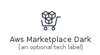
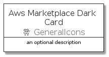
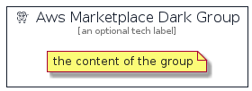

# AwsMarketplaceDark


```text
aws-q3-2021/Architecture/GeneralIcons/AwsMarketplaceDark
```

```text
include('aws-q3-2021/Architecture/GeneralIcons/AwsMarketplaceDark')
```


| Illustration | AwsMarketplaceDark | AwsMarketplaceDarkCard | AwsMarketplaceDarkGroup |
| :---: | :---: | :---: | :---: |
|  |  |  |  |


## AwsMarketplaceDark

### Load remotely
```plantuml
@startuml
' configures the library
!global $LIB_BASE_LOCATION="https://github.com/tmorin/plantuml-libs/distribution"

' loads the library's bootstrap
!include $LIB_BASE_LOCATION/bootstrap.puml

' loads the package bootstrap
include('aws-q3-2021/bootstrap')

' loads the Item which embeds the element AwsMarketplaceDark
include('aws-q3-2021/Architecture/GeneralIcons/AwsMarketplaceDark')

' renders the element
AwsMarketplaceDark('AwsMarketplaceDark', 'Aws Marketplace Dark', 'an optional tech label')
@enduml
```

### Load locally
```plantuml
@startuml
' configures the library
!global $INCLUSION_MODE="local"
!global $LIB_BASE_LOCATION="../../.."

' loads the library's bootstrap
!include $LIB_BASE_LOCATION/bootstrap.puml

' loads the package bootstrap
include('aws-q3-2021/bootstrap')

' loads the Item which embeds the element AwsMarketplaceDark
include('aws-q3-2021/Architecture/GeneralIcons/AwsMarketplaceDark')

' renders the element
AwsMarketplaceDark('AwsMarketplaceDark', 'Aws Marketplace Dark', 'an optional tech label')
@enduml
```

## AwsMarketplaceDarkCard

### Load remotely
```plantuml
@startuml
' configures the library
!global $LIB_BASE_LOCATION="https://github.com/tmorin/plantuml-libs/distribution"

' loads the library's bootstrap
!include $LIB_BASE_LOCATION/bootstrap.puml

' loads the package bootstrap
include('aws-q3-2021/bootstrap')

' loads the Item which embeds the element AwsMarketplaceDarkCard
include('aws-q3-2021/Architecture/GeneralIcons/AwsMarketplaceDark')

' renders the element
AwsMarketplaceDarkCard('AwsMarketplaceDarkCard', 'Aws Marketplace Dark Card', 'an optional description')
@enduml
```

### Load locally
```plantuml
@startuml
' configures the library
!global $INCLUSION_MODE="local"
!global $LIB_BASE_LOCATION="../../.."

' loads the library's bootstrap
!include $LIB_BASE_LOCATION/bootstrap.puml

' loads the package bootstrap
include('aws-q3-2021/bootstrap')

' loads the Item which embeds the element AwsMarketplaceDarkCard
include('aws-q3-2021/Architecture/GeneralIcons/AwsMarketplaceDark')

' renders the element
AwsMarketplaceDarkCard('AwsMarketplaceDarkCard', 'Aws Marketplace Dark Card', 'an optional description')
@enduml
```

## AwsMarketplaceDarkGroup

### Load remotely
```plantuml
@startuml
' configures the library
!global $LIB_BASE_LOCATION="https://github.com/tmorin/plantuml-libs/distribution"

' loads the library's bootstrap
!include $LIB_BASE_LOCATION/bootstrap.puml

' loads the package bootstrap
include('aws-q3-2021/bootstrap')

' loads the Item which embeds the element AwsMarketplaceDarkGroup
include('aws-q3-2021/Architecture/GeneralIcons/AwsMarketplaceDark')

' renders the element
AwsMarketplaceDarkGroup('AwsMarketplaceDarkGroup', 'Aws Marketplace Dark Group', 'an optional tech label') {
    note as note
        the content of the group
    end note
}
@enduml
```

### Load locally
```plantuml
@startuml
' configures the library
!global $INCLUSION_MODE="local"
!global $LIB_BASE_LOCATION="../../.."

' loads the library's bootstrap
!include $LIB_BASE_LOCATION/bootstrap.puml

' loads the package bootstrap
include('aws-q3-2021/bootstrap')

' loads the Item which embeds the element AwsMarketplaceDarkGroup
include('aws-q3-2021/Architecture/GeneralIcons/AwsMarketplaceDark')

' renders the element
AwsMarketplaceDarkGroup('AwsMarketplaceDarkGroup', 'Aws Marketplace Dark Group', 'an optional tech label') {
    note as note
        the content of the group
    end note
}
@enduml
```

