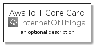
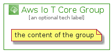

# AwsIoTCore


```text
aws-q3-2021/Architecture/InternetOfThings/AwsIoTCore
```

```text
include('aws-q3-2021/Architecture/InternetOfThings/AwsIoTCore')
```


| Illustration | AwsIoTCore | AwsIoTCoreCard | AwsIoTCoreGroup |
| :---: | :---: | :---: | :---: |
|  |  |  |  |


## AwsIoTCore

### Load remotely
```plantuml
@startuml
' configures the library
!global $LIB_BASE_LOCATION="https://github.com/tmorin/plantuml-libs/distribution"

' loads the library's bootstrap
!include $LIB_BASE_LOCATION/bootstrap.puml

' loads the package bootstrap
include('aws-q3-2021/bootstrap')

' loads the Item which embeds the element AwsIoTCore
include('aws-q3-2021/Architecture/InternetOfThings/AwsIoTCore')

' renders the element
AwsIoTCore('AwsIoTCore', 'Aws Io T Core', 'an optional tech label')
@enduml
```

### Load locally
```plantuml
@startuml
' configures the library
!global $INCLUSION_MODE="local"
!global $LIB_BASE_LOCATION="../../.."

' loads the library's bootstrap
!include $LIB_BASE_LOCATION/bootstrap.puml

' loads the package bootstrap
include('aws-q3-2021/bootstrap')

' loads the Item which embeds the element AwsIoTCore
include('aws-q3-2021/Architecture/InternetOfThings/AwsIoTCore')

' renders the element
AwsIoTCore('AwsIoTCore', 'Aws Io T Core', 'an optional tech label')
@enduml
```

## AwsIoTCoreCard

### Load remotely
```plantuml
@startuml
' configures the library
!global $LIB_BASE_LOCATION="https://github.com/tmorin/plantuml-libs/distribution"

' loads the library's bootstrap
!include $LIB_BASE_LOCATION/bootstrap.puml

' loads the package bootstrap
include('aws-q3-2021/bootstrap')

' loads the Item which embeds the element AwsIoTCoreCard
include('aws-q3-2021/Architecture/InternetOfThings/AwsIoTCore')

' renders the element
AwsIoTCoreCard('AwsIoTCoreCard', 'Aws Io T Core Card', 'an optional description')
@enduml
```

### Load locally
```plantuml
@startuml
' configures the library
!global $INCLUSION_MODE="local"
!global $LIB_BASE_LOCATION="../../.."

' loads the library's bootstrap
!include $LIB_BASE_LOCATION/bootstrap.puml

' loads the package bootstrap
include('aws-q3-2021/bootstrap')

' loads the Item which embeds the element AwsIoTCoreCard
include('aws-q3-2021/Architecture/InternetOfThings/AwsIoTCore')

' renders the element
AwsIoTCoreCard('AwsIoTCoreCard', 'Aws Io T Core Card', 'an optional description')
@enduml
```

## AwsIoTCoreGroup

### Load remotely
```plantuml
@startuml
' configures the library
!global $LIB_BASE_LOCATION="https://github.com/tmorin/plantuml-libs/distribution"

' loads the library's bootstrap
!include $LIB_BASE_LOCATION/bootstrap.puml

' loads the package bootstrap
include('aws-q3-2021/bootstrap')

' loads the Item which embeds the element AwsIoTCoreGroup
include('aws-q3-2021/Architecture/InternetOfThings/AwsIoTCore')

' renders the element
AwsIoTCoreGroup('AwsIoTCoreGroup', 'Aws Io T Core Group', 'an optional tech label') {
    note as note
        the content of the group
    end note
}
@enduml
```

### Load locally
```plantuml
@startuml
' configures the library
!global $INCLUSION_MODE="local"
!global $LIB_BASE_LOCATION="../../.."

' loads the library's bootstrap
!include $LIB_BASE_LOCATION/bootstrap.puml

' loads the package bootstrap
include('aws-q3-2021/bootstrap')

' loads the Item which embeds the element AwsIoTCoreGroup
include('aws-q3-2021/Architecture/InternetOfThings/AwsIoTCore')

' renders the element
AwsIoTCoreGroup('AwsIoTCoreGroup', 'Aws Io T Core Group', 'an optional tech label') {
    note as note
        the content of the group
    end note
}
@enduml
```

