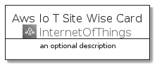
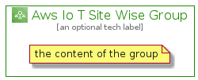

# AwsIoTSiteWise


```text
aws-q3-2021/Architecture/InternetOfThings/AwsIoTSiteWise
```

```text
include('aws-q3-2021/Architecture/InternetOfThings/AwsIoTSiteWise')
```


| Illustration | AwsIoTSiteWise | AwsIoTSiteWiseCard | AwsIoTSiteWiseGroup |
| :---: | :---: | :---: | :---: |
|  |  |  |  |


## AwsIoTSiteWise

### Load remotely
```plantuml
@startuml
' configures the library
!global $LIB_BASE_LOCATION="https://github.com/tmorin/plantuml-libs/distribution"

' loads the library's bootstrap
!include $LIB_BASE_LOCATION/bootstrap.puml

' loads the package bootstrap
include('aws-q3-2021/bootstrap')

' loads the Item which embeds the element AwsIoTSiteWise
include('aws-q3-2021/Architecture/InternetOfThings/AwsIoTSiteWise')

' renders the element
AwsIoTSiteWise('AwsIoTSiteWise', 'Aws Io T Site Wise', 'an optional tech label')
@enduml
```

### Load locally
```plantuml
@startuml
' configures the library
!global $INCLUSION_MODE="local"
!global $LIB_BASE_LOCATION="../../.."

' loads the library's bootstrap
!include $LIB_BASE_LOCATION/bootstrap.puml

' loads the package bootstrap
include('aws-q3-2021/bootstrap')

' loads the Item which embeds the element AwsIoTSiteWise
include('aws-q3-2021/Architecture/InternetOfThings/AwsIoTSiteWise')

' renders the element
AwsIoTSiteWise('AwsIoTSiteWise', 'Aws Io T Site Wise', 'an optional tech label')
@enduml
```

## AwsIoTSiteWiseCard

### Load remotely
```plantuml
@startuml
' configures the library
!global $LIB_BASE_LOCATION="https://github.com/tmorin/plantuml-libs/distribution"

' loads the library's bootstrap
!include $LIB_BASE_LOCATION/bootstrap.puml

' loads the package bootstrap
include('aws-q3-2021/bootstrap')

' loads the Item which embeds the element AwsIoTSiteWiseCard
include('aws-q3-2021/Architecture/InternetOfThings/AwsIoTSiteWise')

' renders the element
AwsIoTSiteWiseCard('AwsIoTSiteWiseCard', 'Aws Io T Site Wise Card', 'an optional description')
@enduml
```

### Load locally
```plantuml
@startuml
' configures the library
!global $INCLUSION_MODE="local"
!global $LIB_BASE_LOCATION="../../.."

' loads the library's bootstrap
!include $LIB_BASE_LOCATION/bootstrap.puml

' loads the package bootstrap
include('aws-q3-2021/bootstrap')

' loads the Item which embeds the element AwsIoTSiteWiseCard
include('aws-q3-2021/Architecture/InternetOfThings/AwsIoTSiteWise')

' renders the element
AwsIoTSiteWiseCard('AwsIoTSiteWiseCard', 'Aws Io T Site Wise Card', 'an optional description')
@enduml
```

## AwsIoTSiteWiseGroup

### Load remotely
```plantuml
@startuml
' configures the library
!global $LIB_BASE_LOCATION="https://github.com/tmorin/plantuml-libs/distribution"

' loads the library's bootstrap
!include $LIB_BASE_LOCATION/bootstrap.puml

' loads the package bootstrap
include('aws-q3-2021/bootstrap')

' loads the Item which embeds the element AwsIoTSiteWiseGroup
include('aws-q3-2021/Architecture/InternetOfThings/AwsIoTSiteWise')

' renders the element
AwsIoTSiteWiseGroup('AwsIoTSiteWiseGroup', 'Aws Io T Site Wise Group', 'an optional tech label') {
    note as note
        the content of the group
    end note
}
@enduml
```

### Load locally
```plantuml
@startuml
' configures the library
!global $INCLUSION_MODE="local"
!global $LIB_BASE_LOCATION="../../.."

' loads the library's bootstrap
!include $LIB_BASE_LOCATION/bootstrap.puml

' loads the package bootstrap
include('aws-q3-2021/bootstrap')

' loads the Item which embeds the element AwsIoTSiteWiseGroup
include('aws-q3-2021/Architecture/InternetOfThings/AwsIoTSiteWise')

' renders the element
AwsIoTSiteWiseGroup('AwsIoTSiteWiseGroup', 'Aws Io T Site Wise Group', 'an optional tech label') {
    note as note
        the content of the group
    end note
}
@enduml
```

