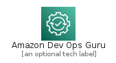
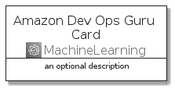
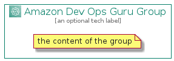

# AmazonDevOpsGuru


```text
aws-q3-2021/Architecture/MachineLearning/AmazonDevOpsGuru
```

```text
include('aws-q3-2021/Architecture/MachineLearning/AmazonDevOpsGuru')
```


| Illustration | AmazonDevOpsGuru | AmazonDevOpsGuruCard | AmazonDevOpsGuruGroup |
| :---: | :---: | :---: | :---: |
|  |  |  |  |


## AmazonDevOpsGuru

### Load remotely
```plantuml
@startuml
' configures the library
!global $LIB_BASE_LOCATION="https://raw.githubusercontent.com/tmorin/plantuml-libs/master/distribution"

' loads the library's bootstrap
!include $LIB_BASE_LOCATION/bootstrap.puml

' loads the package bootstrap
include('aws-q3-2021/bootstrap')

' loads the Item which embeds the element AmazonDevOpsGuru
include('aws-q3-2021/Architecture/MachineLearning/AmazonDevOpsGuru')

' renders the element
AmazonDevOpsGuru('AmazonDevOpsGuru', 'Amazon Dev Ops Guru', 'an optional tech label')
@enduml
```

### Load locally
```plantuml
@startuml
' configures the library
!global $INCLUSION_MODE="local"
!global $LIB_BASE_LOCATION="../../.."

' loads the library's bootstrap
!include $LIB_BASE_LOCATION/bootstrap.puml

' loads the package bootstrap
include('aws-q3-2021/bootstrap')

' loads the Item which embeds the element AmazonDevOpsGuru
include('aws-q3-2021/Architecture/MachineLearning/AmazonDevOpsGuru')

' renders the element
AmazonDevOpsGuru('AmazonDevOpsGuru', 'Amazon Dev Ops Guru', 'an optional tech label')
@enduml
```

## AmazonDevOpsGuruCard

### Load remotely
```plantuml
@startuml
' configures the library
!global $LIB_BASE_LOCATION="https://raw.githubusercontent.com/tmorin/plantuml-libs/master/distribution"

' loads the library's bootstrap
!include $LIB_BASE_LOCATION/bootstrap.puml

' loads the package bootstrap
include('aws-q3-2021/bootstrap')

' loads the Item which embeds the element AmazonDevOpsGuruCard
include('aws-q3-2021/Architecture/MachineLearning/AmazonDevOpsGuru')

' renders the element
AmazonDevOpsGuruCard('AmazonDevOpsGuruCard', 'Amazon Dev Ops Guru Card', 'an optional description')
@enduml
```

### Load locally
```plantuml
@startuml
' configures the library
!global $INCLUSION_MODE="local"
!global $LIB_BASE_LOCATION="../../.."

' loads the library's bootstrap
!include $LIB_BASE_LOCATION/bootstrap.puml

' loads the package bootstrap
include('aws-q3-2021/bootstrap')

' loads the Item which embeds the element AmazonDevOpsGuruCard
include('aws-q3-2021/Architecture/MachineLearning/AmazonDevOpsGuru')

' renders the element
AmazonDevOpsGuruCard('AmazonDevOpsGuruCard', 'Amazon Dev Ops Guru Card', 'an optional description')
@enduml
```

## AmazonDevOpsGuruGroup

### Load remotely
```plantuml
@startuml
' configures the library
!global $LIB_BASE_LOCATION="https://raw.githubusercontent.com/tmorin/plantuml-libs/master/distribution"

' loads the library's bootstrap
!include $LIB_BASE_LOCATION/bootstrap.puml

' loads the package bootstrap
include('aws-q3-2021/bootstrap')

' loads the Item which embeds the element AmazonDevOpsGuruGroup
include('aws-q3-2021/Architecture/MachineLearning/AmazonDevOpsGuru')

' renders the element
AmazonDevOpsGuruGroup('AmazonDevOpsGuruGroup', 'Amazon Dev Ops Guru Group', 'an optional tech label') {
    note as note
        the content of the group
    end note
}
@enduml
```

### Load locally
```plantuml
@startuml
' configures the library
!global $INCLUSION_MODE="local"
!global $LIB_BASE_LOCATION="../../.."

' loads the library's bootstrap
!include $LIB_BASE_LOCATION/bootstrap.puml

' loads the package bootstrap
include('aws-q3-2021/bootstrap')

' loads the Item which embeds the element AmazonDevOpsGuruGroup
include('aws-q3-2021/Architecture/MachineLearning/AmazonDevOpsGuru')

' renders the element
AmazonDevOpsGuruGroup('AmazonDevOpsGuruGroup', 'Amazon Dev Ops Guru Group', 'an optional tech label') {
    note as note
        the content of the group
    end note
}
@enduml
```

