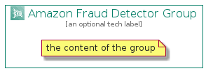

# AmazonFraudDetector


```text
aws-q3-2021/Architecture/MachineLearning/AmazonFraudDetector
```

```text
include('aws-q3-2021/Architecture/MachineLearning/AmazonFraudDetector')
```


| Illustration | AmazonFraudDetector | AmazonFraudDetectorCard | AmazonFraudDetectorGroup |
| :---: | :---: | :---: | :---: |
|  |  |  |  |


## AmazonFraudDetector

### Load remotely
```plantuml
@startuml
' configures the library
!global $LIB_BASE_LOCATION="https://raw.githubusercontent.com/tmorin/plantuml-libs/master/distribution"

' loads the library's bootstrap
!include $LIB_BASE_LOCATION/bootstrap.puml

' loads the package bootstrap
include('aws-q3-2021/bootstrap')

' loads the Item which embeds the element AmazonFraudDetector
include('aws-q3-2021/Architecture/MachineLearning/AmazonFraudDetector')

' renders the element
AmazonFraudDetector('AmazonFraudDetector', 'Amazon Fraud Detector', 'an optional tech label')
@enduml
```

### Load locally
```plantuml
@startuml
' configures the library
!global $INCLUSION_MODE="local"
!global $LIB_BASE_LOCATION="../../.."

' loads the library's bootstrap
!include $LIB_BASE_LOCATION/bootstrap.puml

' loads the package bootstrap
include('aws-q3-2021/bootstrap')

' loads the Item which embeds the element AmazonFraudDetector
include('aws-q3-2021/Architecture/MachineLearning/AmazonFraudDetector')

' renders the element
AmazonFraudDetector('AmazonFraudDetector', 'Amazon Fraud Detector', 'an optional tech label')
@enduml
```

## AmazonFraudDetectorCard

### Load remotely
```plantuml
@startuml
' configures the library
!global $LIB_BASE_LOCATION="https://raw.githubusercontent.com/tmorin/plantuml-libs/master/distribution"

' loads the library's bootstrap
!include $LIB_BASE_LOCATION/bootstrap.puml

' loads the package bootstrap
include('aws-q3-2021/bootstrap')

' loads the Item which embeds the element AmazonFraudDetectorCard
include('aws-q3-2021/Architecture/MachineLearning/AmazonFraudDetector')

' renders the element
AmazonFraudDetectorCard('AmazonFraudDetectorCard', 'Amazon Fraud Detector Card', 'an optional description')
@enduml
```

### Load locally
```plantuml
@startuml
' configures the library
!global $INCLUSION_MODE="local"
!global $LIB_BASE_LOCATION="../../.."

' loads the library's bootstrap
!include $LIB_BASE_LOCATION/bootstrap.puml

' loads the package bootstrap
include('aws-q3-2021/bootstrap')

' loads the Item which embeds the element AmazonFraudDetectorCard
include('aws-q3-2021/Architecture/MachineLearning/AmazonFraudDetector')

' renders the element
AmazonFraudDetectorCard('AmazonFraudDetectorCard', 'Amazon Fraud Detector Card', 'an optional description')
@enduml
```

## AmazonFraudDetectorGroup

### Load remotely
```plantuml
@startuml
' configures the library
!global $LIB_BASE_LOCATION="https://raw.githubusercontent.com/tmorin/plantuml-libs/master/distribution"

' loads the library's bootstrap
!include $LIB_BASE_LOCATION/bootstrap.puml

' loads the package bootstrap
include('aws-q3-2021/bootstrap')

' loads the Item which embeds the element AmazonFraudDetectorGroup
include('aws-q3-2021/Architecture/MachineLearning/AmazonFraudDetector')

' renders the element
AmazonFraudDetectorGroup('AmazonFraudDetectorGroup', 'Amazon Fraud Detector Group', 'an optional tech label') {
    note as note
        the content of the group
    end note
}
@enduml
```

### Load locally
```plantuml
@startuml
' configures the library
!global $INCLUSION_MODE="local"
!global $LIB_BASE_LOCATION="../../.."

' loads the library's bootstrap
!include $LIB_BASE_LOCATION/bootstrap.puml

' loads the package bootstrap
include('aws-q3-2021/bootstrap')

' loads the Item which embeds the element AmazonFraudDetectorGroup
include('aws-q3-2021/Architecture/MachineLearning/AmazonFraudDetector')

' renders the element
AmazonFraudDetectorGroup('AmazonFraudDetectorGroup', 'Amazon Fraud Detector Group', 'an optional tech label') {
    note as note
        the content of the group
    end note
}
@enduml
```

