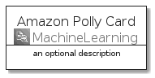
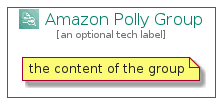

# AmazonPolly


```text
aws-q3-2021/Architecture/MachineLearning/AmazonPolly
```

```text
include('aws-q3-2021/Architecture/MachineLearning/AmazonPolly')
```


| Illustration | AmazonPolly | AmazonPollyCard | AmazonPollyGroup |
| :---: | :---: | :---: | :---: |
|  |  |  |  |


## AmazonPolly

### Load remotely
```plantuml
@startuml
' configures the library
!global $LIB_BASE_LOCATION="https://raw.githubusercontent.com/tmorin/plantuml-libs/master/distribution"

' loads the library's bootstrap
!include $LIB_BASE_LOCATION/bootstrap.puml

' loads the package bootstrap
include('aws-q3-2021/bootstrap')

' loads the Item which embeds the element AmazonPolly
include('aws-q3-2021/Architecture/MachineLearning/AmazonPolly')

' renders the element
AmazonPolly('AmazonPolly', 'Amazon Polly', 'an optional tech label')
@enduml
```

### Load locally
```plantuml
@startuml
' configures the library
!global $INCLUSION_MODE="local"
!global $LIB_BASE_LOCATION="../../.."

' loads the library's bootstrap
!include $LIB_BASE_LOCATION/bootstrap.puml

' loads the package bootstrap
include('aws-q3-2021/bootstrap')

' loads the Item which embeds the element AmazonPolly
include('aws-q3-2021/Architecture/MachineLearning/AmazonPolly')

' renders the element
AmazonPolly('AmazonPolly', 'Amazon Polly', 'an optional tech label')
@enduml
```

## AmazonPollyCard

### Load remotely
```plantuml
@startuml
' configures the library
!global $LIB_BASE_LOCATION="https://raw.githubusercontent.com/tmorin/plantuml-libs/master/distribution"

' loads the library's bootstrap
!include $LIB_BASE_LOCATION/bootstrap.puml

' loads the package bootstrap
include('aws-q3-2021/bootstrap')

' loads the Item which embeds the element AmazonPollyCard
include('aws-q3-2021/Architecture/MachineLearning/AmazonPolly')

' renders the element
AmazonPollyCard('AmazonPollyCard', 'Amazon Polly Card', 'an optional description')
@enduml
```

### Load locally
```plantuml
@startuml
' configures the library
!global $INCLUSION_MODE="local"
!global $LIB_BASE_LOCATION="../../.."

' loads the library's bootstrap
!include $LIB_BASE_LOCATION/bootstrap.puml

' loads the package bootstrap
include('aws-q3-2021/bootstrap')

' loads the Item which embeds the element AmazonPollyCard
include('aws-q3-2021/Architecture/MachineLearning/AmazonPolly')

' renders the element
AmazonPollyCard('AmazonPollyCard', 'Amazon Polly Card', 'an optional description')
@enduml
```

## AmazonPollyGroup

### Load remotely
```plantuml
@startuml
' configures the library
!global $LIB_BASE_LOCATION="https://raw.githubusercontent.com/tmorin/plantuml-libs/master/distribution"

' loads the library's bootstrap
!include $LIB_BASE_LOCATION/bootstrap.puml

' loads the package bootstrap
include('aws-q3-2021/bootstrap')

' loads the Item which embeds the element AmazonPollyGroup
include('aws-q3-2021/Architecture/MachineLearning/AmazonPolly')

' renders the element
AmazonPollyGroup('AmazonPollyGroup', 'Amazon Polly Group', 'an optional tech label') {
    note as note
        the content of the group
    end note
}
@enduml
```

### Load locally
```plantuml
@startuml
' configures the library
!global $INCLUSION_MODE="local"
!global $LIB_BASE_LOCATION="../../.."

' loads the library's bootstrap
!include $LIB_BASE_LOCATION/bootstrap.puml

' loads the package bootstrap
include('aws-q3-2021/bootstrap')

' loads the Item which embeds the element AmazonPollyGroup
include('aws-q3-2021/Architecture/MachineLearning/AmazonPolly')

' renders the element
AmazonPollyGroup('AmazonPollyGroup', 'Amazon Polly Group', 'an optional tech label') {
    note as note
        the content of the group
    end note
}
@enduml
```

