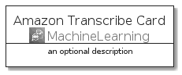
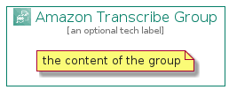

# AmazonTranscribe


```text
aws-q3-2021/Architecture/MachineLearning/AmazonTranscribe
```

```text
include('aws-q3-2021/Architecture/MachineLearning/AmazonTranscribe')
```


| Illustration | AmazonTranscribe | AmazonTranscribeCard | AmazonTranscribeGroup |
| :---: | :---: | :---: | :---: |
|  |  |  |  |


## AmazonTranscribe

### Load remotely
```plantuml
@startuml
' configures the library
!global $LIB_BASE_LOCATION="https://raw.githubusercontent.com/tmorin/plantuml-libs/master/distribution"

' loads the library's bootstrap
!include $LIB_BASE_LOCATION/bootstrap.puml

' loads the package bootstrap
include('aws-q3-2021/bootstrap')

' loads the Item which embeds the element AmazonTranscribe
include('aws-q3-2021/Architecture/MachineLearning/AmazonTranscribe')

' renders the element
AmazonTranscribe('AmazonTranscribe', 'Amazon Transcribe', 'an optional tech label')
@enduml
```

### Load locally
```plantuml
@startuml
' configures the library
!global $INCLUSION_MODE="local"
!global $LIB_BASE_LOCATION="../../.."

' loads the library's bootstrap
!include $LIB_BASE_LOCATION/bootstrap.puml

' loads the package bootstrap
include('aws-q3-2021/bootstrap')

' loads the Item which embeds the element AmazonTranscribe
include('aws-q3-2021/Architecture/MachineLearning/AmazonTranscribe')

' renders the element
AmazonTranscribe('AmazonTranscribe', 'Amazon Transcribe', 'an optional tech label')
@enduml
```

## AmazonTranscribeCard

### Load remotely
```plantuml
@startuml
' configures the library
!global $LIB_BASE_LOCATION="https://raw.githubusercontent.com/tmorin/plantuml-libs/master/distribution"

' loads the library's bootstrap
!include $LIB_BASE_LOCATION/bootstrap.puml

' loads the package bootstrap
include('aws-q3-2021/bootstrap')

' loads the Item which embeds the element AmazonTranscribeCard
include('aws-q3-2021/Architecture/MachineLearning/AmazonTranscribe')

' renders the element
AmazonTranscribeCard('AmazonTranscribeCard', 'Amazon Transcribe Card', 'an optional description')
@enduml
```

### Load locally
```plantuml
@startuml
' configures the library
!global $INCLUSION_MODE="local"
!global $LIB_BASE_LOCATION="../../.."

' loads the library's bootstrap
!include $LIB_BASE_LOCATION/bootstrap.puml

' loads the package bootstrap
include('aws-q3-2021/bootstrap')

' loads the Item which embeds the element AmazonTranscribeCard
include('aws-q3-2021/Architecture/MachineLearning/AmazonTranscribe')

' renders the element
AmazonTranscribeCard('AmazonTranscribeCard', 'Amazon Transcribe Card', 'an optional description')
@enduml
```

## AmazonTranscribeGroup

### Load remotely
```plantuml
@startuml
' configures the library
!global $LIB_BASE_LOCATION="https://raw.githubusercontent.com/tmorin/plantuml-libs/master/distribution"

' loads the library's bootstrap
!include $LIB_BASE_LOCATION/bootstrap.puml

' loads the package bootstrap
include('aws-q3-2021/bootstrap')

' loads the Item which embeds the element AmazonTranscribeGroup
include('aws-q3-2021/Architecture/MachineLearning/AmazonTranscribe')

' renders the element
AmazonTranscribeGroup('AmazonTranscribeGroup', 'Amazon Transcribe Group', 'an optional tech label') {
    note as note
        the content of the group
    end note
}
@enduml
```

### Load locally
```plantuml
@startuml
' configures the library
!global $INCLUSION_MODE="local"
!global $LIB_BASE_LOCATION="../../.."

' loads the library's bootstrap
!include $LIB_BASE_LOCATION/bootstrap.puml

' loads the package bootstrap
include('aws-q3-2021/bootstrap')

' loads the Item which embeds the element AmazonTranscribeGroup
include('aws-q3-2021/Architecture/MachineLearning/AmazonTranscribe')

' renders the element
AmazonTranscribeGroup('AmazonTranscribeGroup', 'Amazon Transcribe Group', 'an optional tech label') {
    note as note
        the content of the group
    end note
}
@enduml
```

