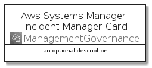
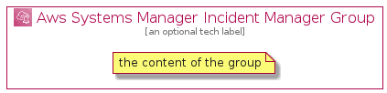

# AwsSystemsManagerIncidentManager


```text
aws-q3-2021/Architecture/ManagementGovernance/AwsSystemsManagerIncidentManager
```

```text
include('aws-q3-2021/Architecture/ManagementGovernance/AwsSystemsManagerIncidentManager')
```


| Illustration | AwsSystemsManagerIncidentManager | AwsSystemsManagerIncidentManagerCard | AwsSystemsManagerIncidentManagerGroup |
| :---: | :---: | :---: | :---: |
|  |  |  |  |


## AwsSystemsManagerIncidentManager

### Load remotely
```plantuml
@startuml
' configures the library
!global $LIB_BASE_LOCATION="https://raw.githubusercontent.com/tmorin/plantuml-libs/master/distribution"

' loads the library's bootstrap
!include $LIB_BASE_LOCATION/bootstrap.puml

' loads the package bootstrap
include('aws-q3-2021/bootstrap')

' loads the Item which embeds the element AwsSystemsManagerIncidentManager
include('aws-q3-2021/Architecture/ManagementGovernance/AwsSystemsManagerIncidentManager')

' renders the element
AwsSystemsManagerIncidentManager('AwsSystemsManagerIncidentManager', 'Aws Systems Manager Incident Manager', 'an optional tech label')
@enduml
```

### Load locally
```plantuml
@startuml
' configures the library
!global $INCLUSION_MODE="local"
!global $LIB_BASE_LOCATION="../../.."

' loads the library's bootstrap
!include $LIB_BASE_LOCATION/bootstrap.puml

' loads the package bootstrap
include('aws-q3-2021/bootstrap')

' loads the Item which embeds the element AwsSystemsManagerIncidentManager
include('aws-q3-2021/Architecture/ManagementGovernance/AwsSystemsManagerIncidentManager')

' renders the element
AwsSystemsManagerIncidentManager('AwsSystemsManagerIncidentManager', 'Aws Systems Manager Incident Manager', 'an optional tech label')
@enduml
```

## AwsSystemsManagerIncidentManagerCard

### Load remotely
```plantuml
@startuml
' configures the library
!global $LIB_BASE_LOCATION="https://raw.githubusercontent.com/tmorin/plantuml-libs/master/distribution"

' loads the library's bootstrap
!include $LIB_BASE_LOCATION/bootstrap.puml

' loads the package bootstrap
include('aws-q3-2021/bootstrap')

' loads the Item which embeds the element AwsSystemsManagerIncidentManagerCard
include('aws-q3-2021/Architecture/ManagementGovernance/AwsSystemsManagerIncidentManager')

' renders the element
AwsSystemsManagerIncidentManagerCard('AwsSystemsManagerIncidentManagerCard', 'Aws Systems Manager Incident Manager Card', 'an optional description')
@enduml
```

### Load locally
```plantuml
@startuml
' configures the library
!global $INCLUSION_MODE="local"
!global $LIB_BASE_LOCATION="../../.."

' loads the library's bootstrap
!include $LIB_BASE_LOCATION/bootstrap.puml

' loads the package bootstrap
include('aws-q3-2021/bootstrap')

' loads the Item which embeds the element AwsSystemsManagerIncidentManagerCard
include('aws-q3-2021/Architecture/ManagementGovernance/AwsSystemsManagerIncidentManager')

' renders the element
AwsSystemsManagerIncidentManagerCard('AwsSystemsManagerIncidentManagerCard', 'Aws Systems Manager Incident Manager Card', 'an optional description')
@enduml
```

## AwsSystemsManagerIncidentManagerGroup

### Load remotely
```plantuml
@startuml
' configures the library
!global $LIB_BASE_LOCATION="https://raw.githubusercontent.com/tmorin/plantuml-libs/master/distribution"

' loads the library's bootstrap
!include $LIB_BASE_LOCATION/bootstrap.puml

' loads the package bootstrap
include('aws-q3-2021/bootstrap')

' loads the Item which embeds the element AwsSystemsManagerIncidentManagerGroup
include('aws-q3-2021/Architecture/ManagementGovernance/AwsSystemsManagerIncidentManager')

' renders the element
AwsSystemsManagerIncidentManagerGroup('AwsSystemsManagerIncidentManagerGroup', 'Aws Systems Manager Incident Manager Group', 'an optional tech label') {
    note as note
        the content of the group
    end note
}
@enduml
```

### Load locally
```plantuml
@startuml
' configures the library
!global $INCLUSION_MODE="local"
!global $LIB_BASE_LOCATION="../../.."

' loads the library's bootstrap
!include $LIB_BASE_LOCATION/bootstrap.puml

' loads the package bootstrap
include('aws-q3-2021/bootstrap')

' loads the Item which embeds the element AwsSystemsManagerIncidentManagerGroup
include('aws-q3-2021/Architecture/ManagementGovernance/AwsSystemsManagerIncidentManager')

' renders the element
AwsSystemsManagerIncidentManagerGroup('AwsSystemsManagerIncidentManagerGroup', 'Aws Systems Manager Incident Manager Group', 'an optional tech label') {
    note as note
        the content of the group
    end note
}
@enduml
```

