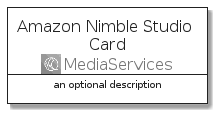
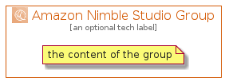

# AmazonNimbleStudio


```text
aws-q3-2021/Architecture/MediaServices/AmazonNimbleStudio
```

```text
include('aws-q3-2021/Architecture/MediaServices/AmazonNimbleStudio')
```


| Illustration | AmazonNimbleStudio | AmazonNimbleStudioCard | AmazonNimbleStudioGroup |
| :---: | :---: | :---: | :---: |
|  |  |  |  |


## AmazonNimbleStudio

### Load remotely
```plantuml
@startuml
' configures the library
!global $LIB_BASE_LOCATION="https://github.com/tmorin/plantuml-libs/distribution"

' loads the library's bootstrap
!include $LIB_BASE_LOCATION/bootstrap.puml

' loads the package bootstrap
include('aws-q3-2021/bootstrap')

' loads the Item which embeds the element AmazonNimbleStudio
include('aws-q3-2021/Architecture/MediaServices/AmazonNimbleStudio')

' renders the element
AmazonNimbleStudio('AmazonNimbleStudio', 'Amazon Nimble Studio', 'an optional tech label')
@enduml
```

### Load locally
```plantuml
@startuml
' configures the library
!global $INCLUSION_MODE="local"
!global $LIB_BASE_LOCATION="../../.."

' loads the library's bootstrap
!include $LIB_BASE_LOCATION/bootstrap.puml

' loads the package bootstrap
include('aws-q3-2021/bootstrap')

' loads the Item which embeds the element AmazonNimbleStudio
include('aws-q3-2021/Architecture/MediaServices/AmazonNimbleStudio')

' renders the element
AmazonNimbleStudio('AmazonNimbleStudio', 'Amazon Nimble Studio', 'an optional tech label')
@enduml
```

## AmazonNimbleStudioCard

### Load remotely
```plantuml
@startuml
' configures the library
!global $LIB_BASE_LOCATION="https://github.com/tmorin/plantuml-libs/distribution"

' loads the library's bootstrap
!include $LIB_BASE_LOCATION/bootstrap.puml

' loads the package bootstrap
include('aws-q3-2021/bootstrap')

' loads the Item which embeds the element AmazonNimbleStudioCard
include('aws-q3-2021/Architecture/MediaServices/AmazonNimbleStudio')

' renders the element
AmazonNimbleStudioCard('AmazonNimbleStudioCard', 'Amazon Nimble Studio Card', 'an optional description')
@enduml
```

### Load locally
```plantuml
@startuml
' configures the library
!global $INCLUSION_MODE="local"
!global $LIB_BASE_LOCATION="../../.."

' loads the library's bootstrap
!include $LIB_BASE_LOCATION/bootstrap.puml

' loads the package bootstrap
include('aws-q3-2021/bootstrap')

' loads the Item which embeds the element AmazonNimbleStudioCard
include('aws-q3-2021/Architecture/MediaServices/AmazonNimbleStudio')

' renders the element
AmazonNimbleStudioCard('AmazonNimbleStudioCard', 'Amazon Nimble Studio Card', 'an optional description')
@enduml
```

## AmazonNimbleStudioGroup

### Load remotely
```plantuml
@startuml
' configures the library
!global $LIB_BASE_LOCATION="https://github.com/tmorin/plantuml-libs/distribution"

' loads the library's bootstrap
!include $LIB_BASE_LOCATION/bootstrap.puml

' loads the package bootstrap
include('aws-q3-2021/bootstrap')

' loads the Item which embeds the element AmazonNimbleStudioGroup
include('aws-q3-2021/Architecture/MediaServices/AmazonNimbleStudio')

' renders the element
AmazonNimbleStudioGroup('AmazonNimbleStudioGroup', 'Amazon Nimble Studio Group', 'an optional tech label') {
    note as note
        the content of the group
    end note
}
@enduml
```

### Load locally
```plantuml
@startuml
' configures the library
!global $INCLUSION_MODE="local"
!global $LIB_BASE_LOCATION="../../.."

' loads the library's bootstrap
!include $LIB_BASE_LOCATION/bootstrap.puml

' loads the package bootstrap
include('aws-q3-2021/bootstrap')

' loads the Item which embeds the element AmazonNimbleStudioGroup
include('aws-q3-2021/Architecture/MediaServices/AmazonNimbleStudio')

' renders the element
AmazonNimbleStudioGroup('AmazonNimbleStudioGroup', 'Amazon Nimble Studio Group', 'an optional tech label') {
    note as note
        the content of the group
    end note
}
@enduml
```

