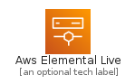
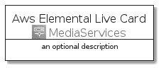
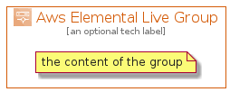

# AwsElementalLive


```text
aws-q3-2021/Architecture/MediaServices/AwsElementalLive
```

```text
include('aws-q3-2021/Architecture/MediaServices/AwsElementalLive')
```


| Illustration | AwsElementalLive | AwsElementalLiveCard | AwsElementalLiveGroup |
| :---: | :---: | :---: | :---: |
|  |  |  |  |


## AwsElementalLive

### Load remotely
```plantuml
@startuml
' configures the library
!global $LIB_BASE_LOCATION="https://raw.githubusercontent.com/tmorin/plantuml-libs/master/distribution"

' loads the library's bootstrap
!include $LIB_BASE_LOCATION/bootstrap.puml

' loads the package bootstrap
include('aws-q3-2021/bootstrap')

' loads the Item which embeds the element AwsElementalLive
include('aws-q3-2021/Architecture/MediaServices/AwsElementalLive')

' renders the element
AwsElementalLive('AwsElementalLive', 'Aws Elemental Live', 'an optional tech label')
@enduml
```

### Load locally
```plantuml
@startuml
' configures the library
!global $INCLUSION_MODE="local"
!global $LIB_BASE_LOCATION="../../.."

' loads the library's bootstrap
!include $LIB_BASE_LOCATION/bootstrap.puml

' loads the package bootstrap
include('aws-q3-2021/bootstrap')

' loads the Item which embeds the element AwsElementalLive
include('aws-q3-2021/Architecture/MediaServices/AwsElementalLive')

' renders the element
AwsElementalLive('AwsElementalLive', 'Aws Elemental Live', 'an optional tech label')
@enduml
```

## AwsElementalLiveCard

### Load remotely
```plantuml
@startuml
' configures the library
!global $LIB_BASE_LOCATION="https://raw.githubusercontent.com/tmorin/plantuml-libs/master/distribution"

' loads the library's bootstrap
!include $LIB_BASE_LOCATION/bootstrap.puml

' loads the package bootstrap
include('aws-q3-2021/bootstrap')

' loads the Item which embeds the element AwsElementalLiveCard
include('aws-q3-2021/Architecture/MediaServices/AwsElementalLive')

' renders the element
AwsElementalLiveCard('AwsElementalLiveCard', 'Aws Elemental Live Card', 'an optional description')
@enduml
```

### Load locally
```plantuml
@startuml
' configures the library
!global $INCLUSION_MODE="local"
!global $LIB_BASE_LOCATION="../../.."

' loads the library's bootstrap
!include $LIB_BASE_LOCATION/bootstrap.puml

' loads the package bootstrap
include('aws-q3-2021/bootstrap')

' loads the Item which embeds the element AwsElementalLiveCard
include('aws-q3-2021/Architecture/MediaServices/AwsElementalLive')

' renders the element
AwsElementalLiveCard('AwsElementalLiveCard', 'Aws Elemental Live Card', 'an optional description')
@enduml
```

## AwsElementalLiveGroup

### Load remotely
```plantuml
@startuml
' configures the library
!global $LIB_BASE_LOCATION="https://raw.githubusercontent.com/tmorin/plantuml-libs/master/distribution"

' loads the library's bootstrap
!include $LIB_BASE_LOCATION/bootstrap.puml

' loads the package bootstrap
include('aws-q3-2021/bootstrap')

' loads the Item which embeds the element AwsElementalLiveGroup
include('aws-q3-2021/Architecture/MediaServices/AwsElementalLive')

' renders the element
AwsElementalLiveGroup('AwsElementalLiveGroup', 'Aws Elemental Live Group', 'an optional tech label') {
    note as note
        the content of the group
    end note
}
@enduml
```

### Load locally
```plantuml
@startuml
' configures the library
!global $INCLUSION_MODE="local"
!global $LIB_BASE_LOCATION="../../.."

' loads the library's bootstrap
!include $LIB_BASE_LOCATION/bootstrap.puml

' loads the package bootstrap
include('aws-q3-2021/bootstrap')

' loads the Item which embeds the element AwsElementalLiveGroup
include('aws-q3-2021/Architecture/MediaServices/AwsElementalLive')

' renders the element
AwsElementalLiveGroup('AwsElementalLiveGroup', 'Aws Elemental Live Group', 'an optional tech label') {
    note as note
        the content of the group
    end note
}
@enduml
```

