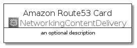
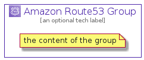

# AmazonRoute53


```text
aws-q3-2021/Architecture/NetworkingContentDelivery/AmazonRoute53
```

```text
include('aws-q3-2021/Architecture/NetworkingContentDelivery/AmazonRoute53')
```


| Illustration | AmazonRoute53 | AmazonRoute53Card | AmazonRoute53Group |
| :---: | :---: | :---: | :---: |
|  |  |  |  |


## AmazonRoute53

### Load remotely
```plantuml
@startuml
' configures the library
!global $LIB_BASE_LOCATION="https://raw.githubusercontent.com/tmorin/plantuml-libs/master/distribution"

' loads the library's bootstrap
!include $LIB_BASE_LOCATION/bootstrap.puml

' loads the package bootstrap
include('aws-q3-2021/bootstrap')

' loads the Item which embeds the element AmazonRoute53
include('aws-q3-2021/Architecture/NetworkingContentDelivery/AmazonRoute53')

' renders the element
AmazonRoute53('AmazonRoute53', 'Amazon Route53', 'an optional tech label')
@enduml
```

### Load locally
```plantuml
@startuml
' configures the library
!global $INCLUSION_MODE="local"
!global $LIB_BASE_LOCATION="../../.."

' loads the library's bootstrap
!include $LIB_BASE_LOCATION/bootstrap.puml

' loads the package bootstrap
include('aws-q3-2021/bootstrap')

' loads the Item which embeds the element AmazonRoute53
include('aws-q3-2021/Architecture/NetworkingContentDelivery/AmazonRoute53')

' renders the element
AmazonRoute53('AmazonRoute53', 'Amazon Route53', 'an optional tech label')
@enduml
```

## AmazonRoute53Card

### Load remotely
```plantuml
@startuml
' configures the library
!global $LIB_BASE_LOCATION="https://raw.githubusercontent.com/tmorin/plantuml-libs/master/distribution"

' loads the library's bootstrap
!include $LIB_BASE_LOCATION/bootstrap.puml

' loads the package bootstrap
include('aws-q3-2021/bootstrap')

' loads the Item which embeds the element AmazonRoute53Card
include('aws-q3-2021/Architecture/NetworkingContentDelivery/AmazonRoute53')

' renders the element
AmazonRoute53Card('AmazonRoute53Card', 'Amazon Route53 Card', 'an optional description')
@enduml
```

### Load locally
```plantuml
@startuml
' configures the library
!global $INCLUSION_MODE="local"
!global $LIB_BASE_LOCATION="../../.."

' loads the library's bootstrap
!include $LIB_BASE_LOCATION/bootstrap.puml

' loads the package bootstrap
include('aws-q3-2021/bootstrap')

' loads the Item which embeds the element AmazonRoute53Card
include('aws-q3-2021/Architecture/NetworkingContentDelivery/AmazonRoute53')

' renders the element
AmazonRoute53Card('AmazonRoute53Card', 'Amazon Route53 Card', 'an optional description')
@enduml
```

## AmazonRoute53Group

### Load remotely
```plantuml
@startuml
' configures the library
!global $LIB_BASE_LOCATION="https://raw.githubusercontent.com/tmorin/plantuml-libs/master/distribution"

' loads the library's bootstrap
!include $LIB_BASE_LOCATION/bootstrap.puml

' loads the package bootstrap
include('aws-q3-2021/bootstrap')

' loads the Item which embeds the element AmazonRoute53Group
include('aws-q3-2021/Architecture/NetworkingContentDelivery/AmazonRoute53')

' renders the element
AmazonRoute53Group('AmazonRoute53Group', 'Amazon Route53 Group', 'an optional tech label') {
    note as note
        the content of the group
    end note
}
@enduml
```

### Load locally
```plantuml
@startuml
' configures the library
!global $INCLUSION_MODE="local"
!global $LIB_BASE_LOCATION="../../.."

' loads the library's bootstrap
!include $LIB_BASE_LOCATION/bootstrap.puml

' loads the package bootstrap
include('aws-q3-2021/bootstrap')

' loads the Item which embeds the element AmazonRoute53Group
include('aws-q3-2021/Architecture/NetworkingContentDelivery/AmazonRoute53')

' renders the element
AmazonRoute53Group('AmazonRoute53Group', 'Amazon Route53 Group', 'an optional tech label') {
    note as note
        the content of the group
    end note
}
@enduml
```

