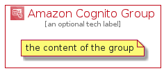

# AmazonCognito


```text
aws-q3-2021/Architecture/SecurityIdentityCompliance/AmazonCognito
```

```text
include('aws-q3-2021/Architecture/SecurityIdentityCompliance/AmazonCognito')
```


| Illustration | AmazonCognito | AmazonCognitoCard | AmazonCognitoGroup |
| :---: | :---: | :---: | :---: |
|  |  |  |  |


## AmazonCognito

### Load remotely
```plantuml
@startuml
' configures the library
!global $LIB_BASE_LOCATION="https://github.com/tmorin/plantuml-libs/distribution"

' loads the library's bootstrap
!include $LIB_BASE_LOCATION/bootstrap.puml

' loads the package bootstrap
include('aws-q3-2021/bootstrap')

' loads the Item which embeds the element AmazonCognito
include('aws-q3-2021/Architecture/SecurityIdentityCompliance/AmazonCognito')

' renders the element
AmazonCognito('AmazonCognito', 'Amazon Cognito', 'an optional tech label')
@enduml
```

### Load locally
```plantuml
@startuml
' configures the library
!global $INCLUSION_MODE="local"
!global $LIB_BASE_LOCATION="../../.."

' loads the library's bootstrap
!include $LIB_BASE_LOCATION/bootstrap.puml

' loads the package bootstrap
include('aws-q3-2021/bootstrap')

' loads the Item which embeds the element AmazonCognito
include('aws-q3-2021/Architecture/SecurityIdentityCompliance/AmazonCognito')

' renders the element
AmazonCognito('AmazonCognito', 'Amazon Cognito', 'an optional tech label')
@enduml
```

## AmazonCognitoCard

### Load remotely
```plantuml
@startuml
' configures the library
!global $LIB_BASE_LOCATION="https://github.com/tmorin/plantuml-libs/distribution"

' loads the library's bootstrap
!include $LIB_BASE_LOCATION/bootstrap.puml

' loads the package bootstrap
include('aws-q3-2021/bootstrap')

' loads the Item which embeds the element AmazonCognitoCard
include('aws-q3-2021/Architecture/SecurityIdentityCompliance/AmazonCognito')

' renders the element
AmazonCognitoCard('AmazonCognitoCard', 'Amazon Cognito Card', 'an optional description')
@enduml
```

### Load locally
```plantuml
@startuml
' configures the library
!global $INCLUSION_MODE="local"
!global $LIB_BASE_LOCATION="../../.."

' loads the library's bootstrap
!include $LIB_BASE_LOCATION/bootstrap.puml

' loads the package bootstrap
include('aws-q3-2021/bootstrap')

' loads the Item which embeds the element AmazonCognitoCard
include('aws-q3-2021/Architecture/SecurityIdentityCompliance/AmazonCognito')

' renders the element
AmazonCognitoCard('AmazonCognitoCard', 'Amazon Cognito Card', 'an optional description')
@enduml
```

## AmazonCognitoGroup

### Load remotely
```plantuml
@startuml
' configures the library
!global $LIB_BASE_LOCATION="https://github.com/tmorin/plantuml-libs/distribution"

' loads the library's bootstrap
!include $LIB_BASE_LOCATION/bootstrap.puml

' loads the package bootstrap
include('aws-q3-2021/bootstrap')

' loads the Item which embeds the element AmazonCognitoGroup
include('aws-q3-2021/Architecture/SecurityIdentityCompliance/AmazonCognito')

' renders the element
AmazonCognitoGroup('AmazonCognitoGroup', 'Amazon Cognito Group', 'an optional tech label') {
    note as note
        the content of the group
    end note
}
@enduml
```

### Load locally
```plantuml
@startuml
' configures the library
!global $INCLUSION_MODE="local"
!global $LIB_BASE_LOCATION="../../.."

' loads the library's bootstrap
!include $LIB_BASE_LOCATION/bootstrap.puml

' loads the package bootstrap
include('aws-q3-2021/bootstrap')

' loads the Item which embeds the element AmazonCognitoGroup
include('aws-q3-2021/Architecture/SecurityIdentityCompliance/AmazonCognito')

' renders the element
AmazonCognitoGroup('AmazonCognitoGroup', 'Amazon Cognito Group', 'an optional tech label') {
    note as note
        the content of the group
    end note
}
@enduml
```

