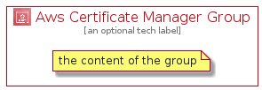

# AwsCertificateManager


```text
aws-q3-2021/Architecture/SecurityIdentityCompliance/AwsCertificateManager
```

```text
include('aws-q3-2021/Architecture/SecurityIdentityCompliance/AwsCertificateManager')
```


| Illustration | AwsCertificateManager | AwsCertificateManagerCard | AwsCertificateManagerGroup |
| :---: | :---: | :---: | :---: |
|  |  |  |  |


## AwsCertificateManager

### Load remotely
```plantuml
@startuml
' configures the library
!global $LIB_BASE_LOCATION="https://raw.githubusercontent.com/tmorin/plantuml-libs/master/distribution"

' loads the library's bootstrap
!include $LIB_BASE_LOCATION/bootstrap.puml

' loads the package bootstrap
include('aws-q3-2021/bootstrap')

' loads the Item which embeds the element AwsCertificateManager
include('aws-q3-2021/Architecture/SecurityIdentityCompliance/AwsCertificateManager')

' renders the element
AwsCertificateManager('AwsCertificateManager', 'Aws Certificate Manager', 'an optional tech label')
@enduml
```

### Load locally
```plantuml
@startuml
' configures the library
!global $INCLUSION_MODE="local"
!global $LIB_BASE_LOCATION="../../.."

' loads the library's bootstrap
!include $LIB_BASE_LOCATION/bootstrap.puml

' loads the package bootstrap
include('aws-q3-2021/bootstrap')

' loads the Item which embeds the element AwsCertificateManager
include('aws-q3-2021/Architecture/SecurityIdentityCompliance/AwsCertificateManager')

' renders the element
AwsCertificateManager('AwsCertificateManager', 'Aws Certificate Manager', 'an optional tech label')
@enduml
```

## AwsCertificateManagerCard

### Load remotely
```plantuml
@startuml
' configures the library
!global $LIB_BASE_LOCATION="https://raw.githubusercontent.com/tmorin/plantuml-libs/master/distribution"

' loads the library's bootstrap
!include $LIB_BASE_LOCATION/bootstrap.puml

' loads the package bootstrap
include('aws-q3-2021/bootstrap')

' loads the Item which embeds the element AwsCertificateManagerCard
include('aws-q3-2021/Architecture/SecurityIdentityCompliance/AwsCertificateManager')

' renders the element
AwsCertificateManagerCard('AwsCertificateManagerCard', 'Aws Certificate Manager Card', 'an optional description')
@enduml
```

### Load locally
```plantuml
@startuml
' configures the library
!global $INCLUSION_MODE="local"
!global $LIB_BASE_LOCATION="../../.."

' loads the library's bootstrap
!include $LIB_BASE_LOCATION/bootstrap.puml

' loads the package bootstrap
include('aws-q3-2021/bootstrap')

' loads the Item which embeds the element AwsCertificateManagerCard
include('aws-q3-2021/Architecture/SecurityIdentityCompliance/AwsCertificateManager')

' renders the element
AwsCertificateManagerCard('AwsCertificateManagerCard', 'Aws Certificate Manager Card', 'an optional description')
@enduml
```

## AwsCertificateManagerGroup

### Load remotely
```plantuml
@startuml
' configures the library
!global $LIB_BASE_LOCATION="https://raw.githubusercontent.com/tmorin/plantuml-libs/master/distribution"

' loads the library's bootstrap
!include $LIB_BASE_LOCATION/bootstrap.puml

' loads the package bootstrap
include('aws-q3-2021/bootstrap')

' loads the Item which embeds the element AwsCertificateManagerGroup
include('aws-q3-2021/Architecture/SecurityIdentityCompliance/AwsCertificateManager')

' renders the element
AwsCertificateManagerGroup('AwsCertificateManagerGroup', 'Aws Certificate Manager Group', 'an optional tech label') {
    note as note
        the content of the group
    end note
}
@enduml
```

### Load locally
```plantuml
@startuml
' configures the library
!global $INCLUSION_MODE="local"
!global $LIB_BASE_LOCATION="../../.."

' loads the library's bootstrap
!include $LIB_BASE_LOCATION/bootstrap.puml

' loads the package bootstrap
include('aws-q3-2021/bootstrap')

' loads the Item which embeds the element AwsCertificateManagerGroup
include('aws-q3-2021/Architecture/SecurityIdentityCompliance/AwsCertificateManager')

' renders the element
AwsCertificateManagerGroup('AwsCertificateManagerGroup', 'Aws Certificate Manager Group', 'an optional tech label') {
    note as note
        the content of the group
    end note
}
@enduml
```

