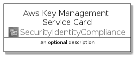

# AwsKeyManagementService


```text
aws-q3-2021/Architecture/SecurityIdentityCompliance/AwsKeyManagementService
```

```text
include('aws-q3-2021/Architecture/SecurityIdentityCompliance/AwsKeyManagementService')
```


| Illustration | AwsKeyManagementService | AwsKeyManagementServiceCard | AwsKeyManagementServiceGroup |
| :---: | :---: | :---: | :---: |
|  |  |  |  |


## AwsKeyManagementService

### Load remotely
```plantuml
@startuml
' configures the library
!global $LIB_BASE_LOCATION="https://raw.githubusercontent.com/tmorin/plantuml-libs/master/distribution"

' loads the library's bootstrap
!include $LIB_BASE_LOCATION/bootstrap.puml

' loads the package bootstrap
include('aws-q3-2021/bootstrap')

' loads the Item which embeds the element AwsKeyManagementService
include('aws-q3-2021/Architecture/SecurityIdentityCompliance/AwsKeyManagementService')

' renders the element
AwsKeyManagementService('AwsKeyManagementService', 'Aws Key Management Service', 'an optional tech label')
@enduml
```

### Load locally
```plantuml
@startuml
' configures the library
!global $INCLUSION_MODE="local"
!global $LIB_BASE_LOCATION="../../.."

' loads the library's bootstrap
!include $LIB_BASE_LOCATION/bootstrap.puml

' loads the package bootstrap
include('aws-q3-2021/bootstrap')

' loads the Item which embeds the element AwsKeyManagementService
include('aws-q3-2021/Architecture/SecurityIdentityCompliance/AwsKeyManagementService')

' renders the element
AwsKeyManagementService('AwsKeyManagementService', 'Aws Key Management Service', 'an optional tech label')
@enduml
```

## AwsKeyManagementServiceCard

### Load remotely
```plantuml
@startuml
' configures the library
!global $LIB_BASE_LOCATION="https://raw.githubusercontent.com/tmorin/plantuml-libs/master/distribution"

' loads the library's bootstrap
!include $LIB_BASE_LOCATION/bootstrap.puml

' loads the package bootstrap
include('aws-q3-2021/bootstrap')

' loads the Item which embeds the element AwsKeyManagementServiceCard
include('aws-q3-2021/Architecture/SecurityIdentityCompliance/AwsKeyManagementService')

' renders the element
AwsKeyManagementServiceCard('AwsKeyManagementServiceCard', 'Aws Key Management Service Card', 'an optional description')
@enduml
```

### Load locally
```plantuml
@startuml
' configures the library
!global $INCLUSION_MODE="local"
!global $LIB_BASE_LOCATION="../../.."

' loads the library's bootstrap
!include $LIB_BASE_LOCATION/bootstrap.puml

' loads the package bootstrap
include('aws-q3-2021/bootstrap')

' loads the Item which embeds the element AwsKeyManagementServiceCard
include('aws-q3-2021/Architecture/SecurityIdentityCompliance/AwsKeyManagementService')

' renders the element
AwsKeyManagementServiceCard('AwsKeyManagementServiceCard', 'Aws Key Management Service Card', 'an optional description')
@enduml
```

## AwsKeyManagementServiceGroup

### Load remotely
```plantuml
@startuml
' configures the library
!global $LIB_BASE_LOCATION="https://raw.githubusercontent.com/tmorin/plantuml-libs/master/distribution"

' loads the library's bootstrap
!include $LIB_BASE_LOCATION/bootstrap.puml

' loads the package bootstrap
include('aws-q3-2021/bootstrap')

' loads the Item which embeds the element AwsKeyManagementServiceGroup
include('aws-q3-2021/Architecture/SecurityIdentityCompliance/AwsKeyManagementService')

' renders the element
AwsKeyManagementServiceGroup('AwsKeyManagementServiceGroup', 'Aws Key Management Service Group', 'an optional tech label') {
    note as note
        the content of the group
    end note
}
@enduml
```

### Load locally
```plantuml
@startuml
' configures the library
!global $INCLUSION_MODE="local"
!global $LIB_BASE_LOCATION="../../.."

' loads the library's bootstrap
!include $LIB_BASE_LOCATION/bootstrap.puml

' loads the package bootstrap
include('aws-q3-2021/bootstrap')

' loads the Item which embeds the element AwsKeyManagementServiceGroup
include('aws-q3-2021/Architecture/SecurityIdentityCompliance/AwsKeyManagementService')

' renders the element
AwsKeyManagementServiceGroup('AwsKeyManagementServiceGroup', 'Aws Key Management Service Group', 'an optional tech label') {
    note as note
        the content of the group
    end note
}
@enduml
```

