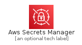
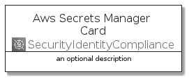
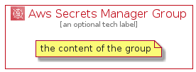

# AwsSecretsManager


```text
aws-q3-2021/Architecture/SecurityIdentityCompliance/AwsSecretsManager
```

```text
include('aws-q3-2021/Architecture/SecurityIdentityCompliance/AwsSecretsManager')
```


| Illustration | AwsSecretsManager | AwsSecretsManagerCard | AwsSecretsManagerGroup |
| :---: | :---: | :---: | :---: |
|  |  |  |  |


## AwsSecretsManager

### Load remotely
```plantuml
@startuml
' configures the library
!global $LIB_BASE_LOCATION="https://github.com/tmorin/plantuml-libs/distribution"

' loads the library's bootstrap
!include $LIB_BASE_LOCATION/bootstrap.puml

' loads the package bootstrap
include('aws-q3-2021/bootstrap')

' loads the Item which embeds the element AwsSecretsManager
include('aws-q3-2021/Architecture/SecurityIdentityCompliance/AwsSecretsManager')

' renders the element
AwsSecretsManager('AwsSecretsManager', 'Aws Secrets Manager', 'an optional tech label')
@enduml
```

### Load locally
```plantuml
@startuml
' configures the library
!global $INCLUSION_MODE="local"
!global $LIB_BASE_LOCATION="../../.."

' loads the library's bootstrap
!include $LIB_BASE_LOCATION/bootstrap.puml

' loads the package bootstrap
include('aws-q3-2021/bootstrap')

' loads the Item which embeds the element AwsSecretsManager
include('aws-q3-2021/Architecture/SecurityIdentityCompliance/AwsSecretsManager')

' renders the element
AwsSecretsManager('AwsSecretsManager', 'Aws Secrets Manager', 'an optional tech label')
@enduml
```

## AwsSecretsManagerCard

### Load remotely
```plantuml
@startuml
' configures the library
!global $LIB_BASE_LOCATION="https://github.com/tmorin/plantuml-libs/distribution"

' loads the library's bootstrap
!include $LIB_BASE_LOCATION/bootstrap.puml

' loads the package bootstrap
include('aws-q3-2021/bootstrap')

' loads the Item which embeds the element AwsSecretsManagerCard
include('aws-q3-2021/Architecture/SecurityIdentityCompliance/AwsSecretsManager')

' renders the element
AwsSecretsManagerCard('AwsSecretsManagerCard', 'Aws Secrets Manager Card', 'an optional description')
@enduml
```

### Load locally
```plantuml
@startuml
' configures the library
!global $INCLUSION_MODE="local"
!global $LIB_BASE_LOCATION="../../.."

' loads the library's bootstrap
!include $LIB_BASE_LOCATION/bootstrap.puml

' loads the package bootstrap
include('aws-q3-2021/bootstrap')

' loads the Item which embeds the element AwsSecretsManagerCard
include('aws-q3-2021/Architecture/SecurityIdentityCompliance/AwsSecretsManager')

' renders the element
AwsSecretsManagerCard('AwsSecretsManagerCard', 'Aws Secrets Manager Card', 'an optional description')
@enduml
```

## AwsSecretsManagerGroup

### Load remotely
```plantuml
@startuml
' configures the library
!global $LIB_BASE_LOCATION="https://github.com/tmorin/plantuml-libs/distribution"

' loads the library's bootstrap
!include $LIB_BASE_LOCATION/bootstrap.puml

' loads the package bootstrap
include('aws-q3-2021/bootstrap')

' loads the Item which embeds the element AwsSecretsManagerGroup
include('aws-q3-2021/Architecture/SecurityIdentityCompliance/AwsSecretsManager')

' renders the element
AwsSecretsManagerGroup('AwsSecretsManagerGroup', 'Aws Secrets Manager Group', 'an optional tech label') {
    note as note
        the content of the group
    end note
}
@enduml
```

### Load locally
```plantuml
@startuml
' configures the library
!global $INCLUSION_MODE="local"
!global $LIB_BASE_LOCATION="../../.."

' loads the library's bootstrap
!include $LIB_BASE_LOCATION/bootstrap.puml

' loads the package bootstrap
include('aws-q3-2021/bootstrap')

' loads the Item which embeds the element AwsSecretsManagerGroup
include('aws-q3-2021/Architecture/SecurityIdentityCompliance/AwsSecretsManager')

' renders the element
AwsSecretsManagerGroup('AwsSecretsManagerGroup', 'Aws Secrets Manager Group', 'an optional tech label') {
    note as note
        the content of the group
    end note
}
@enduml
```

