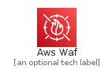
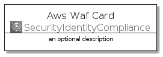
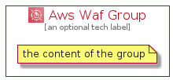

# AwsWaf


```text
aws-q3-2021/Architecture/SecurityIdentityCompliance/AwsWaf
```

```text
include('aws-q3-2021/Architecture/SecurityIdentityCompliance/AwsWaf')
```


| Illustration | AwsWaf | AwsWafCard | AwsWafGroup |
| :---: | :---: | :---: | :---: |
|  |  |  |  |


## AwsWaf

### Load remotely
```plantuml
@startuml
' configures the library
!global $LIB_BASE_LOCATION="https://raw.githubusercontent.com/tmorin/plantuml-libs/master/distribution"

' loads the library's bootstrap
!include $LIB_BASE_LOCATION/bootstrap.puml

' loads the package bootstrap
include('aws-q3-2021/bootstrap')

' loads the Item which embeds the element AwsWaf
include('aws-q3-2021/Architecture/SecurityIdentityCompliance/AwsWaf')

' renders the element
AwsWaf('AwsWaf', 'Aws Waf', 'an optional tech label')
@enduml
```

### Load locally
```plantuml
@startuml
' configures the library
!global $INCLUSION_MODE="local"
!global $LIB_BASE_LOCATION="../../.."

' loads the library's bootstrap
!include $LIB_BASE_LOCATION/bootstrap.puml

' loads the package bootstrap
include('aws-q3-2021/bootstrap')

' loads the Item which embeds the element AwsWaf
include('aws-q3-2021/Architecture/SecurityIdentityCompliance/AwsWaf')

' renders the element
AwsWaf('AwsWaf', 'Aws Waf', 'an optional tech label')
@enduml
```

## AwsWafCard

### Load remotely
```plantuml
@startuml
' configures the library
!global $LIB_BASE_LOCATION="https://raw.githubusercontent.com/tmorin/plantuml-libs/master/distribution"

' loads the library's bootstrap
!include $LIB_BASE_LOCATION/bootstrap.puml

' loads the package bootstrap
include('aws-q3-2021/bootstrap')

' loads the Item which embeds the element AwsWafCard
include('aws-q3-2021/Architecture/SecurityIdentityCompliance/AwsWaf')

' renders the element
AwsWafCard('AwsWafCard', 'Aws Waf Card', 'an optional description')
@enduml
```

### Load locally
```plantuml
@startuml
' configures the library
!global $INCLUSION_MODE="local"
!global $LIB_BASE_LOCATION="../../.."

' loads the library's bootstrap
!include $LIB_BASE_LOCATION/bootstrap.puml

' loads the package bootstrap
include('aws-q3-2021/bootstrap')

' loads the Item which embeds the element AwsWafCard
include('aws-q3-2021/Architecture/SecurityIdentityCompliance/AwsWaf')

' renders the element
AwsWafCard('AwsWafCard', 'Aws Waf Card', 'an optional description')
@enduml
```

## AwsWafGroup

### Load remotely
```plantuml
@startuml
' configures the library
!global $LIB_BASE_LOCATION="https://raw.githubusercontent.com/tmorin/plantuml-libs/master/distribution"

' loads the library's bootstrap
!include $LIB_BASE_LOCATION/bootstrap.puml

' loads the package bootstrap
include('aws-q3-2021/bootstrap')

' loads the Item which embeds the element AwsWafGroup
include('aws-q3-2021/Architecture/SecurityIdentityCompliance/AwsWaf')

' renders the element
AwsWafGroup('AwsWafGroup', 'Aws Waf Group', 'an optional tech label') {
    note as note
        the content of the group
    end note
}
@enduml
```

### Load locally
```plantuml
@startuml
' configures the library
!global $INCLUSION_MODE="local"
!global $LIB_BASE_LOCATION="../../.."

' loads the library's bootstrap
!include $LIB_BASE_LOCATION/bootstrap.puml

' loads the package bootstrap
include('aws-q3-2021/bootstrap')

' loads the Item which embeds the element AwsWafGroup
include('aws-q3-2021/Architecture/SecurityIdentityCompliance/AwsWaf')

' renders the element
AwsWafGroup('AwsWafGroup', 'Aws Waf Group', 'an optional tech label') {
    note as note
        the content of the group
    end note
}
@enduml
```

