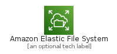
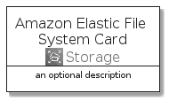
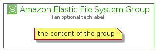

# AmazonElasticFileSystem


```text
aws-q3-2021/Architecture/Storage/AmazonElasticFileSystem
```

```text
include('aws-q3-2021/Architecture/Storage/AmazonElasticFileSystem')
```


| Illustration | AmazonElasticFileSystem | AmazonElasticFileSystemCard | AmazonElasticFileSystemGroup |
| :---: | :---: | :---: | :---: |
|  |  |  |  |


## AmazonElasticFileSystem

### Load remotely
```plantuml
@startuml
' configures the library
!global $LIB_BASE_LOCATION="https://github.com/tmorin/plantuml-libs/distribution"

' loads the library's bootstrap
!include $LIB_BASE_LOCATION/bootstrap.puml

' loads the package bootstrap
include('aws-q3-2021/bootstrap')

' loads the Item which embeds the element AmazonElasticFileSystem
include('aws-q3-2021/Architecture/Storage/AmazonElasticFileSystem')

' renders the element
AmazonElasticFileSystem('AmazonElasticFileSystem', 'Amazon Elastic File System', 'an optional tech label')
@enduml
```

### Load locally
```plantuml
@startuml
' configures the library
!global $INCLUSION_MODE="local"
!global $LIB_BASE_LOCATION="../../.."

' loads the library's bootstrap
!include $LIB_BASE_LOCATION/bootstrap.puml

' loads the package bootstrap
include('aws-q3-2021/bootstrap')

' loads the Item which embeds the element AmazonElasticFileSystem
include('aws-q3-2021/Architecture/Storage/AmazonElasticFileSystem')

' renders the element
AmazonElasticFileSystem('AmazonElasticFileSystem', 'Amazon Elastic File System', 'an optional tech label')
@enduml
```

## AmazonElasticFileSystemCard

### Load remotely
```plantuml
@startuml
' configures the library
!global $LIB_BASE_LOCATION="https://github.com/tmorin/plantuml-libs/distribution"

' loads the library's bootstrap
!include $LIB_BASE_LOCATION/bootstrap.puml

' loads the package bootstrap
include('aws-q3-2021/bootstrap')

' loads the Item which embeds the element AmazonElasticFileSystemCard
include('aws-q3-2021/Architecture/Storage/AmazonElasticFileSystem')

' renders the element
AmazonElasticFileSystemCard('AmazonElasticFileSystemCard', 'Amazon Elastic File System Card', 'an optional description')
@enduml
```

### Load locally
```plantuml
@startuml
' configures the library
!global $INCLUSION_MODE="local"
!global $LIB_BASE_LOCATION="../../.."

' loads the library's bootstrap
!include $LIB_BASE_LOCATION/bootstrap.puml

' loads the package bootstrap
include('aws-q3-2021/bootstrap')

' loads the Item which embeds the element AmazonElasticFileSystemCard
include('aws-q3-2021/Architecture/Storage/AmazonElasticFileSystem')

' renders the element
AmazonElasticFileSystemCard('AmazonElasticFileSystemCard', 'Amazon Elastic File System Card', 'an optional description')
@enduml
```

## AmazonElasticFileSystemGroup

### Load remotely
```plantuml
@startuml
' configures the library
!global $LIB_BASE_LOCATION="https://github.com/tmorin/plantuml-libs/distribution"

' loads the library's bootstrap
!include $LIB_BASE_LOCATION/bootstrap.puml

' loads the package bootstrap
include('aws-q3-2021/bootstrap')

' loads the Item which embeds the element AmazonElasticFileSystemGroup
include('aws-q3-2021/Architecture/Storage/AmazonElasticFileSystem')

' renders the element
AmazonElasticFileSystemGroup('AmazonElasticFileSystemGroup', 'Amazon Elastic File System Group', 'an optional tech label') {
    note as note
        the content of the group
    end note
}
@enduml
```

### Load locally
```plantuml
@startuml
' configures the library
!global $INCLUSION_MODE="local"
!global $LIB_BASE_LOCATION="../../.."

' loads the library's bootstrap
!include $LIB_BASE_LOCATION/bootstrap.puml

' loads the package bootstrap
include('aws-q3-2021/bootstrap')

' loads the Item which embeds the element AmazonElasticFileSystemGroup
include('aws-q3-2021/Architecture/Storage/AmazonElasticFileSystem')

' renders the element
AmazonElasticFileSystemGroup('AmazonElasticFileSystemGroup', 'Amazon Elastic File System Group', 'an optional tech label') {
    note as note
        the content of the group
    end note
}
@enduml
```

