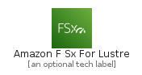
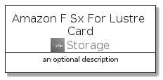
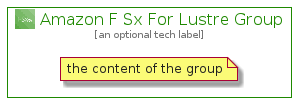

# AmazonFSxForLustre


```text
aws-q3-2021/Architecture/Storage/AmazonFSxForLustre
```

```text
include('aws-q3-2021/Architecture/Storage/AmazonFSxForLustre')
```


| Illustration | AmazonFSxForLustre | AmazonFSxForLustreCard | AmazonFSxForLustreGroup |
| :---: | :---: | :---: | :---: |
|  |  |  |  |


## AmazonFSxForLustre

### Load remotely
```plantuml
@startuml
' configures the library
!global $LIB_BASE_LOCATION="https://raw.githubusercontent.com/tmorin/plantuml-libs/master/distribution"

' loads the library's bootstrap
!include $LIB_BASE_LOCATION/bootstrap.puml

' loads the package bootstrap
include('aws-q3-2021/bootstrap')

' loads the Item which embeds the element AmazonFSxForLustre
include('aws-q3-2021/Architecture/Storage/AmazonFSxForLustre')

' renders the element
AmazonFSxForLustre('AmazonFSxForLustre', 'Amazon F Sx For Lustre', 'an optional tech label')
@enduml
```

### Load locally
```plantuml
@startuml
' configures the library
!global $INCLUSION_MODE="local"
!global $LIB_BASE_LOCATION="../../.."

' loads the library's bootstrap
!include $LIB_BASE_LOCATION/bootstrap.puml

' loads the package bootstrap
include('aws-q3-2021/bootstrap')

' loads the Item which embeds the element AmazonFSxForLustre
include('aws-q3-2021/Architecture/Storage/AmazonFSxForLustre')

' renders the element
AmazonFSxForLustre('AmazonFSxForLustre', 'Amazon F Sx For Lustre', 'an optional tech label')
@enduml
```

## AmazonFSxForLustreCard

### Load remotely
```plantuml
@startuml
' configures the library
!global $LIB_BASE_LOCATION="https://raw.githubusercontent.com/tmorin/plantuml-libs/master/distribution"

' loads the library's bootstrap
!include $LIB_BASE_LOCATION/bootstrap.puml

' loads the package bootstrap
include('aws-q3-2021/bootstrap')

' loads the Item which embeds the element AmazonFSxForLustreCard
include('aws-q3-2021/Architecture/Storage/AmazonFSxForLustre')

' renders the element
AmazonFSxForLustreCard('AmazonFSxForLustreCard', 'Amazon F Sx For Lustre Card', 'an optional description')
@enduml
```

### Load locally
```plantuml
@startuml
' configures the library
!global $INCLUSION_MODE="local"
!global $LIB_BASE_LOCATION="../../.."

' loads the library's bootstrap
!include $LIB_BASE_LOCATION/bootstrap.puml

' loads the package bootstrap
include('aws-q3-2021/bootstrap')

' loads the Item which embeds the element AmazonFSxForLustreCard
include('aws-q3-2021/Architecture/Storage/AmazonFSxForLustre')

' renders the element
AmazonFSxForLustreCard('AmazonFSxForLustreCard', 'Amazon F Sx For Lustre Card', 'an optional description')
@enduml
```

## AmazonFSxForLustreGroup

### Load remotely
```plantuml
@startuml
' configures the library
!global $LIB_BASE_LOCATION="https://raw.githubusercontent.com/tmorin/plantuml-libs/master/distribution"

' loads the library's bootstrap
!include $LIB_BASE_LOCATION/bootstrap.puml

' loads the package bootstrap
include('aws-q3-2021/bootstrap')

' loads the Item which embeds the element AmazonFSxForLustreGroup
include('aws-q3-2021/Architecture/Storage/AmazonFSxForLustre')

' renders the element
AmazonFSxForLustreGroup('AmazonFSxForLustreGroup', 'Amazon F Sx For Lustre Group', 'an optional tech label') {
    note as note
        the content of the group
    end note
}
@enduml
```

### Load locally
```plantuml
@startuml
' configures the library
!global $INCLUSION_MODE="local"
!global $LIB_BASE_LOCATION="../../.."

' loads the library's bootstrap
!include $LIB_BASE_LOCATION/bootstrap.puml

' loads the package bootstrap
include('aws-q3-2021/bootstrap')

' loads the Item which embeds the element AmazonFSxForLustreGroup
include('aws-q3-2021/Architecture/Storage/AmazonFSxForLustre')

' renders the element
AmazonFSxForLustreGroup('AmazonFSxForLustreGroup', 'Amazon F Sx For Lustre Group', 'an optional tech label') {
    note as note
        the content of the group
    end note
}
@enduml
```

