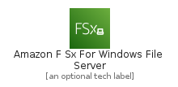
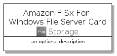
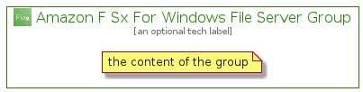

# AmazonFSxForWindowsFileServer


```text
aws-q3-2021/Architecture/Storage/AmazonFSxForWindowsFileServer
```

```text
include('aws-q3-2021/Architecture/Storage/AmazonFSxForWindowsFileServer')
```


| Illustration | AmazonFSxForWindowsFileServer | AmazonFSxForWindowsFileServerCard | AmazonFSxForWindowsFileServerGroup |
| :---: | :---: | :---: | :---: |
|  |  |  |  |


## AmazonFSxForWindowsFileServer

### Load remotely
```plantuml
@startuml
' configures the library
!global $LIB_BASE_LOCATION="https://raw.githubusercontent.com/tmorin/plantuml-libs/master/distribution"

' loads the library's bootstrap
!include $LIB_BASE_LOCATION/bootstrap.puml

' loads the package bootstrap
include('aws-q3-2021/bootstrap')

' loads the Item which embeds the element AmazonFSxForWindowsFileServer
include('aws-q3-2021/Architecture/Storage/AmazonFSxForWindowsFileServer')

' renders the element
AmazonFSxForWindowsFileServer('AmazonFSxForWindowsFileServer', 'Amazon F Sx For Windows File Server', 'an optional tech label')
@enduml
```

### Load locally
```plantuml
@startuml
' configures the library
!global $INCLUSION_MODE="local"
!global $LIB_BASE_LOCATION="../../.."

' loads the library's bootstrap
!include $LIB_BASE_LOCATION/bootstrap.puml

' loads the package bootstrap
include('aws-q3-2021/bootstrap')

' loads the Item which embeds the element AmazonFSxForWindowsFileServer
include('aws-q3-2021/Architecture/Storage/AmazonFSxForWindowsFileServer')

' renders the element
AmazonFSxForWindowsFileServer('AmazonFSxForWindowsFileServer', 'Amazon F Sx For Windows File Server', 'an optional tech label')
@enduml
```

## AmazonFSxForWindowsFileServerCard

### Load remotely
```plantuml
@startuml
' configures the library
!global $LIB_BASE_LOCATION="https://raw.githubusercontent.com/tmorin/plantuml-libs/master/distribution"

' loads the library's bootstrap
!include $LIB_BASE_LOCATION/bootstrap.puml

' loads the package bootstrap
include('aws-q3-2021/bootstrap')

' loads the Item which embeds the element AmazonFSxForWindowsFileServerCard
include('aws-q3-2021/Architecture/Storage/AmazonFSxForWindowsFileServer')

' renders the element
AmazonFSxForWindowsFileServerCard('AmazonFSxForWindowsFileServerCard', 'Amazon F Sx For Windows File Server Card', 'an optional description')
@enduml
```

### Load locally
```plantuml
@startuml
' configures the library
!global $INCLUSION_MODE="local"
!global $LIB_BASE_LOCATION="../../.."

' loads the library's bootstrap
!include $LIB_BASE_LOCATION/bootstrap.puml

' loads the package bootstrap
include('aws-q3-2021/bootstrap')

' loads the Item which embeds the element AmazonFSxForWindowsFileServerCard
include('aws-q3-2021/Architecture/Storage/AmazonFSxForWindowsFileServer')

' renders the element
AmazonFSxForWindowsFileServerCard('AmazonFSxForWindowsFileServerCard', 'Amazon F Sx For Windows File Server Card', 'an optional description')
@enduml
```

## AmazonFSxForWindowsFileServerGroup

### Load remotely
```plantuml
@startuml
' configures the library
!global $LIB_BASE_LOCATION="https://raw.githubusercontent.com/tmorin/plantuml-libs/master/distribution"

' loads the library's bootstrap
!include $LIB_BASE_LOCATION/bootstrap.puml

' loads the package bootstrap
include('aws-q3-2021/bootstrap')

' loads the Item which embeds the element AmazonFSxForWindowsFileServerGroup
include('aws-q3-2021/Architecture/Storage/AmazonFSxForWindowsFileServer')

' renders the element
AmazonFSxForWindowsFileServerGroup('AmazonFSxForWindowsFileServerGroup', 'Amazon F Sx For Windows File Server Group', 'an optional tech label') {
    note as note
        the content of the group
    end note
}
@enduml
```

### Load locally
```plantuml
@startuml
' configures the library
!global $INCLUSION_MODE="local"
!global $LIB_BASE_LOCATION="../../.."

' loads the library's bootstrap
!include $LIB_BASE_LOCATION/bootstrap.puml

' loads the package bootstrap
include('aws-q3-2021/bootstrap')

' loads the Item which embeds the element AmazonFSxForWindowsFileServerGroup
include('aws-q3-2021/Architecture/Storage/AmazonFSxForWindowsFileServer')

' renders the element
AmazonFSxForWindowsFileServerGroup('AmazonFSxForWindowsFileServerGroup', 'Amazon F Sx For Windows File Server Group', 'an optional tech label') {
    note as note
        the content of the group
    end note
}
@enduml
```

