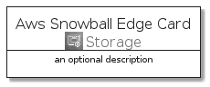
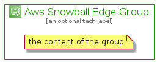

# AwsSnowballEdge


```text
aws-q3-2021/Architecture/Storage/AwsSnowballEdge
```

```text
include('aws-q3-2021/Architecture/Storage/AwsSnowballEdge')
```


| Illustration | AwsSnowballEdge | AwsSnowballEdgeCard | AwsSnowballEdgeGroup |
| :---: | :---: | :---: | :---: |
|  |  |  |  |


## AwsSnowballEdge

### Load remotely
```plantuml
@startuml
' configures the library
!global $LIB_BASE_LOCATION="https://github.com/tmorin/plantuml-libs/distribution"

' loads the library's bootstrap
!include $LIB_BASE_LOCATION/bootstrap.puml

' loads the package bootstrap
include('aws-q3-2021/bootstrap')

' loads the Item which embeds the element AwsSnowballEdge
include('aws-q3-2021/Architecture/Storage/AwsSnowballEdge')

' renders the element
AwsSnowballEdge('AwsSnowballEdge', 'Aws Snowball Edge', 'an optional tech label')
@enduml
```

### Load locally
```plantuml
@startuml
' configures the library
!global $INCLUSION_MODE="local"
!global $LIB_BASE_LOCATION="../../.."

' loads the library's bootstrap
!include $LIB_BASE_LOCATION/bootstrap.puml

' loads the package bootstrap
include('aws-q3-2021/bootstrap')

' loads the Item which embeds the element AwsSnowballEdge
include('aws-q3-2021/Architecture/Storage/AwsSnowballEdge')

' renders the element
AwsSnowballEdge('AwsSnowballEdge', 'Aws Snowball Edge', 'an optional tech label')
@enduml
```

## AwsSnowballEdgeCard

### Load remotely
```plantuml
@startuml
' configures the library
!global $LIB_BASE_LOCATION="https://github.com/tmorin/plantuml-libs/distribution"

' loads the library's bootstrap
!include $LIB_BASE_LOCATION/bootstrap.puml

' loads the package bootstrap
include('aws-q3-2021/bootstrap')

' loads the Item which embeds the element AwsSnowballEdgeCard
include('aws-q3-2021/Architecture/Storage/AwsSnowballEdge')

' renders the element
AwsSnowballEdgeCard('AwsSnowballEdgeCard', 'Aws Snowball Edge Card', 'an optional description')
@enduml
```

### Load locally
```plantuml
@startuml
' configures the library
!global $INCLUSION_MODE="local"
!global $LIB_BASE_LOCATION="../../.."

' loads the library's bootstrap
!include $LIB_BASE_LOCATION/bootstrap.puml

' loads the package bootstrap
include('aws-q3-2021/bootstrap')

' loads the Item which embeds the element AwsSnowballEdgeCard
include('aws-q3-2021/Architecture/Storage/AwsSnowballEdge')

' renders the element
AwsSnowballEdgeCard('AwsSnowballEdgeCard', 'Aws Snowball Edge Card', 'an optional description')
@enduml
```

## AwsSnowballEdgeGroup

### Load remotely
```plantuml
@startuml
' configures the library
!global $LIB_BASE_LOCATION="https://github.com/tmorin/plantuml-libs/distribution"

' loads the library's bootstrap
!include $LIB_BASE_LOCATION/bootstrap.puml

' loads the package bootstrap
include('aws-q3-2021/bootstrap')

' loads the Item which embeds the element AwsSnowballEdgeGroup
include('aws-q3-2021/Architecture/Storage/AwsSnowballEdge')

' renders the element
AwsSnowballEdgeGroup('AwsSnowballEdgeGroup', 'Aws Snowball Edge Group', 'an optional tech label') {
    note as note
        the content of the group
    end note
}
@enduml
```

### Load locally
```plantuml
@startuml
' configures the library
!global $INCLUSION_MODE="local"
!global $LIB_BASE_LOCATION="../../.."

' loads the library's bootstrap
!include $LIB_BASE_LOCATION/bootstrap.puml

' loads the package bootstrap
include('aws-q3-2021/bootstrap')

' loads the Item which embeds the element AwsSnowballEdgeGroup
include('aws-q3-2021/Architecture/Storage/AwsSnowballEdge')

' renders the element
AwsSnowballEdgeGroup('AwsSnowballEdgeGroup', 'Aws Snowball Edge Group', 'an optional tech label') {
    note as note
        the content of the group
    end note
}
@enduml
```

