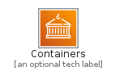
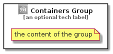

# Containers


```text
aws-q3-2021/Category/Containers
```

```text
include('aws-q3-2021/Category/Containers')
```


| Illustration | Containers | ContainersCard | ContainersGroup |
| :---: | :---: | :---: | :---: |
|  |  |  |  |


## Containers

### Load remotely
```plantuml
@startuml
' configures the library
!global $LIB_BASE_LOCATION="https://raw.githubusercontent.com/tmorin/plantuml-libs/master/distribution"

' loads the library's bootstrap
!include $LIB_BASE_LOCATION/bootstrap.puml

' loads the package bootstrap
include('aws-q3-2021/bootstrap')

' loads the Item which embeds the element Containers
include('aws-q3-2021/Category/Containers')

' renders the element
Containers('Containers', 'Containers', 'an optional tech label')
@enduml
```

### Load locally
```plantuml
@startuml
' configures the library
!global $INCLUSION_MODE="local"
!global $LIB_BASE_LOCATION="../.."

' loads the library's bootstrap
!include $LIB_BASE_LOCATION/bootstrap.puml

' loads the package bootstrap
include('aws-q3-2021/bootstrap')

' loads the Item which embeds the element Containers
include('aws-q3-2021/Category/Containers')

' renders the element
Containers('Containers', 'Containers', 'an optional tech label')
@enduml
```

## ContainersCard

### Load remotely
```plantuml
@startuml
' configures the library
!global $LIB_BASE_LOCATION="https://raw.githubusercontent.com/tmorin/plantuml-libs/master/distribution"

' loads the library's bootstrap
!include $LIB_BASE_LOCATION/bootstrap.puml

' loads the package bootstrap
include('aws-q3-2021/bootstrap')

' loads the Item which embeds the element ContainersCard
include('aws-q3-2021/Category/Containers')

' renders the element
ContainersCard('ContainersCard', 'Containers Card', 'an optional description')
@enduml
```

### Load locally
```plantuml
@startuml
' configures the library
!global $INCLUSION_MODE="local"
!global $LIB_BASE_LOCATION="../.."

' loads the library's bootstrap
!include $LIB_BASE_LOCATION/bootstrap.puml

' loads the package bootstrap
include('aws-q3-2021/bootstrap')

' loads the Item which embeds the element ContainersCard
include('aws-q3-2021/Category/Containers')

' renders the element
ContainersCard('ContainersCard', 'Containers Card', 'an optional description')
@enduml
```

## ContainersGroup

### Load remotely
```plantuml
@startuml
' configures the library
!global $LIB_BASE_LOCATION="https://raw.githubusercontent.com/tmorin/plantuml-libs/master/distribution"

' loads the library's bootstrap
!include $LIB_BASE_LOCATION/bootstrap.puml

' loads the package bootstrap
include('aws-q3-2021/bootstrap')

' loads the Item which embeds the element ContainersGroup
include('aws-q3-2021/Category/Containers')

' renders the element
ContainersGroup('ContainersGroup', 'Containers Group', 'an optional tech label') {
    note as note
        the content of the group
    end note
}
@enduml
```

### Load locally
```plantuml
@startuml
' configures the library
!global $INCLUSION_MODE="local"
!global $LIB_BASE_LOCATION="../.."

' loads the library's bootstrap
!include $LIB_BASE_LOCATION/bootstrap.puml

' loads the package bootstrap
include('aws-q3-2021/bootstrap')

' loads the Item which embeds the element ContainersGroup
include('aws-q3-2021/Category/Containers')

' renders the element
ContainersGroup('ContainersGroup', 'Containers Group', 'an optional tech label') {
    note as note
        the content of the group
    end note
}
@enduml
```

