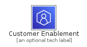
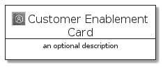
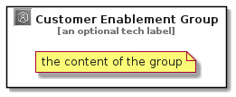

# CustomerEnablement


```text
aws-q3-2021/Category/CustomerEnablement
```

```text
include('aws-q3-2021/Category/CustomerEnablement')
```


| Illustration | CustomerEnablement | CustomerEnablementCard | CustomerEnablementGroup |
| :---: | :---: | :---: | :---: |
|  |  |  |  |


## CustomerEnablement

### Load remotely
```plantuml
@startuml
' configures the library
!global $LIB_BASE_LOCATION="https://raw.githubusercontent.com/tmorin/plantuml-libs/master/distribution"

' loads the library's bootstrap
!include $LIB_BASE_LOCATION/bootstrap.puml

' loads the package bootstrap
include('aws-q3-2021/bootstrap')

' loads the Item which embeds the element CustomerEnablement
include('aws-q3-2021/Category/CustomerEnablement')

' renders the element
CustomerEnablement('CustomerEnablement', 'Customer Enablement', 'an optional tech label')
@enduml
```

### Load locally
```plantuml
@startuml
' configures the library
!global $INCLUSION_MODE="local"
!global $LIB_BASE_LOCATION="../.."

' loads the library's bootstrap
!include $LIB_BASE_LOCATION/bootstrap.puml

' loads the package bootstrap
include('aws-q3-2021/bootstrap')

' loads the Item which embeds the element CustomerEnablement
include('aws-q3-2021/Category/CustomerEnablement')

' renders the element
CustomerEnablement('CustomerEnablement', 'Customer Enablement', 'an optional tech label')
@enduml
```

## CustomerEnablementCard

### Load remotely
```plantuml
@startuml
' configures the library
!global $LIB_BASE_LOCATION="https://raw.githubusercontent.com/tmorin/plantuml-libs/master/distribution"

' loads the library's bootstrap
!include $LIB_BASE_LOCATION/bootstrap.puml

' loads the package bootstrap
include('aws-q3-2021/bootstrap')

' loads the Item which embeds the element CustomerEnablementCard
include('aws-q3-2021/Category/CustomerEnablement')

' renders the element
CustomerEnablementCard('CustomerEnablementCard', 'Customer Enablement Card', 'an optional description')
@enduml
```

### Load locally
```plantuml
@startuml
' configures the library
!global $INCLUSION_MODE="local"
!global $LIB_BASE_LOCATION="../.."

' loads the library's bootstrap
!include $LIB_BASE_LOCATION/bootstrap.puml

' loads the package bootstrap
include('aws-q3-2021/bootstrap')

' loads the Item which embeds the element CustomerEnablementCard
include('aws-q3-2021/Category/CustomerEnablement')

' renders the element
CustomerEnablementCard('CustomerEnablementCard', 'Customer Enablement Card', 'an optional description')
@enduml
```

## CustomerEnablementGroup

### Load remotely
```plantuml
@startuml
' configures the library
!global $LIB_BASE_LOCATION="https://raw.githubusercontent.com/tmorin/plantuml-libs/master/distribution"

' loads the library's bootstrap
!include $LIB_BASE_LOCATION/bootstrap.puml

' loads the package bootstrap
include('aws-q3-2021/bootstrap')

' loads the Item which embeds the element CustomerEnablementGroup
include('aws-q3-2021/Category/CustomerEnablement')

' renders the element
CustomerEnablementGroup('CustomerEnablementGroup', 'Customer Enablement Group', 'an optional tech label') {
    note as note
        the content of the group
    end note
}
@enduml
```

### Load locally
```plantuml
@startuml
' configures the library
!global $INCLUSION_MODE="local"
!global $LIB_BASE_LOCATION="../.."

' loads the library's bootstrap
!include $LIB_BASE_LOCATION/bootstrap.puml

' loads the package bootstrap
include('aws-q3-2021/bootstrap')

' loads the Item which embeds the element CustomerEnablementGroup
include('aws-q3-2021/Category/CustomerEnablement')

' renders the element
CustomerEnablementGroup('CustomerEnablementGroup', 'Customer Enablement Group', 'an optional tech label') {
    note as note
        the content of the group
    end note
}
@enduml
```

