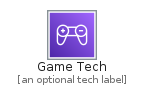
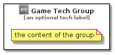

# GameTech


```text
aws-q3-2021/Category/GameTech
```

```text
include('aws-q3-2021/Category/GameTech')
```


| Illustration | GameTech | GameTechCard | GameTechGroup |
| :---: | :---: | :---: | :---: |
|  |  |  |  |


## GameTech

### Load remotely
```plantuml
@startuml
' configures the library
!global $LIB_BASE_LOCATION="https://github.com/tmorin/plantuml-libs/distribution"

' loads the library's bootstrap
!include $LIB_BASE_LOCATION/bootstrap.puml

' loads the package bootstrap
include('aws-q3-2021/bootstrap')

' loads the Item which embeds the element GameTech
include('aws-q3-2021/Category/GameTech')

' renders the element
GameTech('GameTech', 'Game Tech', 'an optional tech label')
@enduml
```

### Load locally
```plantuml
@startuml
' configures the library
!global $INCLUSION_MODE="local"
!global $LIB_BASE_LOCATION="../.."

' loads the library's bootstrap
!include $LIB_BASE_LOCATION/bootstrap.puml

' loads the package bootstrap
include('aws-q3-2021/bootstrap')

' loads the Item which embeds the element GameTech
include('aws-q3-2021/Category/GameTech')

' renders the element
GameTech('GameTech', 'Game Tech', 'an optional tech label')
@enduml
```

## GameTechCard

### Load remotely
```plantuml
@startuml
' configures the library
!global $LIB_BASE_LOCATION="https://github.com/tmorin/plantuml-libs/distribution"

' loads the library's bootstrap
!include $LIB_BASE_LOCATION/bootstrap.puml

' loads the package bootstrap
include('aws-q3-2021/bootstrap')

' loads the Item which embeds the element GameTechCard
include('aws-q3-2021/Category/GameTech')

' renders the element
GameTechCard('GameTechCard', 'Game Tech Card', 'an optional description')
@enduml
```

### Load locally
```plantuml
@startuml
' configures the library
!global $INCLUSION_MODE="local"
!global $LIB_BASE_LOCATION="../.."

' loads the library's bootstrap
!include $LIB_BASE_LOCATION/bootstrap.puml

' loads the package bootstrap
include('aws-q3-2021/bootstrap')

' loads the Item which embeds the element GameTechCard
include('aws-q3-2021/Category/GameTech')

' renders the element
GameTechCard('GameTechCard', 'Game Tech Card', 'an optional description')
@enduml
```

## GameTechGroup

### Load remotely
```plantuml
@startuml
' configures the library
!global $LIB_BASE_LOCATION="https://github.com/tmorin/plantuml-libs/distribution"

' loads the library's bootstrap
!include $LIB_BASE_LOCATION/bootstrap.puml

' loads the package bootstrap
include('aws-q3-2021/bootstrap')

' loads the Item which embeds the element GameTechGroup
include('aws-q3-2021/Category/GameTech')

' renders the element
GameTechGroup('GameTechGroup', 'Game Tech Group', 'an optional tech label') {
    note as note
        the content of the group
    end note
}
@enduml
```

### Load locally
```plantuml
@startuml
' configures the library
!global $INCLUSION_MODE="local"
!global $LIB_BASE_LOCATION="../.."

' loads the library's bootstrap
!include $LIB_BASE_LOCATION/bootstrap.puml

' loads the package bootstrap
include('aws-q3-2021/bootstrap')

' loads the Item which embeds the element GameTechGroup
include('aws-q3-2021/Category/GameTech')

' renders the element
GameTechGroup('GameTechGroup', 'Game Tech Group', 'an optional tech label') {
    note as note
        the content of the group
    end note
}
@enduml
```

