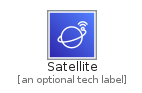
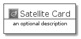
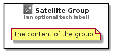

# Satellite


```text
aws-q3-2021/Category/Satellite
```

```text
include('aws-q3-2021/Category/Satellite')
```


| Illustration | Satellite | SatelliteCard | SatelliteGroup |
| :---: | :---: | :---: | :---: |
|  |  |  |  |


## Satellite

### Load remotely
```plantuml
@startuml
' configures the library
!global $LIB_BASE_LOCATION="https://raw.githubusercontent.com/tmorin/plantuml-libs/master/distribution"

' loads the library's bootstrap
!include $LIB_BASE_LOCATION/bootstrap.puml

' loads the package bootstrap
include('aws-q3-2021/bootstrap')

' loads the Item which embeds the element Satellite
include('aws-q3-2021/Category/Satellite')

' renders the element
Satellite('Satellite', 'Satellite', 'an optional tech label')
@enduml
```

### Load locally
```plantuml
@startuml
' configures the library
!global $INCLUSION_MODE="local"
!global $LIB_BASE_LOCATION="../.."

' loads the library's bootstrap
!include $LIB_BASE_LOCATION/bootstrap.puml

' loads the package bootstrap
include('aws-q3-2021/bootstrap')

' loads the Item which embeds the element Satellite
include('aws-q3-2021/Category/Satellite')

' renders the element
Satellite('Satellite', 'Satellite', 'an optional tech label')
@enduml
```

## SatelliteCard

### Load remotely
```plantuml
@startuml
' configures the library
!global $LIB_BASE_LOCATION="https://raw.githubusercontent.com/tmorin/plantuml-libs/master/distribution"

' loads the library's bootstrap
!include $LIB_BASE_LOCATION/bootstrap.puml

' loads the package bootstrap
include('aws-q3-2021/bootstrap')

' loads the Item which embeds the element SatelliteCard
include('aws-q3-2021/Category/Satellite')

' renders the element
SatelliteCard('SatelliteCard', 'Satellite Card', 'an optional description')
@enduml
```

### Load locally
```plantuml
@startuml
' configures the library
!global $INCLUSION_MODE="local"
!global $LIB_BASE_LOCATION="../.."

' loads the library's bootstrap
!include $LIB_BASE_LOCATION/bootstrap.puml

' loads the package bootstrap
include('aws-q3-2021/bootstrap')

' loads the Item which embeds the element SatelliteCard
include('aws-q3-2021/Category/Satellite')

' renders the element
SatelliteCard('SatelliteCard', 'Satellite Card', 'an optional description')
@enduml
```

## SatelliteGroup

### Load remotely
```plantuml
@startuml
' configures the library
!global $LIB_BASE_LOCATION="https://raw.githubusercontent.com/tmorin/plantuml-libs/master/distribution"

' loads the library's bootstrap
!include $LIB_BASE_LOCATION/bootstrap.puml

' loads the package bootstrap
include('aws-q3-2021/bootstrap')

' loads the Item which embeds the element SatelliteGroup
include('aws-q3-2021/Category/Satellite')

' renders the element
SatelliteGroup('SatelliteGroup', 'Satellite Group', 'an optional tech label') {
    note as note
        the content of the group
    end note
}
@enduml
```

### Load locally
```plantuml
@startuml
' configures the library
!global $INCLUSION_MODE="local"
!global $LIB_BASE_LOCATION="../.."

' loads the library's bootstrap
!include $LIB_BASE_LOCATION/bootstrap.puml

' loads the package bootstrap
include('aws-q3-2021/bootstrap')

' loads the Item which embeds the element SatelliteGroup
include('aws-q3-2021/Category/Satellite')

' renders the element
SatelliteGroup('SatelliteGroup', 'Satellite Group', 'an optional tech label') {
    note as note
        the content of the group
    end note
}
@enduml
```

