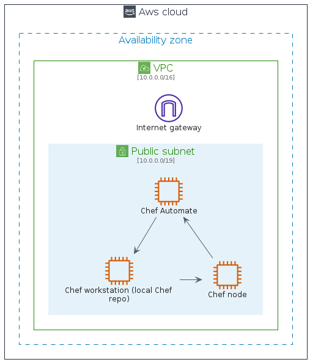
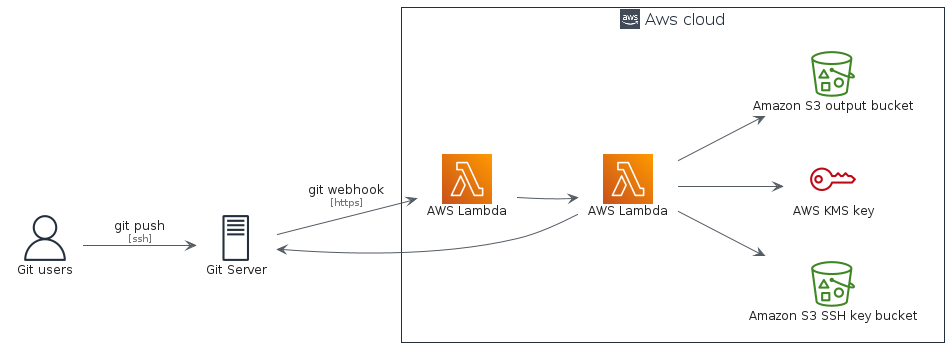

# aws-q3-2021

## Bootstrap

The bootstrap may provide PlantUML artifacts like constants, procedures or style statements.

```plantuml
' loads the aws-q3-2021 bootstrap
include('aws-q3-2021/bootstrap')
```


# Modules

The package provides 4 modules.

- [aws-q3-2021/Architecture](../aws-q3-2021/Architecture/README.md) with 275 items
- [aws-q3-2021/Category](../aws-q3-2021/Category/README.md) with 26 items
- [aws-q3-2021/Group](../aws-q3-2021/Group/README.md) with 17 items
- [aws-q3-2021/Resource](../aws-q3-2021/Resource/README.md) with 419 items


# Examples

The package provides 2 examples.

## Chef Automate Architecture on AWS

<br>
[The source file.](../aws-q3-2021/chef_automate_architecture_on_aws.puml)

## Git to S3 Webhooks

<br>
[The source file.](../aws-q3-2021/git_to_s3_webhooks.puml)


