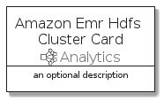
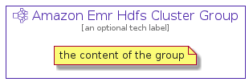

# AmazonEmrHdfsCluster


```text
aws-q3-2021/Resource/Analytics/AmazonEmrHdfsCluster
```

```text
include('aws-q3-2021/Resource/Analytics/AmazonEmrHdfsCluster')
```


| Illustration | AmazonEmrHdfsCluster | AmazonEmrHdfsClusterCard | AmazonEmrHdfsClusterGroup |
| :---: | :---: | :---: | :---: |
|  |  |  |  |


## AmazonEmrHdfsCluster

### Load remotely
```plantuml
@startuml
' configures the library
!global $LIB_BASE_LOCATION="https://github.com/tmorin/plantuml-libs/distribution"

' loads the library's bootstrap
!include $LIB_BASE_LOCATION/bootstrap.puml

' loads the package bootstrap
include('aws-q3-2021/bootstrap')

' loads the Item which embeds the element AmazonEmrHdfsCluster
include('aws-q3-2021/Resource/Analytics/AmazonEmrHdfsCluster')

' renders the element
AmazonEmrHdfsCluster('AmazonEmrHdfsCluster', 'Amazon Emr Hdfs Cluster', 'an optional tech label')
@enduml
```

### Load locally
```plantuml
@startuml
' configures the library
!global $INCLUSION_MODE="local"
!global $LIB_BASE_LOCATION="../../.."

' loads the library's bootstrap
!include $LIB_BASE_LOCATION/bootstrap.puml

' loads the package bootstrap
include('aws-q3-2021/bootstrap')

' loads the Item which embeds the element AmazonEmrHdfsCluster
include('aws-q3-2021/Resource/Analytics/AmazonEmrHdfsCluster')

' renders the element
AmazonEmrHdfsCluster('AmazonEmrHdfsCluster', 'Amazon Emr Hdfs Cluster', 'an optional tech label')
@enduml
```

## AmazonEmrHdfsClusterCard

### Load remotely
```plantuml
@startuml
' configures the library
!global $LIB_BASE_LOCATION="https://github.com/tmorin/plantuml-libs/distribution"

' loads the library's bootstrap
!include $LIB_BASE_LOCATION/bootstrap.puml

' loads the package bootstrap
include('aws-q3-2021/bootstrap')

' loads the Item which embeds the element AmazonEmrHdfsClusterCard
include('aws-q3-2021/Resource/Analytics/AmazonEmrHdfsCluster')

' renders the element
AmazonEmrHdfsClusterCard('AmazonEmrHdfsClusterCard', 'Amazon Emr Hdfs Cluster Card', 'an optional description')
@enduml
```

### Load locally
```plantuml
@startuml
' configures the library
!global $INCLUSION_MODE="local"
!global $LIB_BASE_LOCATION="../../.."

' loads the library's bootstrap
!include $LIB_BASE_LOCATION/bootstrap.puml

' loads the package bootstrap
include('aws-q3-2021/bootstrap')

' loads the Item which embeds the element AmazonEmrHdfsClusterCard
include('aws-q3-2021/Resource/Analytics/AmazonEmrHdfsCluster')

' renders the element
AmazonEmrHdfsClusterCard('AmazonEmrHdfsClusterCard', 'Amazon Emr Hdfs Cluster Card', 'an optional description')
@enduml
```

## AmazonEmrHdfsClusterGroup

### Load remotely
```plantuml
@startuml
' configures the library
!global $LIB_BASE_LOCATION="https://github.com/tmorin/plantuml-libs/distribution"

' loads the library's bootstrap
!include $LIB_BASE_LOCATION/bootstrap.puml

' loads the package bootstrap
include('aws-q3-2021/bootstrap')

' loads the Item which embeds the element AmazonEmrHdfsClusterGroup
include('aws-q3-2021/Resource/Analytics/AmazonEmrHdfsCluster')

' renders the element
AmazonEmrHdfsClusterGroup('AmazonEmrHdfsClusterGroup', 'Amazon Emr Hdfs Cluster Group', 'an optional tech label') {
    note as note
        the content of the group
    end note
}
@enduml
```

### Load locally
```plantuml
@startuml
' configures the library
!global $INCLUSION_MODE="local"
!global $LIB_BASE_LOCATION="../../.."

' loads the library's bootstrap
!include $LIB_BASE_LOCATION/bootstrap.puml

' loads the package bootstrap
include('aws-q3-2021/bootstrap')

' loads the Item which embeds the element AmazonEmrHdfsClusterGroup
include('aws-q3-2021/Resource/Analytics/AmazonEmrHdfsCluster')

' renders the element
AmazonEmrHdfsClusterGroup('AmazonEmrHdfsClusterGroup', 'Amazon Emr Hdfs Cluster Group', 'an optional tech label') {
    note as note
        the content of the group
    end note
}
@enduml
```

