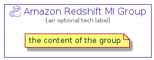

# AmazonRedshiftMl


```text
aws-q3-2021/Resource/Analytics/AmazonRedshiftMl
```

```text
include('aws-q3-2021/Resource/Analytics/AmazonRedshiftMl')
```


| Illustration | AmazonRedshiftMl | AmazonRedshiftMlCard | AmazonRedshiftMlGroup |
| :---: | :---: | :---: | :---: |
|  |  |  |  |


## AmazonRedshiftMl

### Load remotely
```plantuml
@startuml
' configures the library
!global $LIB_BASE_LOCATION="https://github.com/tmorin/plantuml-libs/distribution"

' loads the library's bootstrap
!include $LIB_BASE_LOCATION/bootstrap.puml

' loads the package bootstrap
include('aws-q3-2021/bootstrap')

' loads the Item which embeds the element AmazonRedshiftMl
include('aws-q3-2021/Resource/Analytics/AmazonRedshiftMl')

' renders the element
AmazonRedshiftMl('AmazonRedshiftMl', 'Amazon Redshift Ml', 'an optional tech label')
@enduml
```

### Load locally
```plantuml
@startuml
' configures the library
!global $INCLUSION_MODE="local"
!global $LIB_BASE_LOCATION="../../.."

' loads the library's bootstrap
!include $LIB_BASE_LOCATION/bootstrap.puml

' loads the package bootstrap
include('aws-q3-2021/bootstrap')

' loads the Item which embeds the element AmazonRedshiftMl
include('aws-q3-2021/Resource/Analytics/AmazonRedshiftMl')

' renders the element
AmazonRedshiftMl('AmazonRedshiftMl', 'Amazon Redshift Ml', 'an optional tech label')
@enduml
```

## AmazonRedshiftMlCard

### Load remotely
```plantuml
@startuml
' configures the library
!global $LIB_BASE_LOCATION="https://github.com/tmorin/plantuml-libs/distribution"

' loads the library's bootstrap
!include $LIB_BASE_LOCATION/bootstrap.puml

' loads the package bootstrap
include('aws-q3-2021/bootstrap')

' loads the Item which embeds the element AmazonRedshiftMlCard
include('aws-q3-2021/Resource/Analytics/AmazonRedshiftMl')

' renders the element
AmazonRedshiftMlCard('AmazonRedshiftMlCard', 'Amazon Redshift Ml Card', 'an optional description')
@enduml
```

### Load locally
```plantuml
@startuml
' configures the library
!global $INCLUSION_MODE="local"
!global $LIB_BASE_LOCATION="../../.."

' loads the library's bootstrap
!include $LIB_BASE_LOCATION/bootstrap.puml

' loads the package bootstrap
include('aws-q3-2021/bootstrap')

' loads the Item which embeds the element AmazonRedshiftMlCard
include('aws-q3-2021/Resource/Analytics/AmazonRedshiftMl')

' renders the element
AmazonRedshiftMlCard('AmazonRedshiftMlCard', 'Amazon Redshift Ml Card', 'an optional description')
@enduml
```

## AmazonRedshiftMlGroup

### Load remotely
```plantuml
@startuml
' configures the library
!global $LIB_BASE_LOCATION="https://github.com/tmorin/plantuml-libs/distribution"

' loads the library's bootstrap
!include $LIB_BASE_LOCATION/bootstrap.puml

' loads the package bootstrap
include('aws-q3-2021/bootstrap')

' loads the Item which embeds the element AmazonRedshiftMlGroup
include('aws-q3-2021/Resource/Analytics/AmazonRedshiftMl')

' renders the element
AmazonRedshiftMlGroup('AmazonRedshiftMlGroup', 'Amazon Redshift Ml Group', 'an optional tech label') {
    note as note
        the content of the group
    end note
}
@enduml
```

### Load locally
```plantuml
@startuml
' configures the library
!global $INCLUSION_MODE="local"
!global $LIB_BASE_LOCATION="../../.."

' loads the library's bootstrap
!include $LIB_BASE_LOCATION/bootstrap.puml

' loads the package bootstrap
include('aws-q3-2021/bootstrap')

' loads the Item which embeds the element AmazonRedshiftMlGroup
include('aws-q3-2021/Resource/Analytics/AmazonRedshiftMl')

' renders the element
AmazonRedshiftMlGroup('AmazonRedshiftMlGroup', 'Amazon Redshift Ml Group', 'an optional tech label') {
    note as note
        the content of the group
    end note
}
@enduml
```

