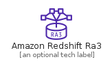
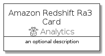
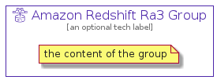

# AmazonRedshiftRa3


```text
aws-q3-2021/Resource/Analytics/AmazonRedshiftRa3
```

```text
include('aws-q3-2021/Resource/Analytics/AmazonRedshiftRa3')
```


| Illustration | AmazonRedshiftRa3 | AmazonRedshiftRa3Card | AmazonRedshiftRa3Group |
| :---: | :---: | :---: | :---: |
|  |  |  |  |


## AmazonRedshiftRa3

### Load remotely
```plantuml
@startuml
' configures the library
!global $LIB_BASE_LOCATION="https://github.com/tmorin/plantuml-libs/distribution"

' loads the library's bootstrap
!include $LIB_BASE_LOCATION/bootstrap.puml

' loads the package bootstrap
include('aws-q3-2021/bootstrap')

' loads the Item which embeds the element AmazonRedshiftRa3
include('aws-q3-2021/Resource/Analytics/AmazonRedshiftRa3')

' renders the element
AmazonRedshiftRa3('AmazonRedshiftRa3', 'Amazon Redshift Ra3', 'an optional tech label')
@enduml
```

### Load locally
```plantuml
@startuml
' configures the library
!global $INCLUSION_MODE="local"
!global $LIB_BASE_LOCATION="../../.."

' loads the library's bootstrap
!include $LIB_BASE_LOCATION/bootstrap.puml

' loads the package bootstrap
include('aws-q3-2021/bootstrap')

' loads the Item which embeds the element AmazonRedshiftRa3
include('aws-q3-2021/Resource/Analytics/AmazonRedshiftRa3')

' renders the element
AmazonRedshiftRa3('AmazonRedshiftRa3', 'Amazon Redshift Ra3', 'an optional tech label')
@enduml
```

## AmazonRedshiftRa3Card

### Load remotely
```plantuml
@startuml
' configures the library
!global $LIB_BASE_LOCATION="https://github.com/tmorin/plantuml-libs/distribution"

' loads the library's bootstrap
!include $LIB_BASE_LOCATION/bootstrap.puml

' loads the package bootstrap
include('aws-q3-2021/bootstrap')

' loads the Item which embeds the element AmazonRedshiftRa3Card
include('aws-q3-2021/Resource/Analytics/AmazonRedshiftRa3')

' renders the element
AmazonRedshiftRa3Card('AmazonRedshiftRa3Card', 'Amazon Redshift Ra3 Card', 'an optional description')
@enduml
```

### Load locally
```plantuml
@startuml
' configures the library
!global $INCLUSION_MODE="local"
!global $LIB_BASE_LOCATION="../../.."

' loads the library's bootstrap
!include $LIB_BASE_LOCATION/bootstrap.puml

' loads the package bootstrap
include('aws-q3-2021/bootstrap')

' loads the Item which embeds the element AmazonRedshiftRa3Card
include('aws-q3-2021/Resource/Analytics/AmazonRedshiftRa3')

' renders the element
AmazonRedshiftRa3Card('AmazonRedshiftRa3Card', 'Amazon Redshift Ra3 Card', 'an optional description')
@enduml
```

## AmazonRedshiftRa3Group

### Load remotely
```plantuml
@startuml
' configures the library
!global $LIB_BASE_LOCATION="https://github.com/tmorin/plantuml-libs/distribution"

' loads the library's bootstrap
!include $LIB_BASE_LOCATION/bootstrap.puml

' loads the package bootstrap
include('aws-q3-2021/bootstrap')

' loads the Item which embeds the element AmazonRedshiftRa3Group
include('aws-q3-2021/Resource/Analytics/AmazonRedshiftRa3')

' renders the element
AmazonRedshiftRa3Group('AmazonRedshiftRa3Group', 'Amazon Redshift Ra3 Group', 'an optional tech label') {
    note as note
        the content of the group
    end note
}
@enduml
```

### Load locally
```plantuml
@startuml
' configures the library
!global $INCLUSION_MODE="local"
!global $LIB_BASE_LOCATION="../../.."

' loads the library's bootstrap
!include $LIB_BASE_LOCATION/bootstrap.puml

' loads the package bootstrap
include('aws-q3-2021/bootstrap')

' loads the Item which embeds the element AmazonRedshiftRa3Group
include('aws-q3-2021/Resource/Analytics/AmazonRedshiftRa3')

' renders the element
AmazonRedshiftRa3Group('AmazonRedshiftRa3Group', 'Amazon Redshift Ra3 Group', 'an optional tech label') {
    note as note
        the content of the group
    end note
}
@enduml
```

