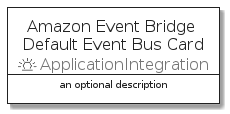

# AmazonEventBridgeDefaultEventBus


```text
aws-q3-2021/Resource/ApplicationIntegration/AmazonEventBridgeDefaultEventBus
```

```text
include('aws-q3-2021/Resource/ApplicationIntegration/AmazonEventBridgeDefaultEventBus')
```


| Illustration | AmazonEventBridgeDefaultEventBus | AmazonEventBridgeDefaultEventBusCard | AmazonEventBridgeDefaultEventBusGroup |
| :---: | :---: | :---: | :---: |
|  |  |  |  |


## AmazonEventBridgeDefaultEventBus

### Load remotely
```plantuml
@startuml
' configures the library
!global $LIB_BASE_LOCATION="https://github.com/tmorin/plantuml-libs/distribution"

' loads the library's bootstrap
!include $LIB_BASE_LOCATION/bootstrap.puml

' loads the package bootstrap
include('aws-q3-2021/bootstrap')

' loads the Item which embeds the element AmazonEventBridgeDefaultEventBus
include('aws-q3-2021/Resource/ApplicationIntegration/AmazonEventBridgeDefaultEventBus')

' renders the element
AmazonEventBridgeDefaultEventBus('AmazonEventBridgeDefaultEventBus', 'Amazon Event Bridge Default Event Bus', 'an optional tech label')
@enduml
```

### Load locally
```plantuml
@startuml
' configures the library
!global $INCLUSION_MODE="local"
!global $LIB_BASE_LOCATION="../../.."

' loads the library's bootstrap
!include $LIB_BASE_LOCATION/bootstrap.puml

' loads the package bootstrap
include('aws-q3-2021/bootstrap')

' loads the Item which embeds the element AmazonEventBridgeDefaultEventBus
include('aws-q3-2021/Resource/ApplicationIntegration/AmazonEventBridgeDefaultEventBus')

' renders the element
AmazonEventBridgeDefaultEventBus('AmazonEventBridgeDefaultEventBus', 'Amazon Event Bridge Default Event Bus', 'an optional tech label')
@enduml
```

## AmazonEventBridgeDefaultEventBusCard

### Load remotely
```plantuml
@startuml
' configures the library
!global $LIB_BASE_LOCATION="https://github.com/tmorin/plantuml-libs/distribution"

' loads the library's bootstrap
!include $LIB_BASE_LOCATION/bootstrap.puml

' loads the package bootstrap
include('aws-q3-2021/bootstrap')

' loads the Item which embeds the element AmazonEventBridgeDefaultEventBusCard
include('aws-q3-2021/Resource/ApplicationIntegration/AmazonEventBridgeDefaultEventBus')

' renders the element
AmazonEventBridgeDefaultEventBusCard('AmazonEventBridgeDefaultEventBusCard', 'Amazon Event Bridge Default Event Bus Card', 'an optional description')
@enduml
```

### Load locally
```plantuml
@startuml
' configures the library
!global $INCLUSION_MODE="local"
!global $LIB_BASE_LOCATION="../../.."

' loads the library's bootstrap
!include $LIB_BASE_LOCATION/bootstrap.puml

' loads the package bootstrap
include('aws-q3-2021/bootstrap')

' loads the Item which embeds the element AmazonEventBridgeDefaultEventBusCard
include('aws-q3-2021/Resource/ApplicationIntegration/AmazonEventBridgeDefaultEventBus')

' renders the element
AmazonEventBridgeDefaultEventBusCard('AmazonEventBridgeDefaultEventBusCard', 'Amazon Event Bridge Default Event Bus Card', 'an optional description')
@enduml
```

## AmazonEventBridgeDefaultEventBusGroup

### Load remotely
```plantuml
@startuml
' configures the library
!global $LIB_BASE_LOCATION="https://github.com/tmorin/plantuml-libs/distribution"

' loads the library's bootstrap
!include $LIB_BASE_LOCATION/bootstrap.puml

' loads the package bootstrap
include('aws-q3-2021/bootstrap')

' loads the Item which embeds the element AmazonEventBridgeDefaultEventBusGroup
include('aws-q3-2021/Resource/ApplicationIntegration/AmazonEventBridgeDefaultEventBus')

' renders the element
AmazonEventBridgeDefaultEventBusGroup('AmazonEventBridgeDefaultEventBusGroup', 'Amazon Event Bridge Default Event Bus Group', 'an optional tech label') {
    note as note
        the content of the group
    end note
}
@enduml
```

### Load locally
```plantuml
@startuml
' configures the library
!global $INCLUSION_MODE="local"
!global $LIB_BASE_LOCATION="../../.."

' loads the library's bootstrap
!include $LIB_BASE_LOCATION/bootstrap.puml

' loads the package bootstrap
include('aws-q3-2021/bootstrap')

' loads the Item which embeds the element AmazonEventBridgeDefaultEventBusGroup
include('aws-q3-2021/Resource/ApplicationIntegration/AmazonEventBridgeDefaultEventBus')

' renders the element
AmazonEventBridgeDefaultEventBusGroup('AmazonEventBridgeDefaultEventBusGroup', 'Amazon Event Bridge Default Event Bus Group', 'an optional tech label') {
    note as note
        the content of the group
    end note
}
@enduml
```

