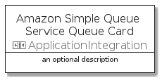

# AmazonSimpleQueueServiceQueue


```text
aws-q3-2021/Resource/ApplicationIntegration/AmazonSimpleQueueServiceQueue
```

```text
include('aws-q3-2021/Resource/ApplicationIntegration/AmazonSimpleQueueServiceQueue')
```


| Illustration | AmazonSimpleQueueServiceQueue | AmazonSimpleQueueServiceQueueCard | AmazonSimpleQueueServiceQueueGroup |
| :---: | :---: | :---: | :---: |
|  |  |  |  |


## AmazonSimpleQueueServiceQueue

### Load remotely
```plantuml
@startuml
' configures the library
!global $LIB_BASE_LOCATION="https://raw.githubusercontent.com/tmorin/plantuml-libs/master/distribution"

' loads the library's bootstrap
!include $LIB_BASE_LOCATION/bootstrap.puml

' loads the package bootstrap
include('aws-q3-2021/bootstrap')

' loads the Item which embeds the element AmazonSimpleQueueServiceQueue
include('aws-q3-2021/Resource/ApplicationIntegration/AmazonSimpleQueueServiceQueue')

' renders the element
AmazonSimpleQueueServiceQueue('AmazonSimpleQueueServiceQueue', 'Amazon Simple Queue Service Queue', 'an optional tech label')
@enduml
```

### Load locally
```plantuml
@startuml
' configures the library
!global $INCLUSION_MODE="local"
!global $LIB_BASE_LOCATION="../../.."

' loads the library's bootstrap
!include $LIB_BASE_LOCATION/bootstrap.puml

' loads the package bootstrap
include('aws-q3-2021/bootstrap')

' loads the Item which embeds the element AmazonSimpleQueueServiceQueue
include('aws-q3-2021/Resource/ApplicationIntegration/AmazonSimpleQueueServiceQueue')

' renders the element
AmazonSimpleQueueServiceQueue('AmazonSimpleQueueServiceQueue', 'Amazon Simple Queue Service Queue', 'an optional tech label')
@enduml
```

## AmazonSimpleQueueServiceQueueCard

### Load remotely
```plantuml
@startuml
' configures the library
!global $LIB_BASE_LOCATION="https://raw.githubusercontent.com/tmorin/plantuml-libs/master/distribution"

' loads the library's bootstrap
!include $LIB_BASE_LOCATION/bootstrap.puml

' loads the package bootstrap
include('aws-q3-2021/bootstrap')

' loads the Item which embeds the element AmazonSimpleQueueServiceQueueCard
include('aws-q3-2021/Resource/ApplicationIntegration/AmazonSimpleQueueServiceQueue')

' renders the element
AmazonSimpleQueueServiceQueueCard('AmazonSimpleQueueServiceQueueCard', 'Amazon Simple Queue Service Queue Card', 'an optional description')
@enduml
```

### Load locally
```plantuml
@startuml
' configures the library
!global $INCLUSION_MODE="local"
!global $LIB_BASE_LOCATION="../../.."

' loads the library's bootstrap
!include $LIB_BASE_LOCATION/bootstrap.puml

' loads the package bootstrap
include('aws-q3-2021/bootstrap')

' loads the Item which embeds the element AmazonSimpleQueueServiceQueueCard
include('aws-q3-2021/Resource/ApplicationIntegration/AmazonSimpleQueueServiceQueue')

' renders the element
AmazonSimpleQueueServiceQueueCard('AmazonSimpleQueueServiceQueueCard', 'Amazon Simple Queue Service Queue Card', 'an optional description')
@enduml
```

## AmazonSimpleQueueServiceQueueGroup

### Load remotely
```plantuml
@startuml
' configures the library
!global $LIB_BASE_LOCATION="https://raw.githubusercontent.com/tmorin/plantuml-libs/master/distribution"

' loads the library's bootstrap
!include $LIB_BASE_LOCATION/bootstrap.puml

' loads the package bootstrap
include('aws-q3-2021/bootstrap')

' loads the Item which embeds the element AmazonSimpleQueueServiceQueueGroup
include('aws-q3-2021/Resource/ApplicationIntegration/AmazonSimpleQueueServiceQueue')

' renders the element
AmazonSimpleQueueServiceQueueGroup('AmazonSimpleQueueServiceQueueGroup', 'Amazon Simple Queue Service Queue Group', 'an optional tech label') {
    note as note
        the content of the group
    end note
}
@enduml
```

### Load locally
```plantuml
@startuml
' configures the library
!global $INCLUSION_MODE="local"
!global $LIB_BASE_LOCATION="../../.."

' loads the library's bootstrap
!include $LIB_BASE_LOCATION/bootstrap.puml

' loads the package bootstrap
include('aws-q3-2021/bootstrap')

' loads the Item which embeds the element AmazonSimpleQueueServiceQueueGroup
include('aws-q3-2021/Resource/ApplicationIntegration/AmazonSimpleQueueServiceQueue')

' renders the element
AmazonSimpleQueueServiceQueueGroup('AmazonSimpleQueueServiceQueueGroup', 'Amazon Simple Queue Service Queue Group', 'an optional tech label') {
    note as note
        the content of the group
    end note
}
@enduml
```

