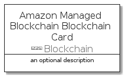
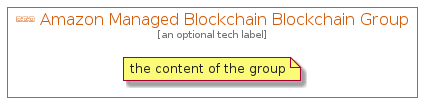

# AmazonManagedBlockchainBlockchain


```text
aws-q3-2021/Resource/Blockchain/AmazonManagedBlockchainBlockchain
```

```text
include('aws-q3-2021/Resource/Blockchain/AmazonManagedBlockchainBlockchain')
```


| Illustration | AmazonManagedBlockchainBlockchain | AmazonManagedBlockchainBlockchainCard | AmazonManagedBlockchainBlockchainGroup |
| :---: | :---: | :---: | :---: |
|  |  |  |  |


## AmazonManagedBlockchainBlockchain

### Load remotely
```plantuml
@startuml
' configures the library
!global $LIB_BASE_LOCATION="https://raw.githubusercontent.com/tmorin/plantuml-libs/master/distribution"

' loads the library's bootstrap
!include $LIB_BASE_LOCATION/bootstrap.puml

' loads the package bootstrap
include('aws-q3-2021/bootstrap')

' loads the Item which embeds the element AmazonManagedBlockchainBlockchain
include('aws-q3-2021/Resource/Blockchain/AmazonManagedBlockchainBlockchain')

' renders the element
AmazonManagedBlockchainBlockchain('AmazonManagedBlockchainBlockchain', 'Amazon Managed Blockchain Blockchain', 'an optional tech label')
@enduml
```

### Load locally
```plantuml
@startuml
' configures the library
!global $INCLUSION_MODE="local"
!global $LIB_BASE_LOCATION="../../.."

' loads the library's bootstrap
!include $LIB_BASE_LOCATION/bootstrap.puml

' loads the package bootstrap
include('aws-q3-2021/bootstrap')

' loads the Item which embeds the element AmazonManagedBlockchainBlockchain
include('aws-q3-2021/Resource/Blockchain/AmazonManagedBlockchainBlockchain')

' renders the element
AmazonManagedBlockchainBlockchain('AmazonManagedBlockchainBlockchain', 'Amazon Managed Blockchain Blockchain', 'an optional tech label')
@enduml
```

## AmazonManagedBlockchainBlockchainCard

### Load remotely
```plantuml
@startuml
' configures the library
!global $LIB_BASE_LOCATION="https://raw.githubusercontent.com/tmorin/plantuml-libs/master/distribution"

' loads the library's bootstrap
!include $LIB_BASE_LOCATION/bootstrap.puml

' loads the package bootstrap
include('aws-q3-2021/bootstrap')

' loads the Item which embeds the element AmazonManagedBlockchainBlockchainCard
include('aws-q3-2021/Resource/Blockchain/AmazonManagedBlockchainBlockchain')

' renders the element
AmazonManagedBlockchainBlockchainCard('AmazonManagedBlockchainBlockchainCard', 'Amazon Managed Blockchain Blockchain Card', 'an optional description')
@enduml
```

### Load locally
```plantuml
@startuml
' configures the library
!global $INCLUSION_MODE="local"
!global $LIB_BASE_LOCATION="../../.."

' loads the library's bootstrap
!include $LIB_BASE_LOCATION/bootstrap.puml

' loads the package bootstrap
include('aws-q3-2021/bootstrap')

' loads the Item which embeds the element AmazonManagedBlockchainBlockchainCard
include('aws-q3-2021/Resource/Blockchain/AmazonManagedBlockchainBlockchain')

' renders the element
AmazonManagedBlockchainBlockchainCard('AmazonManagedBlockchainBlockchainCard', 'Amazon Managed Blockchain Blockchain Card', 'an optional description')
@enduml
```

## AmazonManagedBlockchainBlockchainGroup

### Load remotely
```plantuml
@startuml
' configures the library
!global $LIB_BASE_LOCATION="https://raw.githubusercontent.com/tmorin/plantuml-libs/master/distribution"

' loads the library's bootstrap
!include $LIB_BASE_LOCATION/bootstrap.puml

' loads the package bootstrap
include('aws-q3-2021/bootstrap')

' loads the Item which embeds the element AmazonManagedBlockchainBlockchainGroup
include('aws-q3-2021/Resource/Blockchain/AmazonManagedBlockchainBlockchain')

' renders the element
AmazonManagedBlockchainBlockchainGroup('AmazonManagedBlockchainBlockchainGroup', 'Amazon Managed Blockchain Blockchain Group', 'an optional tech label') {
    note as note
        the content of the group
    end note
}
@enduml
```

### Load locally
```plantuml
@startuml
' configures the library
!global $INCLUSION_MODE="local"
!global $LIB_BASE_LOCATION="../../.."

' loads the library's bootstrap
!include $LIB_BASE_LOCATION/bootstrap.puml

' loads the package bootstrap
include('aws-q3-2021/bootstrap')

' loads the Item which embeds the element AmazonManagedBlockchainBlockchainGroup
include('aws-q3-2021/Resource/Blockchain/AmazonManagedBlockchainBlockchain')

' renders the element
AmazonManagedBlockchainBlockchainGroup('AmazonManagedBlockchainBlockchainGroup', 'Amazon Managed Blockchain Blockchain Group', 'an optional tech label') {
    note as note
        the content of the group
    end note
}
@enduml
```

