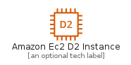
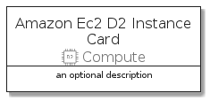
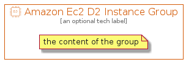

# AmazonEc2D2Instance


```text
aws-q3-2021/Resource/Compute/AmazonEc2D2Instance
```

```text
include('aws-q3-2021/Resource/Compute/AmazonEc2D2Instance')
```


| Illustration | AmazonEc2D2Instance | AmazonEc2D2InstanceCard | AmazonEc2D2InstanceGroup |
| :---: | :---: | :---: | :---: |
|  |  |  |  |


## AmazonEc2D2Instance

### Load remotely
```plantuml
@startuml
' configures the library
!global $LIB_BASE_LOCATION="https://github.com/tmorin/plantuml-libs/distribution"

' loads the library's bootstrap
!include $LIB_BASE_LOCATION/bootstrap.puml

' loads the package bootstrap
include('aws-q3-2021/bootstrap')

' loads the Item which embeds the element AmazonEc2D2Instance
include('aws-q3-2021/Resource/Compute/AmazonEc2D2Instance')

' renders the element
AmazonEc2D2Instance('AmazonEc2D2Instance', 'Amazon Ec2 D2 Instance', 'an optional tech label')
@enduml
```

### Load locally
```plantuml
@startuml
' configures the library
!global $INCLUSION_MODE="local"
!global $LIB_BASE_LOCATION="../../.."

' loads the library's bootstrap
!include $LIB_BASE_LOCATION/bootstrap.puml

' loads the package bootstrap
include('aws-q3-2021/bootstrap')

' loads the Item which embeds the element AmazonEc2D2Instance
include('aws-q3-2021/Resource/Compute/AmazonEc2D2Instance')

' renders the element
AmazonEc2D2Instance('AmazonEc2D2Instance', 'Amazon Ec2 D2 Instance', 'an optional tech label')
@enduml
```

## AmazonEc2D2InstanceCard

### Load remotely
```plantuml
@startuml
' configures the library
!global $LIB_BASE_LOCATION="https://github.com/tmorin/plantuml-libs/distribution"

' loads the library's bootstrap
!include $LIB_BASE_LOCATION/bootstrap.puml

' loads the package bootstrap
include('aws-q3-2021/bootstrap')

' loads the Item which embeds the element AmazonEc2D2InstanceCard
include('aws-q3-2021/Resource/Compute/AmazonEc2D2Instance')

' renders the element
AmazonEc2D2InstanceCard('AmazonEc2D2InstanceCard', 'Amazon Ec2 D2 Instance Card', 'an optional description')
@enduml
```

### Load locally
```plantuml
@startuml
' configures the library
!global $INCLUSION_MODE="local"
!global $LIB_BASE_LOCATION="../../.."

' loads the library's bootstrap
!include $LIB_BASE_LOCATION/bootstrap.puml

' loads the package bootstrap
include('aws-q3-2021/bootstrap')

' loads the Item which embeds the element AmazonEc2D2InstanceCard
include('aws-q3-2021/Resource/Compute/AmazonEc2D2Instance')

' renders the element
AmazonEc2D2InstanceCard('AmazonEc2D2InstanceCard', 'Amazon Ec2 D2 Instance Card', 'an optional description')
@enduml
```

## AmazonEc2D2InstanceGroup

### Load remotely
```plantuml
@startuml
' configures the library
!global $LIB_BASE_LOCATION="https://github.com/tmorin/plantuml-libs/distribution"

' loads the library's bootstrap
!include $LIB_BASE_LOCATION/bootstrap.puml

' loads the package bootstrap
include('aws-q3-2021/bootstrap')

' loads the Item which embeds the element AmazonEc2D2InstanceGroup
include('aws-q3-2021/Resource/Compute/AmazonEc2D2Instance')

' renders the element
AmazonEc2D2InstanceGroup('AmazonEc2D2InstanceGroup', 'Amazon Ec2 D2 Instance Group', 'an optional tech label') {
    note as note
        the content of the group
    end note
}
@enduml
```

### Load locally
```plantuml
@startuml
' configures the library
!global $INCLUSION_MODE="local"
!global $LIB_BASE_LOCATION="../../.."

' loads the library's bootstrap
!include $LIB_BASE_LOCATION/bootstrap.puml

' loads the package bootstrap
include('aws-q3-2021/bootstrap')

' loads the Item which embeds the element AmazonEc2D2InstanceGroup
include('aws-q3-2021/Resource/Compute/AmazonEc2D2Instance')

' renders the element
AmazonEc2D2InstanceGroup('AmazonEc2D2InstanceGroup', 'Amazon Ec2 D2 Instance Group', 'an optional tech label') {
    note as note
        the content of the group
    end note
}
@enduml
```

