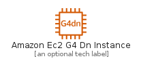
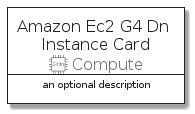
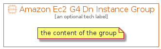

# AmazonEc2G4DnInstance


```text
aws-q3-2021/Resource/Compute/AmazonEc2G4DnInstance
```

```text
include('aws-q3-2021/Resource/Compute/AmazonEc2G4DnInstance')
```


| Illustration | AmazonEc2G4DnInstance | AmazonEc2G4DnInstanceCard | AmazonEc2G4DnInstanceGroup |
| :---: | :---: | :---: | :---: |
|  |  |  |  |


## AmazonEc2G4DnInstance

### Load remotely
```plantuml
@startuml
' configures the library
!global $LIB_BASE_LOCATION="https://raw.githubusercontent.com/tmorin/plantuml-libs/master/distribution"

' loads the library's bootstrap
!include $LIB_BASE_LOCATION/bootstrap.puml

' loads the package bootstrap
include('aws-q3-2021/bootstrap')

' loads the Item which embeds the element AmazonEc2G4DnInstance
include('aws-q3-2021/Resource/Compute/AmazonEc2G4DnInstance')

' renders the element
AmazonEc2G4DnInstance('AmazonEc2G4DnInstance', 'Amazon Ec2 G4 Dn Instance', 'an optional tech label')
@enduml
```

### Load locally
```plantuml
@startuml
' configures the library
!global $INCLUSION_MODE="local"
!global $LIB_BASE_LOCATION="../../.."

' loads the library's bootstrap
!include $LIB_BASE_LOCATION/bootstrap.puml

' loads the package bootstrap
include('aws-q3-2021/bootstrap')

' loads the Item which embeds the element AmazonEc2G4DnInstance
include('aws-q3-2021/Resource/Compute/AmazonEc2G4DnInstance')

' renders the element
AmazonEc2G4DnInstance('AmazonEc2G4DnInstance', 'Amazon Ec2 G4 Dn Instance', 'an optional tech label')
@enduml
```

## AmazonEc2G4DnInstanceCard

### Load remotely
```plantuml
@startuml
' configures the library
!global $LIB_BASE_LOCATION="https://raw.githubusercontent.com/tmorin/plantuml-libs/master/distribution"

' loads the library's bootstrap
!include $LIB_BASE_LOCATION/bootstrap.puml

' loads the package bootstrap
include('aws-q3-2021/bootstrap')

' loads the Item which embeds the element AmazonEc2G4DnInstanceCard
include('aws-q3-2021/Resource/Compute/AmazonEc2G4DnInstance')

' renders the element
AmazonEc2G4DnInstanceCard('AmazonEc2G4DnInstanceCard', 'Amazon Ec2 G4 Dn Instance Card', 'an optional description')
@enduml
```

### Load locally
```plantuml
@startuml
' configures the library
!global $INCLUSION_MODE="local"
!global $LIB_BASE_LOCATION="../../.."

' loads the library's bootstrap
!include $LIB_BASE_LOCATION/bootstrap.puml

' loads the package bootstrap
include('aws-q3-2021/bootstrap')

' loads the Item which embeds the element AmazonEc2G4DnInstanceCard
include('aws-q3-2021/Resource/Compute/AmazonEc2G4DnInstance')

' renders the element
AmazonEc2G4DnInstanceCard('AmazonEc2G4DnInstanceCard', 'Amazon Ec2 G4 Dn Instance Card', 'an optional description')
@enduml
```

## AmazonEc2G4DnInstanceGroup

### Load remotely
```plantuml
@startuml
' configures the library
!global $LIB_BASE_LOCATION="https://raw.githubusercontent.com/tmorin/plantuml-libs/master/distribution"

' loads the library's bootstrap
!include $LIB_BASE_LOCATION/bootstrap.puml

' loads the package bootstrap
include('aws-q3-2021/bootstrap')

' loads the Item which embeds the element AmazonEc2G4DnInstanceGroup
include('aws-q3-2021/Resource/Compute/AmazonEc2G4DnInstance')

' renders the element
AmazonEc2G4DnInstanceGroup('AmazonEc2G4DnInstanceGroup', 'Amazon Ec2 G4 Dn Instance Group', 'an optional tech label') {
    note as note
        the content of the group
    end note
}
@enduml
```

### Load locally
```plantuml
@startuml
' configures the library
!global $INCLUSION_MODE="local"
!global $LIB_BASE_LOCATION="../../.."

' loads the library's bootstrap
!include $LIB_BASE_LOCATION/bootstrap.puml

' loads the package bootstrap
include('aws-q3-2021/bootstrap')

' loads the Item which embeds the element AmazonEc2G4DnInstanceGroup
include('aws-q3-2021/Resource/Compute/AmazonEc2G4DnInstance')

' renders the element
AmazonEc2G4DnInstanceGroup('AmazonEc2G4DnInstanceGroup', 'Amazon Ec2 G4 Dn Instance Group', 'an optional tech label') {
    note as note
        the content of the group
    end note
}
@enduml
```

