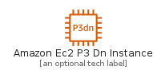
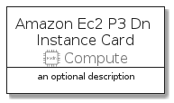
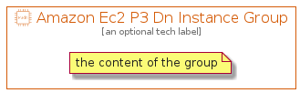

# AmazonEc2P3DnInstance


```text
aws-q3-2021/Resource/Compute/AmazonEc2P3DnInstance
```

```text
include('aws-q3-2021/Resource/Compute/AmazonEc2P3DnInstance')
```


| Illustration | AmazonEc2P3DnInstance | AmazonEc2P3DnInstanceCard | AmazonEc2P3DnInstanceGroup |
| :---: | :---: | :---: | :---: |
|  |  |  |  |


## AmazonEc2P3DnInstance

### Load remotely
```plantuml
@startuml
' configures the library
!global $LIB_BASE_LOCATION="https://raw.githubusercontent.com/tmorin/plantuml-libs/master/distribution"

' loads the library's bootstrap
!include $LIB_BASE_LOCATION/bootstrap.puml

' loads the package bootstrap
include('aws-q3-2021/bootstrap')

' loads the Item which embeds the element AmazonEc2P3DnInstance
include('aws-q3-2021/Resource/Compute/AmazonEc2P3DnInstance')

' renders the element
AmazonEc2P3DnInstance('AmazonEc2P3DnInstance', 'Amazon Ec2 P3 Dn Instance', 'an optional tech label')
@enduml
```

### Load locally
```plantuml
@startuml
' configures the library
!global $INCLUSION_MODE="local"
!global $LIB_BASE_LOCATION="../../.."

' loads the library's bootstrap
!include $LIB_BASE_LOCATION/bootstrap.puml

' loads the package bootstrap
include('aws-q3-2021/bootstrap')

' loads the Item which embeds the element AmazonEc2P3DnInstance
include('aws-q3-2021/Resource/Compute/AmazonEc2P3DnInstance')

' renders the element
AmazonEc2P3DnInstance('AmazonEc2P3DnInstance', 'Amazon Ec2 P3 Dn Instance', 'an optional tech label')
@enduml
```

## AmazonEc2P3DnInstanceCard

### Load remotely
```plantuml
@startuml
' configures the library
!global $LIB_BASE_LOCATION="https://raw.githubusercontent.com/tmorin/plantuml-libs/master/distribution"

' loads the library's bootstrap
!include $LIB_BASE_LOCATION/bootstrap.puml

' loads the package bootstrap
include('aws-q3-2021/bootstrap')

' loads the Item which embeds the element AmazonEc2P3DnInstanceCard
include('aws-q3-2021/Resource/Compute/AmazonEc2P3DnInstance')

' renders the element
AmazonEc2P3DnInstanceCard('AmazonEc2P3DnInstanceCard', 'Amazon Ec2 P3 Dn Instance Card', 'an optional description')
@enduml
```

### Load locally
```plantuml
@startuml
' configures the library
!global $INCLUSION_MODE="local"
!global $LIB_BASE_LOCATION="../../.."

' loads the library's bootstrap
!include $LIB_BASE_LOCATION/bootstrap.puml

' loads the package bootstrap
include('aws-q3-2021/bootstrap')

' loads the Item which embeds the element AmazonEc2P3DnInstanceCard
include('aws-q3-2021/Resource/Compute/AmazonEc2P3DnInstance')

' renders the element
AmazonEc2P3DnInstanceCard('AmazonEc2P3DnInstanceCard', 'Amazon Ec2 P3 Dn Instance Card', 'an optional description')
@enduml
```

## AmazonEc2P3DnInstanceGroup

### Load remotely
```plantuml
@startuml
' configures the library
!global $LIB_BASE_LOCATION="https://raw.githubusercontent.com/tmorin/plantuml-libs/master/distribution"

' loads the library's bootstrap
!include $LIB_BASE_LOCATION/bootstrap.puml

' loads the package bootstrap
include('aws-q3-2021/bootstrap')

' loads the Item which embeds the element AmazonEc2P3DnInstanceGroup
include('aws-q3-2021/Resource/Compute/AmazonEc2P3DnInstance')

' renders the element
AmazonEc2P3DnInstanceGroup('AmazonEc2P3DnInstanceGroup', 'Amazon Ec2 P3 Dn Instance Group', 'an optional tech label') {
    note as note
        the content of the group
    end note
}
@enduml
```

### Load locally
```plantuml
@startuml
' configures the library
!global $INCLUSION_MODE="local"
!global $LIB_BASE_LOCATION="../../.."

' loads the library's bootstrap
!include $LIB_BASE_LOCATION/bootstrap.puml

' loads the package bootstrap
include('aws-q3-2021/bootstrap')

' loads the Item which embeds the element AmazonEc2P3DnInstanceGroup
include('aws-q3-2021/Resource/Compute/AmazonEc2P3DnInstance')

' renders the element
AmazonEc2P3DnInstanceGroup('AmazonEc2P3DnInstanceGroup', 'Amazon Ec2 P3 Dn Instance Group', 'an optional tech label') {
    note as note
        the content of the group
    end note
}
@enduml
```

