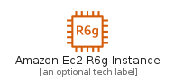
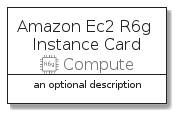
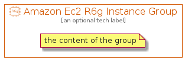

# AmazonEc2R6GInstance


```text
aws-q3-2021/Resource/Compute/AmazonEc2R6GInstance
```

```text
include('aws-q3-2021/Resource/Compute/AmazonEc2R6GInstance')
```


| Illustration | AmazonEc2R6GInstance | AmazonEc2R6GInstanceCard | AmazonEc2R6GInstanceGroup |
| :---: | :---: | :---: | :---: |
|  |  |  |  |


## AmazonEc2R6GInstance

### Load remotely
```plantuml
@startuml
' configures the library
!global $LIB_BASE_LOCATION="https://raw.githubusercontent.com/tmorin/plantuml-libs/master/distribution"

' loads the library's bootstrap
!include $LIB_BASE_LOCATION/bootstrap.puml

' loads the package bootstrap
include('aws-q3-2021/bootstrap')

' loads the Item which embeds the element AmazonEc2R6GInstance
include('aws-q3-2021/Resource/Compute/AmazonEc2R6GInstance')

' renders the element
AmazonEc2R6GInstance('AmazonEc2R6gInstance', 'Amazon Ec2 R6g Instance', 'an optional tech label')
@enduml
```

### Load locally
```plantuml
@startuml
' configures the library
!global $INCLUSION_MODE="local"
!global $LIB_BASE_LOCATION="../../.."

' loads the library's bootstrap
!include $LIB_BASE_LOCATION/bootstrap.puml

' loads the package bootstrap
include('aws-q3-2021/bootstrap')

' loads the Item which embeds the element AmazonEc2R6GInstance
include('aws-q3-2021/Resource/Compute/AmazonEc2R6GInstance')

' renders the element
AmazonEc2R6GInstance('AmazonEc2R6gInstance', 'Amazon Ec2 R6g Instance', 'an optional tech label')
@enduml
```

## AmazonEc2R6GInstanceCard

### Load remotely
```plantuml
@startuml
' configures the library
!global $LIB_BASE_LOCATION="https://raw.githubusercontent.com/tmorin/plantuml-libs/master/distribution"

' loads the library's bootstrap
!include $LIB_BASE_LOCATION/bootstrap.puml

' loads the package bootstrap
include('aws-q3-2021/bootstrap')

' loads the Item which embeds the element AmazonEc2R6GInstanceCard
include('aws-q3-2021/Resource/Compute/AmazonEc2R6GInstance')

' renders the element
AmazonEc2R6GInstanceCard('AmazonEc2R6gInstanceCard', 'Amazon Ec2 R6g Instance Card', 'an optional description')
@enduml
```

### Load locally
```plantuml
@startuml
' configures the library
!global $INCLUSION_MODE="local"
!global $LIB_BASE_LOCATION="../../.."

' loads the library's bootstrap
!include $LIB_BASE_LOCATION/bootstrap.puml

' loads the package bootstrap
include('aws-q3-2021/bootstrap')

' loads the Item which embeds the element AmazonEc2R6GInstanceCard
include('aws-q3-2021/Resource/Compute/AmazonEc2R6GInstance')

' renders the element
AmazonEc2R6GInstanceCard('AmazonEc2R6gInstanceCard', 'Amazon Ec2 R6g Instance Card', 'an optional description')
@enduml
```

## AmazonEc2R6GInstanceGroup

### Load remotely
```plantuml
@startuml
' configures the library
!global $LIB_BASE_LOCATION="https://raw.githubusercontent.com/tmorin/plantuml-libs/master/distribution"

' loads the library's bootstrap
!include $LIB_BASE_LOCATION/bootstrap.puml

' loads the package bootstrap
include('aws-q3-2021/bootstrap')

' loads the Item which embeds the element AmazonEc2R6GInstanceGroup
include('aws-q3-2021/Resource/Compute/AmazonEc2R6GInstance')

' renders the element
AmazonEc2R6GInstanceGroup('AmazonEc2R6gInstanceGroup', 'Amazon Ec2 R6g Instance Group', 'an optional tech label') {
    note as note
        the content of the group
    end note
}
@enduml
```

### Load locally
```plantuml
@startuml
' configures the library
!global $INCLUSION_MODE="local"
!global $LIB_BASE_LOCATION="../../.."

' loads the library's bootstrap
!include $LIB_BASE_LOCATION/bootstrap.puml

' loads the package bootstrap
include('aws-q3-2021/bootstrap')

' loads the Item which embeds the element AmazonEc2R6GInstanceGroup
include('aws-q3-2021/Resource/Compute/AmazonEc2R6GInstance')

' renders the element
AmazonEc2R6GInstanceGroup('AmazonEc2R6gInstanceGroup', 'Amazon Ec2 R6g Instance Group', 'an optional tech label') {
    note as note
        the content of the group
    end note
}
@enduml
```

