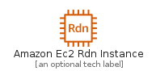
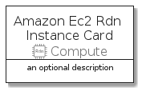
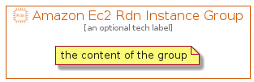

# AmazonEc2RdnInstance


```text
aws-q3-2021/Resource/Compute/AmazonEc2RdnInstance
```

```text
include('aws-q3-2021/Resource/Compute/AmazonEc2RdnInstance')
```


| Illustration | AmazonEc2RdnInstance | AmazonEc2RdnInstanceCard | AmazonEc2RdnInstanceGroup |
| :---: | :---: | :---: | :---: |
|  |  |  |  |


## AmazonEc2RdnInstance

### Load remotely
```plantuml
@startuml
' configures the library
!global $LIB_BASE_LOCATION="https://raw.githubusercontent.com/tmorin/plantuml-libs/master/distribution"

' loads the library's bootstrap
!include $LIB_BASE_LOCATION/bootstrap.puml

' loads the package bootstrap
include('aws-q3-2021/bootstrap')

' loads the Item which embeds the element AmazonEc2RdnInstance
include('aws-q3-2021/Resource/Compute/AmazonEc2RdnInstance')

' renders the element
AmazonEc2RdnInstance('AmazonEc2RdnInstance', 'Amazon Ec2 Rdn Instance', 'an optional tech label')
@enduml
```

### Load locally
```plantuml
@startuml
' configures the library
!global $INCLUSION_MODE="local"
!global $LIB_BASE_LOCATION="../../.."

' loads the library's bootstrap
!include $LIB_BASE_LOCATION/bootstrap.puml

' loads the package bootstrap
include('aws-q3-2021/bootstrap')

' loads the Item which embeds the element AmazonEc2RdnInstance
include('aws-q3-2021/Resource/Compute/AmazonEc2RdnInstance')

' renders the element
AmazonEc2RdnInstance('AmazonEc2RdnInstance', 'Amazon Ec2 Rdn Instance', 'an optional tech label')
@enduml
```

## AmazonEc2RdnInstanceCard

### Load remotely
```plantuml
@startuml
' configures the library
!global $LIB_BASE_LOCATION="https://raw.githubusercontent.com/tmorin/plantuml-libs/master/distribution"

' loads the library's bootstrap
!include $LIB_BASE_LOCATION/bootstrap.puml

' loads the package bootstrap
include('aws-q3-2021/bootstrap')

' loads the Item which embeds the element AmazonEc2RdnInstanceCard
include('aws-q3-2021/Resource/Compute/AmazonEc2RdnInstance')

' renders the element
AmazonEc2RdnInstanceCard('AmazonEc2RdnInstanceCard', 'Amazon Ec2 Rdn Instance Card', 'an optional description')
@enduml
```

### Load locally
```plantuml
@startuml
' configures the library
!global $INCLUSION_MODE="local"
!global $LIB_BASE_LOCATION="../../.."

' loads the library's bootstrap
!include $LIB_BASE_LOCATION/bootstrap.puml

' loads the package bootstrap
include('aws-q3-2021/bootstrap')

' loads the Item which embeds the element AmazonEc2RdnInstanceCard
include('aws-q3-2021/Resource/Compute/AmazonEc2RdnInstance')

' renders the element
AmazonEc2RdnInstanceCard('AmazonEc2RdnInstanceCard', 'Amazon Ec2 Rdn Instance Card', 'an optional description')
@enduml
```

## AmazonEc2RdnInstanceGroup

### Load remotely
```plantuml
@startuml
' configures the library
!global $LIB_BASE_LOCATION="https://raw.githubusercontent.com/tmorin/plantuml-libs/master/distribution"

' loads the library's bootstrap
!include $LIB_BASE_LOCATION/bootstrap.puml

' loads the package bootstrap
include('aws-q3-2021/bootstrap')

' loads the Item which embeds the element AmazonEc2RdnInstanceGroup
include('aws-q3-2021/Resource/Compute/AmazonEc2RdnInstance')

' renders the element
AmazonEc2RdnInstanceGroup('AmazonEc2RdnInstanceGroup', 'Amazon Ec2 Rdn Instance Group', 'an optional tech label') {
    note as note
        the content of the group
    end note
}
@enduml
```

### Load locally
```plantuml
@startuml
' configures the library
!global $INCLUSION_MODE="local"
!global $LIB_BASE_LOCATION="../../.."

' loads the library's bootstrap
!include $LIB_BASE_LOCATION/bootstrap.puml

' loads the package bootstrap
include('aws-q3-2021/bootstrap')

' loads the Item which embeds the element AmazonEc2RdnInstanceGroup
include('aws-q3-2021/Resource/Compute/AmazonEc2RdnInstance')

' renders the element
AmazonEc2RdnInstanceGroup('AmazonEc2RdnInstanceGroup', 'Amazon Ec2 Rdn Instance Group', 'an optional tech label') {
    note as note
        the content of the group
    end note
}
@enduml
```

