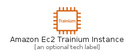
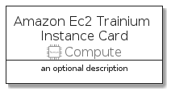

# AmazonEc2TrainiumInstance


```text
aws-q3-2021/Resource/Compute/AmazonEc2TrainiumInstance
```

```text
include('aws-q3-2021/Resource/Compute/AmazonEc2TrainiumInstance')
```


| Illustration | AmazonEc2TrainiumInstance | AmazonEc2TrainiumInstanceCard | AmazonEc2TrainiumInstanceGroup |
| :---: | :---: | :---: | :---: |
|  |  |  |  |


## AmazonEc2TrainiumInstance

### Load remotely
```plantuml
@startuml
' configures the library
!global $LIB_BASE_LOCATION="https://raw.githubusercontent.com/tmorin/plantuml-libs/master/distribution"

' loads the library's bootstrap
!include $LIB_BASE_LOCATION/bootstrap.puml

' loads the package bootstrap
include('aws-q3-2021/bootstrap')

' loads the Item which embeds the element AmazonEc2TrainiumInstance
include('aws-q3-2021/Resource/Compute/AmazonEc2TrainiumInstance')

' renders the element
AmazonEc2TrainiumInstance('AmazonEc2TrainiumInstance', 'Amazon Ec2 Trainium Instance', 'an optional tech label')
@enduml
```

### Load locally
```plantuml
@startuml
' configures the library
!global $INCLUSION_MODE="local"
!global $LIB_BASE_LOCATION="../../.."

' loads the library's bootstrap
!include $LIB_BASE_LOCATION/bootstrap.puml

' loads the package bootstrap
include('aws-q3-2021/bootstrap')

' loads the Item which embeds the element AmazonEc2TrainiumInstance
include('aws-q3-2021/Resource/Compute/AmazonEc2TrainiumInstance')

' renders the element
AmazonEc2TrainiumInstance('AmazonEc2TrainiumInstance', 'Amazon Ec2 Trainium Instance', 'an optional tech label')
@enduml
```

## AmazonEc2TrainiumInstanceCard

### Load remotely
```plantuml
@startuml
' configures the library
!global $LIB_BASE_LOCATION="https://raw.githubusercontent.com/tmorin/plantuml-libs/master/distribution"

' loads the library's bootstrap
!include $LIB_BASE_LOCATION/bootstrap.puml

' loads the package bootstrap
include('aws-q3-2021/bootstrap')

' loads the Item which embeds the element AmazonEc2TrainiumInstanceCard
include('aws-q3-2021/Resource/Compute/AmazonEc2TrainiumInstance')

' renders the element
AmazonEc2TrainiumInstanceCard('AmazonEc2TrainiumInstanceCard', 'Amazon Ec2 Trainium Instance Card', 'an optional description')
@enduml
```

### Load locally
```plantuml
@startuml
' configures the library
!global $INCLUSION_MODE="local"
!global $LIB_BASE_LOCATION="../../.."

' loads the library's bootstrap
!include $LIB_BASE_LOCATION/bootstrap.puml

' loads the package bootstrap
include('aws-q3-2021/bootstrap')

' loads the Item which embeds the element AmazonEc2TrainiumInstanceCard
include('aws-q3-2021/Resource/Compute/AmazonEc2TrainiumInstance')

' renders the element
AmazonEc2TrainiumInstanceCard('AmazonEc2TrainiumInstanceCard', 'Amazon Ec2 Trainium Instance Card', 'an optional description')
@enduml
```

## AmazonEc2TrainiumInstanceGroup

### Load remotely
```plantuml
@startuml
' configures the library
!global $LIB_BASE_LOCATION="https://raw.githubusercontent.com/tmorin/plantuml-libs/master/distribution"

' loads the library's bootstrap
!include $LIB_BASE_LOCATION/bootstrap.puml

' loads the package bootstrap
include('aws-q3-2021/bootstrap')

' loads the Item which embeds the element AmazonEc2TrainiumInstanceGroup
include('aws-q3-2021/Resource/Compute/AmazonEc2TrainiumInstance')

' renders the element
AmazonEc2TrainiumInstanceGroup('AmazonEc2TrainiumInstanceGroup', 'Amazon Ec2 Trainium Instance Group', 'an optional tech label') {
    note as note
        the content of the group
    end note
}
@enduml
```

### Load locally
```plantuml
@startuml
' configures the library
!global $INCLUSION_MODE="local"
!global $LIB_BASE_LOCATION="../../.."

' loads the library's bootstrap
!include $LIB_BASE_LOCATION/bootstrap.puml

' loads the package bootstrap
include('aws-q3-2021/bootstrap')

' loads the Item which embeds the element AmazonEc2TrainiumInstanceGroup
include('aws-q3-2021/Resource/Compute/AmazonEc2TrainiumInstance')

' renders the element
AmazonEc2TrainiumInstanceGroup('AmazonEc2TrainiumInstanceGroup', 'Amazon Ec2 Trainium Instance Group', 'an optional tech label') {
    note as note
        the content of the group
    end note
}
@enduml
```

