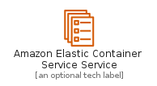
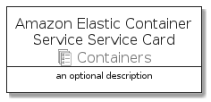

# AmazonElasticContainerServiceService


```text
aws-q3-2021/Resource/Containers/AmazonElasticContainerServiceService
```

```text
include('aws-q3-2021/Resource/Containers/AmazonElasticContainerServiceService')
```


| Illustration | AmazonElasticContainerServiceService | AmazonElasticContainerServiceServiceCard | AmazonElasticContainerServiceServiceGroup |
| :---: | :---: | :---: | :---: |
|  |  |  |  |


## AmazonElasticContainerServiceService

### Load remotely
```plantuml
@startuml
' configures the library
!global $LIB_BASE_LOCATION="https://raw.githubusercontent.com/tmorin/plantuml-libs/master/distribution"

' loads the library's bootstrap
!include $LIB_BASE_LOCATION/bootstrap.puml

' loads the package bootstrap
include('aws-q3-2021/bootstrap')

' loads the Item which embeds the element AmazonElasticContainerServiceService
include('aws-q3-2021/Resource/Containers/AmazonElasticContainerServiceService')

' renders the element
AmazonElasticContainerServiceService('AmazonElasticContainerServiceService', 'Amazon Elastic Container Service Service', 'an optional tech label')
@enduml
```

### Load locally
```plantuml
@startuml
' configures the library
!global $INCLUSION_MODE="local"
!global $LIB_BASE_LOCATION="../../.."

' loads the library's bootstrap
!include $LIB_BASE_LOCATION/bootstrap.puml

' loads the package bootstrap
include('aws-q3-2021/bootstrap')

' loads the Item which embeds the element AmazonElasticContainerServiceService
include('aws-q3-2021/Resource/Containers/AmazonElasticContainerServiceService')

' renders the element
AmazonElasticContainerServiceService('AmazonElasticContainerServiceService', 'Amazon Elastic Container Service Service', 'an optional tech label')
@enduml
```

## AmazonElasticContainerServiceServiceCard

### Load remotely
```plantuml
@startuml
' configures the library
!global $LIB_BASE_LOCATION="https://raw.githubusercontent.com/tmorin/plantuml-libs/master/distribution"

' loads the library's bootstrap
!include $LIB_BASE_LOCATION/bootstrap.puml

' loads the package bootstrap
include('aws-q3-2021/bootstrap')

' loads the Item which embeds the element AmazonElasticContainerServiceServiceCard
include('aws-q3-2021/Resource/Containers/AmazonElasticContainerServiceService')

' renders the element
AmazonElasticContainerServiceServiceCard('AmazonElasticContainerServiceServiceCard', 'Amazon Elastic Container Service Service Card', 'an optional description')
@enduml
```

### Load locally
```plantuml
@startuml
' configures the library
!global $INCLUSION_MODE="local"
!global $LIB_BASE_LOCATION="../../.."

' loads the library's bootstrap
!include $LIB_BASE_LOCATION/bootstrap.puml

' loads the package bootstrap
include('aws-q3-2021/bootstrap')

' loads the Item which embeds the element AmazonElasticContainerServiceServiceCard
include('aws-q3-2021/Resource/Containers/AmazonElasticContainerServiceService')

' renders the element
AmazonElasticContainerServiceServiceCard('AmazonElasticContainerServiceServiceCard', 'Amazon Elastic Container Service Service Card', 'an optional description')
@enduml
```

## AmazonElasticContainerServiceServiceGroup

### Load remotely
```plantuml
@startuml
' configures the library
!global $LIB_BASE_LOCATION="https://raw.githubusercontent.com/tmorin/plantuml-libs/master/distribution"

' loads the library's bootstrap
!include $LIB_BASE_LOCATION/bootstrap.puml

' loads the package bootstrap
include('aws-q3-2021/bootstrap')

' loads the Item which embeds the element AmazonElasticContainerServiceServiceGroup
include('aws-q3-2021/Resource/Containers/AmazonElasticContainerServiceService')

' renders the element
AmazonElasticContainerServiceServiceGroup('AmazonElasticContainerServiceServiceGroup', 'Amazon Elastic Container Service Service Group', 'an optional tech label') {
    note as note
        the content of the group
    end note
}
@enduml
```

### Load locally
```plantuml
@startuml
' configures the library
!global $INCLUSION_MODE="local"
!global $LIB_BASE_LOCATION="../../.."

' loads the library's bootstrap
!include $LIB_BASE_LOCATION/bootstrap.puml

' loads the package bootstrap
include('aws-q3-2021/bootstrap')

' loads the Item which embeds the element AmazonElasticContainerServiceServiceGroup
include('aws-q3-2021/Resource/Containers/AmazonElasticContainerServiceService')

' renders the element
AmazonElasticContainerServiceServiceGroup('AmazonElasticContainerServiceServiceGroup', 'Amazon Elastic Container Service Service Group', 'an optional tech label') {
    note as note
        the content of the group
    end note
}
@enduml
```

