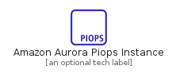
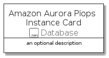
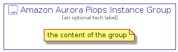

# AmazonAuroraPiopsInstance


```text
aws-q3-2021/Resource/Database/AmazonAuroraPiopsInstance
```

```text
include('aws-q3-2021/Resource/Database/AmazonAuroraPiopsInstance')
```


| Illustration | AmazonAuroraPiopsInstance | AmazonAuroraPiopsInstanceCard | AmazonAuroraPiopsInstanceGroup |
| :---: | :---: | :---: | :---: |
|  |  |  |  |


## AmazonAuroraPiopsInstance

### Load remotely
```plantuml
@startuml
' configures the library
!global $LIB_BASE_LOCATION="https://raw.githubusercontent.com/tmorin/plantuml-libs/master/distribution"

' loads the library's bootstrap
!include $LIB_BASE_LOCATION/bootstrap.puml

' loads the package bootstrap
include('aws-q3-2021/bootstrap')

' loads the Item which embeds the element AmazonAuroraPiopsInstance
include('aws-q3-2021/Resource/Database/AmazonAuroraPiopsInstance')

' renders the element
AmazonAuroraPiopsInstance('AmazonAuroraPiopsInstance', 'Amazon Aurora Piops Instance', 'an optional tech label')
@enduml
```

### Load locally
```plantuml
@startuml
' configures the library
!global $INCLUSION_MODE="local"
!global $LIB_BASE_LOCATION="../../.."

' loads the library's bootstrap
!include $LIB_BASE_LOCATION/bootstrap.puml

' loads the package bootstrap
include('aws-q3-2021/bootstrap')

' loads the Item which embeds the element AmazonAuroraPiopsInstance
include('aws-q3-2021/Resource/Database/AmazonAuroraPiopsInstance')

' renders the element
AmazonAuroraPiopsInstance('AmazonAuroraPiopsInstance', 'Amazon Aurora Piops Instance', 'an optional tech label')
@enduml
```

## AmazonAuroraPiopsInstanceCard

### Load remotely
```plantuml
@startuml
' configures the library
!global $LIB_BASE_LOCATION="https://raw.githubusercontent.com/tmorin/plantuml-libs/master/distribution"

' loads the library's bootstrap
!include $LIB_BASE_LOCATION/bootstrap.puml

' loads the package bootstrap
include('aws-q3-2021/bootstrap')

' loads the Item which embeds the element AmazonAuroraPiopsInstanceCard
include('aws-q3-2021/Resource/Database/AmazonAuroraPiopsInstance')

' renders the element
AmazonAuroraPiopsInstanceCard('AmazonAuroraPiopsInstanceCard', 'Amazon Aurora Piops Instance Card', 'an optional description')
@enduml
```

### Load locally
```plantuml
@startuml
' configures the library
!global $INCLUSION_MODE="local"
!global $LIB_BASE_LOCATION="../../.."

' loads the library's bootstrap
!include $LIB_BASE_LOCATION/bootstrap.puml

' loads the package bootstrap
include('aws-q3-2021/bootstrap')

' loads the Item which embeds the element AmazonAuroraPiopsInstanceCard
include('aws-q3-2021/Resource/Database/AmazonAuroraPiopsInstance')

' renders the element
AmazonAuroraPiopsInstanceCard('AmazonAuroraPiopsInstanceCard', 'Amazon Aurora Piops Instance Card', 'an optional description')
@enduml
```

## AmazonAuroraPiopsInstanceGroup

### Load remotely
```plantuml
@startuml
' configures the library
!global $LIB_BASE_LOCATION="https://raw.githubusercontent.com/tmorin/plantuml-libs/master/distribution"

' loads the library's bootstrap
!include $LIB_BASE_LOCATION/bootstrap.puml

' loads the package bootstrap
include('aws-q3-2021/bootstrap')

' loads the Item which embeds the element AmazonAuroraPiopsInstanceGroup
include('aws-q3-2021/Resource/Database/AmazonAuroraPiopsInstance')

' renders the element
AmazonAuroraPiopsInstanceGroup('AmazonAuroraPiopsInstanceGroup', 'Amazon Aurora Piops Instance Group', 'an optional tech label') {
    note as note
        the content of the group
    end note
}
@enduml
```

### Load locally
```plantuml
@startuml
' configures the library
!global $INCLUSION_MODE="local"
!global $LIB_BASE_LOCATION="../../.."

' loads the library's bootstrap
!include $LIB_BASE_LOCATION/bootstrap.puml

' loads the package bootstrap
include('aws-q3-2021/bootstrap')

' loads the Item which embeds the element AmazonAuroraPiopsInstanceGroup
include('aws-q3-2021/Resource/Database/AmazonAuroraPiopsInstance')

' renders the element
AmazonAuroraPiopsInstanceGroup('AmazonAuroraPiopsInstanceGroup', 'Amazon Aurora Piops Instance Group', 'an optional tech label') {
    note as note
        the content of the group
    end note
}
@enduml
```

