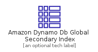
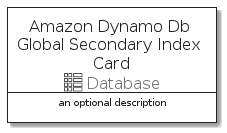
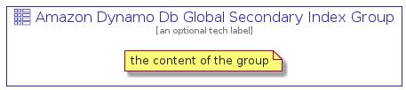

# AmazonDynamoDbGlobalSecondaryIndex


```text
aws-q3-2021/Resource/Database/AmazonDynamoDbGlobalSecondaryIndex
```

```text
include('aws-q3-2021/Resource/Database/AmazonDynamoDbGlobalSecondaryIndex')
```


| Illustration | AmazonDynamoDbGlobalSecondaryIndex | AmazonDynamoDbGlobalSecondaryIndexCard | AmazonDynamoDbGlobalSecondaryIndexGroup |
| :---: | :---: | :---: | :---: |
|  |  |  |  |


## AmazonDynamoDbGlobalSecondaryIndex

### Load remotely
```plantuml
@startuml
' configures the library
!global $LIB_BASE_LOCATION="https://github.com/tmorin/plantuml-libs/distribution"

' loads the library's bootstrap
!include $LIB_BASE_LOCATION/bootstrap.puml

' loads the package bootstrap
include('aws-q3-2021/bootstrap')

' loads the Item which embeds the element AmazonDynamoDbGlobalSecondaryIndex
include('aws-q3-2021/Resource/Database/AmazonDynamoDbGlobalSecondaryIndex')

' renders the element
AmazonDynamoDbGlobalSecondaryIndex('AmazonDynamoDbGlobalSecondaryIndex', 'Amazon Dynamo Db Global Secondary Index', 'an optional tech label')
@enduml
```

### Load locally
```plantuml
@startuml
' configures the library
!global $INCLUSION_MODE="local"
!global $LIB_BASE_LOCATION="../../.."

' loads the library's bootstrap
!include $LIB_BASE_LOCATION/bootstrap.puml

' loads the package bootstrap
include('aws-q3-2021/bootstrap')

' loads the Item which embeds the element AmazonDynamoDbGlobalSecondaryIndex
include('aws-q3-2021/Resource/Database/AmazonDynamoDbGlobalSecondaryIndex')

' renders the element
AmazonDynamoDbGlobalSecondaryIndex('AmazonDynamoDbGlobalSecondaryIndex', 'Amazon Dynamo Db Global Secondary Index', 'an optional tech label')
@enduml
```

## AmazonDynamoDbGlobalSecondaryIndexCard

### Load remotely
```plantuml
@startuml
' configures the library
!global $LIB_BASE_LOCATION="https://github.com/tmorin/plantuml-libs/distribution"

' loads the library's bootstrap
!include $LIB_BASE_LOCATION/bootstrap.puml

' loads the package bootstrap
include('aws-q3-2021/bootstrap')

' loads the Item which embeds the element AmazonDynamoDbGlobalSecondaryIndexCard
include('aws-q3-2021/Resource/Database/AmazonDynamoDbGlobalSecondaryIndex')

' renders the element
AmazonDynamoDbGlobalSecondaryIndexCard('AmazonDynamoDbGlobalSecondaryIndexCard', 'Amazon Dynamo Db Global Secondary Index Card', 'an optional description')
@enduml
```

### Load locally
```plantuml
@startuml
' configures the library
!global $INCLUSION_MODE="local"
!global $LIB_BASE_LOCATION="../../.."

' loads the library's bootstrap
!include $LIB_BASE_LOCATION/bootstrap.puml

' loads the package bootstrap
include('aws-q3-2021/bootstrap')

' loads the Item which embeds the element AmazonDynamoDbGlobalSecondaryIndexCard
include('aws-q3-2021/Resource/Database/AmazonDynamoDbGlobalSecondaryIndex')

' renders the element
AmazonDynamoDbGlobalSecondaryIndexCard('AmazonDynamoDbGlobalSecondaryIndexCard', 'Amazon Dynamo Db Global Secondary Index Card', 'an optional description')
@enduml
```

## AmazonDynamoDbGlobalSecondaryIndexGroup

### Load remotely
```plantuml
@startuml
' configures the library
!global $LIB_BASE_LOCATION="https://github.com/tmorin/plantuml-libs/distribution"

' loads the library's bootstrap
!include $LIB_BASE_LOCATION/bootstrap.puml

' loads the package bootstrap
include('aws-q3-2021/bootstrap')

' loads the Item which embeds the element AmazonDynamoDbGlobalSecondaryIndexGroup
include('aws-q3-2021/Resource/Database/AmazonDynamoDbGlobalSecondaryIndex')

' renders the element
AmazonDynamoDbGlobalSecondaryIndexGroup('AmazonDynamoDbGlobalSecondaryIndexGroup', 'Amazon Dynamo Db Global Secondary Index Group', 'an optional tech label') {
    note as note
        the content of the group
    end note
}
@enduml
```

### Load locally
```plantuml
@startuml
' configures the library
!global $INCLUSION_MODE="local"
!global $LIB_BASE_LOCATION="../../.."

' loads the library's bootstrap
!include $LIB_BASE_LOCATION/bootstrap.puml

' loads the package bootstrap
include('aws-q3-2021/bootstrap')

' loads the Item which embeds the element AmazonDynamoDbGlobalSecondaryIndexGroup
include('aws-q3-2021/Resource/Database/AmazonDynamoDbGlobalSecondaryIndex')

' renders the element
AmazonDynamoDbGlobalSecondaryIndexGroup('AmazonDynamoDbGlobalSecondaryIndexGroup', 'Amazon Dynamo Db Global Secondary Index Group', 'an optional tech label') {
    note as note
        the content of the group
    end note
}
@enduml
```

