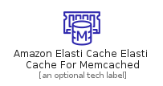
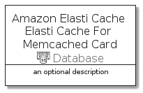

# AmazonElastiCacheElastiCacheForMemcached


```text
aws-q3-2021/Resource/Database/AmazonElastiCacheElastiCacheForMemcached
```

```text
include('aws-q3-2021/Resource/Database/AmazonElastiCacheElastiCacheForMemcached')
```


| Illustration | AmazonElastiCacheElastiCacheForMemcached | AmazonElastiCacheElastiCacheForMemcachedCard | AmazonElastiCacheElastiCacheForMemcachedGroup |
| :---: | :---: | :---: | :---: |
|  |  |  |  |


## AmazonElastiCacheElastiCacheForMemcached

### Load remotely
```plantuml
@startuml
' configures the library
!global $LIB_BASE_LOCATION="https://github.com/tmorin/plantuml-libs/distribution"

' loads the library's bootstrap
!include $LIB_BASE_LOCATION/bootstrap.puml

' loads the package bootstrap
include('aws-q3-2021/bootstrap')

' loads the Item which embeds the element AmazonElastiCacheElastiCacheForMemcached
include('aws-q3-2021/Resource/Database/AmazonElastiCacheElastiCacheForMemcached')

' renders the element
AmazonElastiCacheElastiCacheForMemcached('AmazonElastiCacheElastiCacheForMemcached', 'Amazon Elasti Cache Elasti Cache For Memcached', 'an optional tech label')
@enduml
```

### Load locally
```plantuml
@startuml
' configures the library
!global $INCLUSION_MODE="local"
!global $LIB_BASE_LOCATION="../../.."

' loads the library's bootstrap
!include $LIB_BASE_LOCATION/bootstrap.puml

' loads the package bootstrap
include('aws-q3-2021/bootstrap')

' loads the Item which embeds the element AmazonElastiCacheElastiCacheForMemcached
include('aws-q3-2021/Resource/Database/AmazonElastiCacheElastiCacheForMemcached')

' renders the element
AmazonElastiCacheElastiCacheForMemcached('AmazonElastiCacheElastiCacheForMemcached', 'Amazon Elasti Cache Elasti Cache For Memcached', 'an optional tech label')
@enduml
```

## AmazonElastiCacheElastiCacheForMemcachedCard

### Load remotely
```plantuml
@startuml
' configures the library
!global $LIB_BASE_LOCATION="https://github.com/tmorin/plantuml-libs/distribution"

' loads the library's bootstrap
!include $LIB_BASE_LOCATION/bootstrap.puml

' loads the package bootstrap
include('aws-q3-2021/bootstrap')

' loads the Item which embeds the element AmazonElastiCacheElastiCacheForMemcachedCard
include('aws-q3-2021/Resource/Database/AmazonElastiCacheElastiCacheForMemcached')

' renders the element
AmazonElastiCacheElastiCacheForMemcachedCard('AmazonElastiCacheElastiCacheForMemcachedCard', 'Amazon Elasti Cache Elasti Cache For Memcached Card', 'an optional description')
@enduml
```

### Load locally
```plantuml
@startuml
' configures the library
!global $INCLUSION_MODE="local"
!global $LIB_BASE_LOCATION="../../.."

' loads the library's bootstrap
!include $LIB_BASE_LOCATION/bootstrap.puml

' loads the package bootstrap
include('aws-q3-2021/bootstrap')

' loads the Item which embeds the element AmazonElastiCacheElastiCacheForMemcachedCard
include('aws-q3-2021/Resource/Database/AmazonElastiCacheElastiCacheForMemcached')

' renders the element
AmazonElastiCacheElastiCacheForMemcachedCard('AmazonElastiCacheElastiCacheForMemcachedCard', 'Amazon Elasti Cache Elasti Cache For Memcached Card', 'an optional description')
@enduml
```

## AmazonElastiCacheElastiCacheForMemcachedGroup

### Load remotely
```plantuml
@startuml
' configures the library
!global $LIB_BASE_LOCATION="https://github.com/tmorin/plantuml-libs/distribution"

' loads the library's bootstrap
!include $LIB_BASE_LOCATION/bootstrap.puml

' loads the package bootstrap
include('aws-q3-2021/bootstrap')

' loads the Item which embeds the element AmazonElastiCacheElastiCacheForMemcachedGroup
include('aws-q3-2021/Resource/Database/AmazonElastiCacheElastiCacheForMemcached')

' renders the element
AmazonElastiCacheElastiCacheForMemcachedGroup('AmazonElastiCacheElastiCacheForMemcachedGroup', 'Amazon Elasti Cache Elasti Cache For Memcached Group', 'an optional tech label') {
    note as note
        the content of the group
    end note
}
@enduml
```

### Load locally
```plantuml
@startuml
' configures the library
!global $INCLUSION_MODE="local"
!global $LIB_BASE_LOCATION="../../.."

' loads the library's bootstrap
!include $LIB_BASE_LOCATION/bootstrap.puml

' loads the package bootstrap
include('aws-q3-2021/bootstrap')

' loads the Item which embeds the element AmazonElastiCacheElastiCacheForMemcachedGroup
include('aws-q3-2021/Resource/Database/AmazonElastiCacheElastiCacheForMemcached')

' renders the element
AmazonElastiCacheElastiCacheForMemcachedGroup('AmazonElastiCacheElastiCacheForMemcachedGroup', 'Amazon Elasti Cache Elasti Cache For Memcached Group', 'an optional tech label') {
    note as note
        the content of the group
    end note
}
@enduml
```

