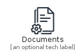
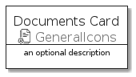
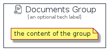

# Documents


```text
aws-q3-2021/Resource/GeneralIcons/Documents
```

```text
include('aws-q3-2021/Resource/GeneralIcons/Documents')
```


| Illustration | Documents | DocumentsCard | DocumentsGroup |
| :---: | :---: | :---: | :---: |
|  |  |  |  |


## Documents

### Load remotely
```plantuml
@startuml
' configures the library
!global $LIB_BASE_LOCATION="https://github.com/tmorin/plantuml-libs/distribution"

' loads the library's bootstrap
!include $LIB_BASE_LOCATION/bootstrap.puml

' loads the package bootstrap
include('aws-q3-2021/bootstrap')

' loads the Item which embeds the element Documents
include('aws-q3-2021/Resource/GeneralIcons/Documents')

' renders the element
Documents('Documents', 'Documents', 'an optional tech label')
@enduml
```

### Load locally
```plantuml
@startuml
' configures the library
!global $INCLUSION_MODE="local"
!global $LIB_BASE_LOCATION="../../.."

' loads the library's bootstrap
!include $LIB_BASE_LOCATION/bootstrap.puml

' loads the package bootstrap
include('aws-q3-2021/bootstrap')

' loads the Item which embeds the element Documents
include('aws-q3-2021/Resource/GeneralIcons/Documents')

' renders the element
Documents('Documents', 'Documents', 'an optional tech label')
@enduml
```

## DocumentsCard

### Load remotely
```plantuml
@startuml
' configures the library
!global $LIB_BASE_LOCATION="https://github.com/tmorin/plantuml-libs/distribution"

' loads the library's bootstrap
!include $LIB_BASE_LOCATION/bootstrap.puml

' loads the package bootstrap
include('aws-q3-2021/bootstrap')

' loads the Item which embeds the element DocumentsCard
include('aws-q3-2021/Resource/GeneralIcons/Documents')

' renders the element
DocumentsCard('DocumentsCard', 'Documents Card', 'an optional description')
@enduml
```

### Load locally
```plantuml
@startuml
' configures the library
!global $INCLUSION_MODE="local"
!global $LIB_BASE_LOCATION="../../.."

' loads the library's bootstrap
!include $LIB_BASE_LOCATION/bootstrap.puml

' loads the package bootstrap
include('aws-q3-2021/bootstrap')

' loads the Item which embeds the element DocumentsCard
include('aws-q3-2021/Resource/GeneralIcons/Documents')

' renders the element
DocumentsCard('DocumentsCard', 'Documents Card', 'an optional description')
@enduml
```

## DocumentsGroup

### Load remotely
```plantuml
@startuml
' configures the library
!global $LIB_BASE_LOCATION="https://github.com/tmorin/plantuml-libs/distribution"

' loads the library's bootstrap
!include $LIB_BASE_LOCATION/bootstrap.puml

' loads the package bootstrap
include('aws-q3-2021/bootstrap')

' loads the Item which embeds the element DocumentsGroup
include('aws-q3-2021/Resource/GeneralIcons/Documents')

' renders the element
DocumentsGroup('DocumentsGroup', 'Documents Group', 'an optional tech label') {
    note as note
        the content of the group
    end note
}
@enduml
```

### Load locally
```plantuml
@startuml
' configures the library
!global $INCLUSION_MODE="local"
!global $LIB_BASE_LOCATION="../../.."

' loads the library's bootstrap
!include $LIB_BASE_LOCATION/bootstrap.puml

' loads the package bootstrap
include('aws-q3-2021/bootstrap')

' loads the Item which embeds the element DocumentsGroup
include('aws-q3-2021/Resource/GeneralIcons/Documents')

' renders the element
DocumentsGroup('DocumentsGroup', 'Documents Group', 'an optional tech label') {
    note as note
        the content of the group
    end note
}
@enduml
```

